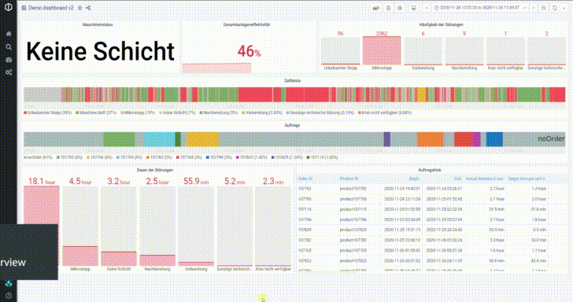

<!-- PROJECT LOGO -->
# United Manufacturing Hub

<!--  -->

The Open-Source toolkit to build your own reliable and secure Industrial IoT platform. It provides you with an entire IT / OT infrastructure - from the edge to on-premise to the cloud. 

You can use it 
1. as a **standalone end-to-end Industrial IoT platform** to securely connect your machines with the cloud or 
2. as a **toolkit** and integrate its components fully into your IT/OT infrastructure to close potential gaps.

### Key benefits

- **Applicable** by including manufacturing specific business logics and applications (e.g., OEE analysis or Digital Shadow)
- **Reliable and Maintainable** through the usage of established IT and OT technologies
- **Scalable** across factories and clouds through a microservice approach and Kubernetes
- **Secure** by allowing to inspect and control each component to ensure confidentiality, integrity, and availability

### Dashboard demo

## Get started

- [Go to our documentation](https://docs.umh.app/docs/) to learn about installation, maintaining, the architecture and the topic IIoT in general
- [Go to our website](https://www.umh.app) for commercial support and implementation

## Technology & architecture

The UMH consists out of a single Helm Chart for Kubernetes, which allows you to easily install, provision and configure it using a single .yaml file.

The Helm Chart consists out of
- [TimescaleDB](https://www.timescale.com/), as relational and time-series database
- [VerneMQ](https://vernemq.com/), as MQTT Broker to connect with external devices
- [Apache Kafka](https://kafka.apache.org/), as message broker for internal communication
- [Node-RED](https://nodered.org/), as low-code programming tool for customization
- A wrapper around [PLC4X](https://plc4x.apache.org/), as library to read out PLCs
- [Grafana](https://grafana.com/) and various plugins, as default visualization tool
- [Various self-written microservices](https://docs.umh.app/docs/developers/), as application logic (e.g., customizable OEE calculation) and/or to extract data from the shop floor (e.g., IO-Link sensors)

It can be deployed 
- in a federation (recommended), to allow each machine, production line and factory to work on its own without being reliant on external factors like internet connection
- centralized, e.g., "everything connected with the cloud"
- decentralized, e.g., "each machine is on its own"

A [full architecture diagram](https://docs.umh.app/docs/concepts/) can be found in the documentation.

## Citations

- Niemeyer, C. & Gehrke, Inga & Müller, Kai & Küsters, Dennis & Gries, Thomas. (2020). Getting Small Medium Enterprises started on Industry 4.0 using retrofitting solutions. Procedia Manufacturing. 45. 208-214. 10.1016/j.promfg.2020.04.096. 
- Kunz, P. (2020). Deep Learning zur industriellen Qualitätsprüfung: Entwicklung eines Plug-and-Play Bildverarbeitungssystems. Institut für Textiltechnik (RWTH Aachen University). 
- Müller, M. (2020). Industrielle Bildverarbeitung zur Qualitätskontrolle in Produktionslinien: Entwicklung einer Entscheidungslogik zur Anwendungsfallspezifischen Auswahl von Hard- und Software. Institut für Textiltechnik (RWTH Aachen University). 
- Altenhofen, N. (2021). Design and Evaluation of a Blue Ocean Strategy for an Open-Core IIoT Platform Provider in the Manufacturing Sector. Institute for Technology and Innovation Management (RWTH Aachen University). 
- Tratner, T. (2021). Implementation of Time Series Data based Digital Time Studies for Manual Processes within the Context of a Learning Factory. Institute of Innovation and Industrial Management (TU Graz).

See also [publications](https://docs.umh.app/docs/publications/) for more material!

<!-- LICENSE -->
## License

All source code is distributed under the GNU AFFERO GENERAL PUBLIC LICENSE. See [`LICENSE`](LICENSE) for more information. All other components (e.g. trademarks, images, logos, documentation, publications), especially those in the `/docs` folder, are property of the respective owner.

<!-- CONTACT -->
## Contact

[UMH Systems GmbH](https://www.umh.app)
