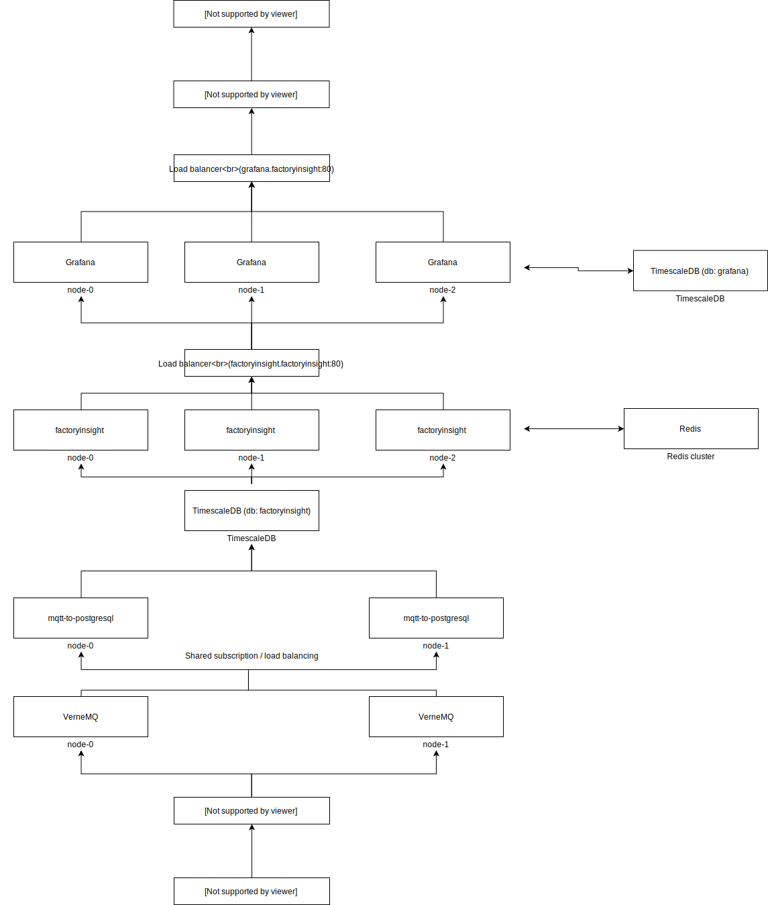

<!-- PROJECT SHIELDS -->
<!--
*** I'm using markdown "reference style" links for readability.
*** Reference links are enclosed in brackets [ ] instead of parentheses ( ).
*** See the bottom of this document for the declaration of the reference variables
*** for contributors-url, forks-url, etc. This is an optional, concise syntax you may use.
*** https://www.markdownguide.org/basic-syntax/#reference-style-links
-->

<!--
[![Contributors][contributors-shield]][contributors-url]
[![Forks][forks-shield]][forks-url]
[![Stargazers][stars-shield]][stars-url]
[![Issues][issues-shield]][issues-url]
[![MIT License][license-shield]][license-url]
[![LinkedIn][linkedin-shield]][linkedin-url]

-->

<!-- PROJECT LOGO -->
# United Manufacturing Hub

# Contents
- [United Manufacturing Hub](#united-manufacturing-hub)
- [Contents](#contents)
  - [About The Project](#about-the-project)
    - [Architecture & project structure](#architecture--project-structure)
      - [Server architecture](#server-architecture)
        - [factoryinsight](#factoryinsight)
        - [mqtt-to-postgresql](#mqtt-to-postgresql)
        - [factoryinsight-datasource](#factoryinsight-datasource)
      - [Hardware architecture](#hardware-architecture)
        - [sensorconnect](#sensorconnect)
        - [barcodereader](#barcodereader)
      - [Folder structure](#folder-structure)
    - [Referenced projects](#referenced-projects)
  - [Getting Started](#getting-started)
    - [Prerequisites](#prerequisites)
    - [Installation](#installation)
  - [Usage](#usage)
  - [Roadmap](#roadmap)
  - [Contributing](#contributing)
  - [License](#license)
  - [Contact](#contact)
  - [Acknowledgements](#acknowledgements)

<!-- ABOUT THE PROJECT -->
## About The Project

[![Product Name Screen Shot][product-screenshot]](https://example.com)

United Manufacturing Hub (UMH) is an open sourcesystem for extracting and analyzing data from manufacturing plants. It is an end-to-end solution for various issues in manufacturing, e.g. optimization of production through OEE analysis (in German: "Betriebsdatenerfassung") and includes software as well as hardware components.

Existing Industry 4.0 platforms are often based on theoretical concepts and research by "big players" in the industry. They tend to develop many elements from scratch and be universal. In contrast, UMH has grown organically and under economic conditions through a wide variety of customer projects in diverse industries. Therefore UMH makes use of a wide range of other open source projects with the focus on solving concrete user problems in production. If you combine all involved projects you can up to xxx millions lines of code and an estimate of xx hundred years of programming time (see also: referenced projects)

### Architecture & project structure

As this repository contains an end-to-end solution with over xx various components we provide in this chapter a rough overview over each component, their purpose and how they are integrated.

#### Server architecture

##### factoryinsight

factoryinsight is an open source REST API written in Golang to fetch manufacturing data from a timescaleDB database and calculate various manufacturing KPIs before delivering it to a user visualization, e.g. [Grafana] or [PowerBI].

Features:

- OEE (Overall Equipment Effectiveness), including various options to investigate OEE losses (e.g. analysis over time, microstop analytics, changeover deep-dives, etc.)
- Various options to investigate OEE losses further, for example stop analysis over time, microstop analytics, paretos, changeover deep-dives or stop histograms
- Scalable, microservice oriented approach for Plug-and-Play usage in Kubernetes or behind load balancers (including health checks and monitoring)
- Compatible with important automation standards, e.g. Weihenstephaner Standards 09.01 (for filling), [Omron PackML (for packaging/filling)](http://omac.org/wp-content/uploads/2016/11/PackML_Unit_Machine_Implementation_Guide-V1-00.pdf), [EUROMAP 84.1 (for plastic)](https://www.euromap.org/euromap84), [OPC 30060 (for tobacco machines)](https://reference.opcfoundation.org/v104/TMC/v100/docs/) and [VDMA 40502 (for CNC machines)](http://normung.vdma.org/viewer/-/v2article/render/32921121)

##### mqtt-to-postgresql

the tool to store incoming MQTT messages to the postgres / timescaleDB database

##### factoryinsight-datasource

This is a plugin for Grafana which acts as a datasource and creates a connection to factoryinsight.

#### Hardware architecture

TODO: add architecture

##### sensorconnect

This tool automatically finds connected ifm AL1350 or AL1352 IO-Link masters, extracts all relevant data and pushes the data to a MQTT broker.

##### barcodereader

This tool automatically detected connected USB barcode scanners and send the data to a MQTT broker. //TODO Add source / license

#### Folder structure

This repository contains multiple folders and sub-projects:

- **/api** API documentation
- **/golang** contains software developed in Go, especially [factoryinsight](#factoryinsight) and [mqtt-to-postgresql](#mqtt-to-postgresql) and their corresponding tests (-environments)
- **/deployment** contains all deployment related files for the server and the factorycube, e.g. based on Kubernetes or Docker, sorted in seperate folders
- **/sensorconnect** contains [sensorconnect](#sensorconnect)
- **/grafana-plugins/factoryinsight-datasource** contains [factoryinsight-datasource](#factoryinsight-datasource)
- **/barcodereader** contains [barcodereader](#barcodereader)
- **/python-sdk** contains a template and examples to analyze data in real-time on the edge devices using Python, Pandas and Docker. It is deprecated as we switched to [node-red] and only published for reference.
- **/docs** contains the entire documentation for all components including all information to buy, assemble and setup the hardware

### Referenced projects

This section should list any major frameworks that you built your project using. Leave any add-ons/plugins for the acknowledgements section. Here are a few examples.
- [Grafana] as a dashboarding & visualization tool
- [node-red], to extract and pre-process data on the edge
- [TimescaleDB], to store sequel and time series data
- [Kubernetes] and [Helm], to orchestrate microservices
- [Docker], for containerization

<!-- GETTING STARTED -->
## Getting Started

Check out [Getting Started](docs/getting-started.md) for more information.

To get a local copy up and running follow these simple example steps.

### Prerequisites

### Installation

<!-- USAGE EXAMPLES -->
## Usage

Use this space to show useful examples of how a project can be used. Additional screenshots, code examples and demos work well in this space. You may also link to more resources.

_For more examples, please refer to the [Documentation]_

<!-- ROADMAP -->
## Roadmap

- Adding more manufacturing KPIs, like MTBF, MTTR, etc.
- Providing various maintenance options, e.g. charts for Condition Monitoring, Predictive Maintenance or Time-based Maintenance

Additionally, see the [open issues](https://github.com/united-manufacturing-hub/united-manufacturing-hub/issues) for a list of proposed features (and known issues).

<!-- CONTRIBUTING -->
## Contributing

Contributions are what make the open source community such an amazing place to be learn, inspire, and create. Any contributions you make are **greatly appreciated**. See `CONTRIBUTING.md` for more information.

<!-- LICENSE -->
## License

Distributed under the United Public License. The license is basically AGPL with a modification to prevent offering the solution "as-a-service" without contributing back to the community. See `LICENSE` for more information.

<!-- CONTACT -->
## Contact

United Factory Systems GmbH

Project Link: [https://github.com/united-manufacturing-hub/united-manufacturing-hub](https://github.com/united-manufacturing-hub/united-manufacturing-hub)

<!-- ACKNOWLEDGEMENTS -->
## Acknowledgements
* [Digital Capability Center Aachen](https://www.mckinsey.com/business-functions/operations/how-we-help-clients/capability-center-network/our-centers/aachen)

<!-- MARKDOWN LINKS & IMAGES -->
<!-- https://www.markdownguide.org/basic-syntax/#reference-style-links -->
[product-screenshot]: images/screenshot.png
[Documentation]: https://wiki.industrial-analytics.net

<!-- Software -->
[Grafana]: https://github.com/grafana/grafana
[PowerBI]: https://powerbi.microsoft.com/
[node-red]: https://github.com/node-red/node-red
[TimescaleDB]: https://github.com/timescale/timescaledb
[Kubernetes]: https://github.com/kubernetes/kubernetes
[Helm]: https://github.com/helm/helm
[Docker]: https://github.com/docker/engine