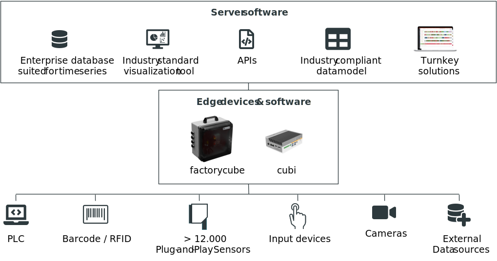
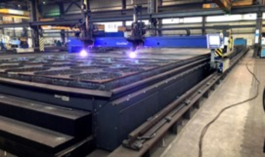
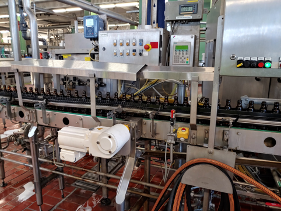
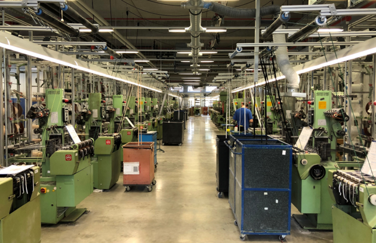

<!-- PROJECT SHIELDS -->
<!--
*** I'm using markdown "reference style" links for readability.
*** Reference links are enclosed in brackets [ ] instead of parentheses ( ).
*** See the bottom of this document for the declaration of the reference variables
*** for contributors-url, forks-url, etc. This is an optional, concise syntax you may use.
*** https://www.markdownguide.org/basic-syntax/#reference-style-links
-->

<!--
[![Contributors][contributors-shield]][contributors-url]
[![Forks][forks-shield]][forks-url]
[![Stargazers][stars-shield]][stars-url]
[![Issues][issues-shield]][issues-url]
[![MIT License][license-shield]][license-url]
[![LinkedIn][linkedin-shield]][linkedin-url]

-->

<!-- PROJECT LOGO -->
# United Manufacturing Hub

<!-- -->

----

<!-- ABOUT THE PROJECT -->
## About The Project

The United Manufacturing Hub is an open source system for extracting and analyzing data from manufacturing plants and sensors. The Hub includes both software and hardware components to enable the retrofit of productions plants by plug-and-play. Resulting is an end-to-end solution for various questions in manufacturing, e.g. optimization of production through OEE analysis, preventive maintenance through condition analysis and quality improvement through stop analysis.

### Features

- **Fulfills all your Industrial IoT needs**. The United Factorycube and the United Manufacturing Hub represent a complete hardware and software package. When selecting the components, we paid particular attention to only use established and scalable sub-components in order to meet the requirements of an enterprise-ready solution. This makes the System highly flexible and easily scalable.
- **Solves concrete problems**. The United Manufacturing Hub is our solution that presents the data of the connected production lines in real time. Additional the system includes a portfolio of specific, ready to use solutions to facilitate daily work production. The portfolio contains tools to calculate and analyse the OEE, to break down optimization potentials, to facilitate reporting, to monitor diverse processes via alarms and to enable a condition-based forward looking maintenance.
- **Open Source**. We combine the best of established open source projects to give all producing companies and machine manufacturers an easy and straightforward access to modern technology. For this purpose we publish both the core software and our gathered knowledge to this topic on our Hub so that everyone interested has free access to the information and core software in order to develop own solutions for his needs. For you, this means: 1. free of charge, forever; 2. no lock-in, because you can adapt the software yourself at any time.

### Dashboard demo

----

## Getting Started

Check out [Getting Started](docs/getting-started.md) for more information on how to install the server and edge components.

### Architecture

<!-- SHOWCASE -->
## Showcase

The United Manufacturing Hub has been deployed in various industries, from CNC milling over filling to flame cutting.

Here are some selected cases. For detailed information, please take a look in [our documentation](docs/examples/overview.md)

### Flame cutting

Retrofitting of 11 flame cutting machines and blasting systems at two locations using sensors, barcode scanners and button bars to extract and analyze operating data

### Brewery

Retrofit of a bottling line for different beer types. Focus on the identification of microstops causes and exact delimitation of the bottleneck machine.

### Weaving

Retrofitting of weaving machines that do not provide data via the PLC to extract operating data. Subsequent determination of the OEE and detailed breakdown of the individual key figures

<!-- ROADMAP -->
## Roadmap

See the [open issues](https://github.com/united-manufacturing-hub/united-manufacturing-hub/issues) for a list of proposed features (and known issues).

<!-- CONTRIBUTING -->
## Contributing

Contributions are what make the open source community such an amazing place to be learn, inspire, and create. Any contributions you make are **greatly appreciated**. See [`CONTRIBUTING.md`](CONTRIBUTING.md) for more information.

<!-- LICENSE -->
## License

All source code is distributed under the GNU AFFERO GENERAL PUBLIC LICENSE. See [`LICENSE`](LICENSE) for more information. All other components (e.g. trademarks, images, logos) are property of the respective owner.

<!-- CONTACT -->
## Contact

[United Factory Systems GmbH](https://www.united-manufacturing-hub.com)

<!-- ACKNOWLEDGEMENTS -->
## Acknowledgements

- [Digital Capability Center Aachen](https://www.mckinsey.com/business-functions/operations/how-we-help-clients/capability-center-network/our-centers/aachen)

<!-- MARKDOWN LINKS & IMAGES -->
<!-- https://www.markdownguide.org/basic-syntax/#reference-style-links -->
[product-screenshot]: images/screenshot.png
[Documentation]: https://wiki.industrial-analytics.net
[Website]: https://www.united-manufacturing-hub.com

<!-- Software -->
[Grafana]: https://github.com/grafana/grafana
[PowerBI]: https://powerbi.microsoft.com/
[node-red]: https://github.com/node-red/node-red
[TimescaleDB]: https://github.com/timescale/timescaledb
[Kubernetes]: https://github.com/kubernetes/kubernetes
[Helm]: https://github.com/helm/helm
[Docker]: https://github.com/docker/engine
