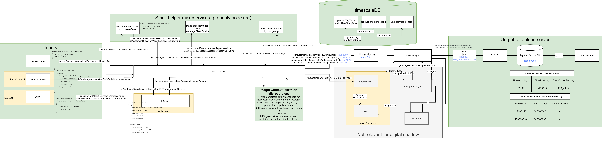

## Introduction

During the production process a lot of data is generated (e.g., process values like temperature or images), but typically not linked to specific products. When investigating product returns, one needs to gather data from various data sources to understand what exactly happened, which might take so much time that it is not done at all. 

The life would be much easier for a quality inspector if he would be able to enter the ID of the defect product and then receive all related information to it - from temperatures during the production to test results to product images.

**Solution:**
We've expanded the United Manufacturing Hub so that the end-user only needs to do two things:

1. Connect data sources with MQTT, for example by leveraging [barcodereader](/docs/developers/factorycube-edge/barcodereader/) and [sensorconnect](/docs/developers/factorycube-edge/sensorconnect/)
2. Process this raw data with Node-RED and send MQTT messages according to the [UMH specification](/docs/concepts/mqtt/)
3. Access the processed data either in a BI tool or using Grafana

To allow this to happen the backend has been modified to support multiple new MQTT message types in [mqtt-to-postgresql](/docs/developers/factorycube-server/mqtt-to-postgresql/) and to provide more endpoints to fetch Digital Shadow related data from the database [factoryinsight](/docs/developers/factorycube-server/factoryinsight/).

## Dataflow



*(right click on the image and open it for a better resolution)*

This is the overview of the digital shadow concept. It follows the general design principles of the United Manufacturing Hub by sending all raw sensor data first to an MQTT broker and then continuously processing it.

The following chapters are going through the concept from left to right (from the inputs of the digital shadow to the outputs).

### Step 1: Gathering data from the shopfloor

Data sources are connected by sending their data to the central MQTT broker.
UMH recommends to stick to the data definition of [the UMH datamodel] for the topics and messages, but the implementation is client specific and can be modeled for the individual problem. 

#### Example

This example is acquired using [barcodereader](/docs/developers/factorycube-edge/barcodereader/)

Topic: `ia/rawBarcode/2020-0102/210-156`\
Topic structure: `ia/rawBarcode/<transmitterID>/<barcodeReaderID>`

```json
{
    "timestamp_ms": 1588879689394, 
    "barcode": "1284ABCtestbarcode"
}
```

### Step 2: contextualizing the data using microservices and MQTT

Now the information is available at the MQTT broker because of that to all subscribed services. 

In the next step this raw data is contextualized, which means to link it to specific products. To identify a product two different type of IDs are used: AID's and UID's ([identifiers](#identifiers) are later explained in detail).

The raw data from the data sources needs to be converted to four different MQTT message types:

- [productTag](/docs/concepts/mqtt/#producttag)
- [productTagString](/docs/concepts/mqtt/#producttagstring)
- [addParentToChild](/docs/concepts/mqtt/#addparenttochild)
- [uniqueProduct](/docs/concepts/mqtt/#uniqueproduct)

To do that we recommend writing microservices. You can do that either in Node-RED (our recommendation) or in a programming language of your choice. These microservices convert messages under a `raw` topic into messages under  [processValue] or [processValueString]. 

This typically only requires resending the message under the appropriate topic or breaking messages with multiple values apart into single ones.

#### Generating the contextualized messages
The goal is to convert messages under the [processValue] and the [processValueString] topics, containing all relevant data,
into messages under the topic [productTag], [productTagString] and [addParentToChild]. The latter messages contain AID's
which hold the contextualization information - they are tied to a single product.

The implementation of the generation of the above mentioned messages with contextualized information is up to the user 
and depends heavily on the specific process. To help with this we want to present a general logic and talk about the 
advantages and disadvantages of it:


#### General steps:
1. Make empty containers for predefined messages to [mqtt-to-postgresql] when the first production step took place
2. Fill containers step by step when relevant messages come in.
3. If full, send the container.
4. If the message from the first production step for the new product is received before the container is full, 
   send container and set missing fields to null. Also send an error message.

#### Example process:
1. parent ID 1 scanned (specifically the later explained [AID](#identifiers)) -> barcode sent under 
   [processValueString] topic
2. screws fixed -> torque [processValue] send
3. child AID scanned -> barcode [processValueString] send
4. parent AID 2 scanned -> barcode [processValueString] send

Example of generating a message under [productTagString] topic containing the measured torque value for the Example
process:
- when parent AID scanned: make empty container for message because scanning parent AID is first step
```json
{
    "timestamp_ms": 
    "AID":
    "name": "torque",
    "value":
}
```
- when torque value comes in: fill in value and timestamp
```json
{
    "timestamp_ms": 13498435234,
    "AID":
    "name": "torque",
    "value": 1.458
}
```
- when child AID comes in: fill it in:
```json
{
    "timestamp_ms": 13498435234,
    "AID": "34258349857",
    "name": "torque",
    "value": 1.458
}
```
Now the container is full: send it away. 

**Important:** always send the [uniqueProduct] message first and afterwards the messages for the related 
[productTag]/[productTagString] and messages on the [addParentToChild] topic.


#### Advantages and disadvantages of presented process
Pro | Con
--- | ---
simple | not stateless
general usability good |might need a lot of different containers if the number of e.g. [productTag] messages gets to big

#### Identifiers

The explaination of the IDs can be found [in the UMH datamodel](/docs/concepts/mqtt/#explanation-of-ids) (especially the definition of the terms AID and UID)

##### Definition of when to change the UID
If we can move a product from point "A" in the production to point "B" or back without causing problems from a process perspective, the UID of the product should stay the same. (For example if the product only gets transported between point "A" and "B").

If moving the object produces problems (e.g. moving a not yet tested object in the bin "tested products"), the object should have gotten a new UID on its regular way.

##### Example 1: Testing
Even though testing a product doesn't change the part itself, it changes its state in the production process:
- it gets something like a virtual "certificate"
- the value increases because of that

-> Make a new UID.

##### Example 2: Transport
Monitored Transport from China to Germany (This would be a significant distance: transport data would be useful to include into digital shadow)
- parts value increases
- transport is separately paid
- not easy to revert

-> Make a new UID

##### Life of a single UID

Type | creation UID   |   death UID
--- | --- | ---
without inheritance at creation | topic: `storage/uniqueProduct`   |   `/addParentToChild` (UID is parent)
with inheritance at creation | topic: `<asset>/uniqueProduct` + [addParentToChild] (UID is child)| `/addParentToChild` (UID is parent)

MQTT messages under the [productTag] topic should not be used to indicate transport of a part. If transport is relevant, change the UID (-> send a new MQTT message to [mqtt-to-postgresql] under the [uniqueProduct] topic).

##### Example process to show the usage of AID's and UID's in the production:

##### Explanation of the diagram:
**Assembly Station 1:**
- ProductA and ProductB are combined into ProductC
- Because ProductA and ProductB have not been "seen" by the digital shadow, they get a new UID and asset = "storage" 
  assigned (placeholder asset for unknown/unspecified origin).
- After ProductC is now produced it gets a new UID and as an asset, Assy1, because it is the child at Assembly Station 1
- The AID of the child can always be freely chosen out of the parent AID's. The AID of ProductA ("A") is a physical 
  label. Because ProductB doesn't have a physical Label, it gets a generated AID. For ProductC (child) we can now choose 
  either the AID from ProductA or from ProductB. Because "A" is a physical label, it   makes sense to use the AID of 
  ProductA.
 
MQTT messages to send at Assembly 1:
- [uniqueProduct] message for ProductA origin, with asset = storage, under the topic: 
  `ia/testcustomer/testlocation/storage/uniqueProduct`
  ```json
  {
    "begin_timestamp_ms": 1611171012717,
    "end_timestamp_ms": 1611171016443,
    "product_id": "test123",
    "is_scrap": false,
    "uniqueProductAlternativeID": "A"
  }
  ```
- [uniqueProduct] message for ProductB origin, with asset = storage, under the topic: 
  `ia/testcustomer/testlocation/storage/uniqueProduct`
  ```json
  {
    "begin_timestamp_ms": 1611171012717,
    "end_timestamp_ms": 1611171016443,
    "product_id": "test124",
    "is_scrap": false,
    "uniqueProductAlternativeID": "B"
  }
  ```
- [uniqueProduct] message for ProductC, with asset = Assy1, under the topic: 
  `ia/testcustomer/testlocation/Assy1/uniqueProduct`
  ```json
  {
    "begin_timestamp_ms": 1611171012717,
    "end_timestamp_ms": 1611171016443,
    "product_id": "test125",
    "is_scrap": false,
    "uniqueProductAlternativeID": "A"
  }
  ```
- [addParentToChild] message describing the inheritance from ProductA to ProductC, under the topic: 
  `ia/testcustomer/testlocation/Assy1/addParentToChild`
  ```json
  {
  "timestamp_ms": 124387,
  "childAID": "A",
  "parentAID": "A"
  }
  ```

- [addParentToChild] message describing the inheritance from ProductB to ProductC, under the topic: 
  `ia/testcustomer/testlocation/Assy1/addParentToChild`
  ```json
  {
  "timestamp_ms": 124387,
  "childAID": "A",
  "parentAID": "B"
  }
  ```
  
- [productTag] message for e.g. a measured process value like the temperature,under the topic: 
  `ia/testcustomer/testlocation/Assy1/productTag`
  ```json
  {
  "timestamp_ms": 1243204549,
  "AID": "A",
  "name": "temperature",
  "value": 35.4
  }
  ```

Now the ProductC is transported to Assembly Station 2. Because it is a short transport, doesn't add value etc. we do not need to produce a new UID after the transport of ProductA.

**Assembly Station 2:**
- ProductC stays the same (in the sense that it is keeping its UID before and after the transport), because of the easy
  transport. 
- ProductD is new and not produced at assembly station 2, so it gets asset = "storage" assigned
- ProductC and ProductD are combined into ProductE. ProductE gets a new UID. Both AID's are physical. We again freely 
  choose the AID we want to use (AID C was chosen, maybe because after the assembly of ProductC and ProductD, the AID 
  Label on ProductD is not accessible while the AID Label on the ProductC is).


**Assembly Station 3:**
- At Assembly Station ProductE comes in and is turned into ProductF
- ProductF gets a new UID and keeps the AID of ProductE. It now gets the Assy3 assigned as asset.

Note that the [uniqueProduct] MQTT message for ProductD would not be under the Topic of Assembly2 as asset but for  example under storage. The convention is, that every part never seen by digital shadow "comes" from storage even though the UID and the related [uniqueProduct] message is created at the current station.

##### Batches of parts
If for example a batch of screws is supplied to one asset with only one datamatrix code (one AID) for all screws together, there will only be one MQTT message under the topic [uniqueProduct] created for the batch with one AID, a newly generated UID and with the default supply asset `storage`.
- The batch AID is then used as parent for a MQTT message under the topic [addParentToChild].
  (-> mqtt-to-postgres will repeatedly fetch the same parent uid for the inheritanceTable)
- The batch AID only changes when new batch AID is scanned.

### Step 3: mqtt-to-postgresql
The [mqtt-to-postgresql] microservice now uses the MQTT messages it gets from the broker and writes the information in the database. The microservice is not use-case specific, so the user just needs to send it the correct MQTT messages.

[mqtt-to-postgresql] now needs to generate UID's and save the information in the database, because the database uses UID's to store and link all the generated data efficiently. Remember that the incoming MQTT messages are contextualized with AID's.

We can divide the task of [mqtt-to-postgresql] in three (regarding the digital shadow):
1. Use the MQTT message under the Topic **uniqueProduct** which gives us the AID and the Asset and make an entry in the uniqueProduct table containing the AID and a newly generated UID.
    1. Generate UID (with snowflake: https://en.wikipedia.org/wiki/Snowflake_ID)
    2. Store new UID and all data from [uniqueProduct] MQTT Message in the  `uniqueProductTable`

2. Use **productTag and productTagString** topic MQTT messages. The AID and the AssetId is used to look for the uniqueProduct the messages belong to. The value information is then stored with the UID in the TimescaleDB 
    1. Look in TimescaleDB, `uniqueProductTable` for the uniqueProduct with the same Asset and AID from the [productTag] message (the child)
    2. Get the UID when found from the child (that is why it is important to send the [uniqueProduct] message before sending [productTag]/[productTagString]).
    3. Write value information without AID, instead with the found UID in the uniqueProductTable

3. Use the **addParentToChild** message. Retrieve the child UID by using the child AID and the Asset. Get the parent 
  UID's by finding the last time the parents AID's were stored in the uniqueProductTable.
    1. Look in TimescaleDB, `uniqueProductTable` for the uniqueProduct with the same Asset and AID as written in the child of the /addParentToChild message
    2. Look in the TimescaleDB, `uniqueProductTable` for all other assets for the last time the AID of the parent was used and get the UID
    3. Write UID of child and UID of the parent in the `productInheritanceTable`

**Possible Problems:**
- The [uniqueProduct] MQTT message of the child has to be made before we can store [productTag] or [productTagString]
  messages. 
- All [uniqueProduct] of one step at one asset need to be stored before we can process [addParentToChild] messages.
This means we also need to send possible parent [uniqueProduct] MQTT messages (asset = `storage`) before.

### Step 4: Database and the database model

*The structure of the database might be changed in the future.*



Four tables are especially relevant:
- `uniqueProductTable` contains entries with a pair of one UID and one AID and other data.
- `productTagTable` and `productTagStringTable` store information referenced to the UID's in the `uniqueProductTable`. 
  Stored is everything from individual measurements to quality classes.
- `productInheritanceTable` contains pairs of child and parent UID's. The table as a whole thereby contains the complete 
  inheritance information of each individual part. One entry describes one edge of the inheritance graph.

The new relevant tables are dotted, the `uniqueProductTable` changes are bold in the timescaleDB structure visualization. 

### Step 5: factoryinsight

To make the relevant data from digital shadow available we need to provide new REST API's. [factoryinsight] is the microservice doing that task. It accepts specific requests, accesses the timescale database and returns the data in the desired format.

#### Implemented functionality for digital shadow

The following function returns all uniqueProducts for that specific asset in a specified time range. One datapoint contains one childUID, AID and all parentAID's regarding the asset. All uniqueProductTags and  uniqueProductTagStrings (value and timestamp) for the childUID are returned to the same datapoint.

`get /{customer}/{location}/{asset}/uniqueProductsWithTags`
from `<timestamp1>` to `<timestamp2>` (in RFC 3999 Format).

Example Return with two data points: 
```json
{
  "columnNames":
  [
    "UID",
    "AID",
    "TimestampBegin",
    "TimestampEnd",
    "ProductID",
    "IsScrap",
    "torque2",
    "torque1",
    "torque3",
    "torque4",
    "VH_Type123",
    "Gasket_Type123"
  ],
  "datapoints":
  [
    [
      2,
      "57000458",
      1629807326485,
      null,
      15,
      false,
      5.694793469033914,
      5.500782656464146,
      5.868141105450906,
      5.780416969961664,
      "57000458",
      "12000459"
    ],
    [
      6,
      "57000459",
      1629807443961,
      null,
      15,
      false,
      5.835010327979067,
      5.9666619086350945,
      5.425482064635844,
      5.6943075975030535,
      "57000459",
      "12000460"
    ]
  ]
}
```

#### Implemented logic of factoryinsight to achieve the functionality
1. Get all productUID's and AID's from `uniqueProductTable` within the specified time and from the specified asset.
2. Get all parentUID's from the `productInheritanceTable` for each of the selected UID's.
3. Get the AID's for the parentUID's from the `uniqueProductTable`.
4. Get all key, value pairs from the `productTagTable` and `productTagStringTable` for the in step 1 selected UID's.
5. Return all parent AID's under the column name of the corresponding parent productID's. Return the child AID and UID. Return the productTag and productTagString values under the column name of the corresponding valueNames.

### Step 6: SQL Database to connect to Tableau server

*This is currently not included in the stack*

For the digital shadow functionality we need to give the tableau server access to the data. Because the tableau server can't directly connect to the REST API, we need to either use a database in between, or a tableau web data connector. We were advised against the tableau web data connector (general info about tableau webdata connectors: https://help.tableau.com/current/pro/desktop/en-us/examples_web_data_connector.htm ). 

Because of that we implemented a SQL database in combination with Node-RED. Node-RED requests data from the REST API in regular intervals and pushes it into the SQL database. From there on we can access the data with the Tableau server.

## Industry Example
To test the digital shadow functionality and display its advantages we implemented the solution in a model factory.


This graphic displays the events and following MQTT messages, [mqtt-to-postgresql] receives.


## Long term: planned features
We plan to integrate further functionalities to the digital shadow.
Possible candidates are:
- multiple new REST API's to use the digital shadow more flexible
- detailed performance analysis and subsequent optimization to enable digital shadow for massive 
  production speed and complexity
- A buffer in microservice [mqtt-to-postgresql]. If [productTag]/[productTagString] messages are sent to the 
  microservice before writing the message [uniqueProduct] in the database the tags should be stored until the 
  [uniqueProduct] message arrives. A buffer could hold [productTag]/[productTagString] messages and regularly try to 
  write them in the database.


[the UMH datamodel]: /docs/concepts/mqtt
[sensorconnect]: /docs/developers/factorycube-core/sensorconnect
[mqtt-to-postgresql]: /docs/developers/factorycube-server/mqtt-to-postgresql/
[factoryinsight]: /docs/developers/factorycube-server/factoryinsight/
[processValue]: /docs/concepts/mqtt/#processvalue
[processValueString]: /docs/concepts/mqtt/#processvaluestring
[productTag]: /docs/concepts/mqtt/#producttag
[productTagString]: /docs/concepts/mqtt/#producttagstring
[addParentToChild]: /docs/concepts/mqtt/#addparenttochild
[uniqueProduct]: /docs/concepts/mqtt/#uniqueproduct
