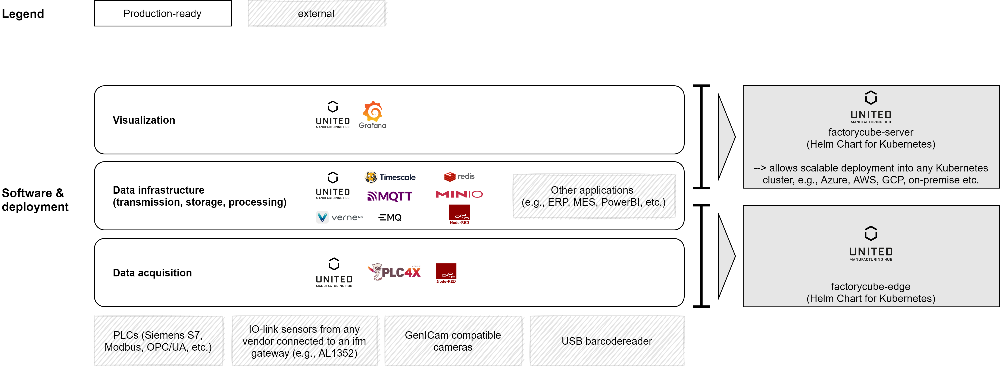
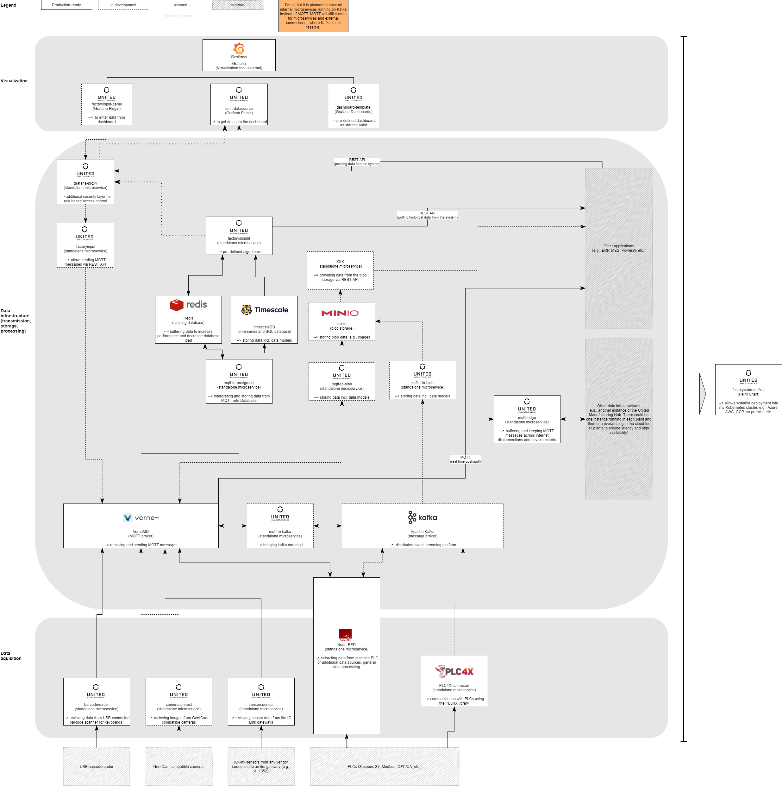

## High-level architecture

The United Manufacturing Hub consists out of three layers and two packages for installation:

The following sub-chapters will explain the layers and the two packages further. If you want to deep-dive into the actual architecture, you can [scroll further down](#low-level-architecture)

### Lower level: data acquisition

The data sources connected to the edge device provide the foundation for automatic data collection.  The data sources can be external sensors (e.g. light barriers, vibration sensors), input devices (e.g. button bars), Auto-ID technologies (e.g. barcode scanners), industrial cameras and other data sources such as machine PLCs. The wide range of data sources allows the connection of all machines, either directly via the machine PLC or via simple and fast retrofitting with external sensors.

**Examples:**

- sensorconnect (to automatically read out IO-Link Master and their connected sensors)
- cameraconnect (to automatically read out GenICam compatible cameras and push the result into MQTT, in development)
- barcodereader (to connect USB barcodereader and push data into MQTT)
- Node-RED (e.g., for propertiary and / or machine specific protocols)
- PLC4X (in development)

### Middle layer: data infrastructure

This layer is the central part of the United Manufacturing Hub. It provides an infrastructure including data models to fulfull all manufacturing needs for data processing and storage.

It starts by making all acquired data accessible in real-time for data processing using either established solutions like Node-RED or your own written software using a microservice approach and MQTT. Therefore, adding new data, processing it or integrating it with other systems on-the-edge is very easy. We recommend to start transforming data into the [central data model](/docs/concepts/mqtt/) at this step.

To send the raw and / or processed data to a central place (cloud or on-premise) we use our self-written [MQTT bridge](/docs/developers/factorycube-edge/mqtt-bridge/). Internet connections or network in general is often unstable in manufacturing environments and therefore one needs to safely buffer messages across internet or electricity downtimes. As existing MQTT bridge solutions were unreliable we developed our own.

Once the data arrives at the server it can be further processed using the same methods as on-the-edge (MQTT microservice, Node-RED, etc.). The real-time data can also integrated into MES or ERP systems.

All processed data is then stored into databases using load-balanced microservices with caching. Therefore, one can archieve high-availability and enourmous scalability through the load-balanced microservices. Furthermore, common requests and operations are cached in [redis](https://redis.io/) 

Relational data (e.g., data about orders and products) as well as time series data in high resolution (e.g., machine data like temperature) can be stored in the TimescaleDB database (difference between InfluxDB and timescaleDB have been described [in detail](/docs/concepts/timescaledb-vs-influxdb/)). Blob data (e.g., camera pictures) will be stored in a blob storage either directly [in Minio](https://min.io/) or using a Minio gateway in a cloud specific storage like [AWS S3](https://docs.min.io/docs/minio-gateway-for-s3.html) or [Microsoft Azure Blob Storage](https://docs.min.io/docs/minio-gateway-for-azure.html).

We do not allow direct access to the databases for performance and security reasons. Instead, we've put an additional, self-written, component in front called [factoryinsight](/docs/developers/factorycube-server/factoryinsight/). factoryinsight provides a REST API to access raw data from the databases as well as processed data in form of KPI's like 'OEE losses' or similar. All requests are load-balanced, cached and executed only on a replica of the database.

To insert data via a REST API we've developed two additional services [grafana-proxy](http://localhost:1313/docs/developers/factorycube-server/grafana-proxy/) and [factoryinput](/docs/developers/factorycube-server/factoryinput/).

**Examples:**

- TimescaleDB 
- Node-RED
- factoryinput
- factoryinsight
- minio

### Higher level: visualization 

As a standard dashboarding tool the United Manufacturing Hub uses [Grafana](https://grafana.com/) in combination with self-written plugins, which allow every user (even without programming knowledge) to quickly and easilyy compose personally tailored dashboards with the help of modular building blocks.

**Examples:**

- Grafana
- [umh-datasource and umh-factoryinput-panel](/docs/developers/factorycube-server/grafana-plugins/)

### The right side: deployment options

The entire stack can be deployed using only a configuration file (`values.yaml`) and the corresponding Helm charts factorycube-server and factorycube-edge.

This allows to deploy the architecture in hybrid setups, from deploying it on-the-edge IIoT gateways to on-premise servers to the cloud (e.g., Azure AKS)

## Low-level architecture

If you want to go more into detail, here is the detailled architecture:

