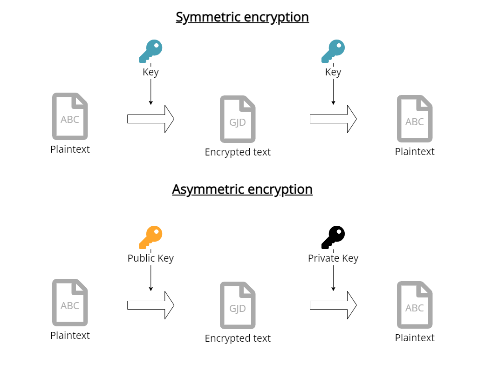

## Introduction

Newcomers to IT security are often confused about the difference between passwords and certificates. This article gives newcomers to IT security an introduction into the topic of secure communication with IoT devices. The focus is to explain the two fundamental methods to ensure that nobody else can read your communication, namely symmetric (e.g., passwords) and asymmetric encryption (e.g., certificates). 

The need to ensure that nobody else than you and the recipient can read messages exist for thousands of years and has always been a battle between people creating encryption methods and so-called code-breakers, that focus on trying to decipher other messages. Wars have been started, won and lost because of a knowledge advantage gained through secure communications (see also [ENIGMA](https://en.wikipedia.org/wiki/Enigma_machine) or [Zimmerman-Telegram](https://en.wikipedia.org/wiki/Zimmermann_Telegram)).

In today’s world, the topic of secure communication is more relevant than ever: companies want to protect their intellectual knowledge from other companies and want to protect themselves from [Ransomware attacks](https://en.wikipedia.org/wiki/Ransomware).

In IoT or Industrial IoT it is important as well: 

- How to ensure that the data send to the cloud from my microcontroller or PLC [^PLC] is not read or modified?
- How to push updates onto my PLCs or IoT devices and prevent that someone else modifies or pushes their own updates?
- What are these certificates that are required for a [connection to Azure IoT Hub](/docs/tutorials/azure/connecting-united-manufacturing-hub-with-azure-iot-hub/), an MQTT broker [^MQTT], or any other API?

Let's have fun and deep dive in!

[^MQTT]: Message Queuing Telemetry Transport, common IoT protocol, https://en.wikipedia.org/wiki/MQTT
[^PLC]: Programmable Logic Controller, industrial computer controlling production machines, https://en.wikipedia.org/wiki/Programmable_logic_controller

## Symmetric encryption

Let's start with the simpler method of both approaches: symmetric encryption. In cryptography, the field of encryption, methods are always explained using Alice, Bob, and Mallory. All of them (there are way more, see also the [Wikipedia article on Alice and Bob](https://en.wikipedia.org/wiki/Alice_and_Bob)) are fictional characters. Alice usually initiates the communication and wants to send a message to Bob without any third party like Mallory being able to read it.

Alice, Bob, and Mallory

In IoT, Alice could be a Raspberry Pi with a temperature sensor that is trying to send a message to Bob, who is a service running in the cloud. In Industrial IoT, Alice could be A PLC and Bob an Industrial IoT platform.

Alice, Bob, and Mallory practically

Before Alice and Bob can communicate with each other using a symmetric encryption they need to do two things first:

1. align on the encryption method
2. align on the secret, also called password

Let's explain symmetric encryption using Alice and Bob and one of the oldest, yet, one of the most famous encryptions, Caesar's cipher. This encryption technique is named after Julius Caesar's who used it for his private correspondence. 

before their first messages, Alice and Bob need to align to use this cipher and then additionally to use a number between 1-26 (which is also called a **secret**) first. 

When Alice wants to send a message to Bob, Alice needs to encrypt the plaintext using the cipher and the secret. For Caesar’s cipher, it works by shifting the alphabet x characters to the right (and x is the chosen number from above, the **secret**). 

Caesar’s cipher

For example, a right shift of 3 is resulting in the replacement of the letter A with D. Alice then sends the encrypted message to Bob. Bob then reverts the encryption by shifting the alphabet x characters back to the left, so a D gets converted back into an A. Now Bob can read the plaintext.

Theoretically, a third party like Mallory could not decrypt the encrypted message because Mallory doesn't know the **secret**. You might ask now: "But hey, couldn't Mallory just try out all numbers?" and you would be right. Having a secret or password that can only be between the numbers 1-26 is considered unsafe, but please keep in mind that this was the technology in ancient Rome.

In the example above we could easily crack the secret by trying out, which is also called brute-forcing. To prevent that more and more encryption methods emerged and almost as many methods to crack them - from good old brute-forcing to deriving parts of the secret by knowing already knowing certain parts of the plaintext (this was how the Allied cracked the German ENIGMA during World War 2). 

Today, we have encryptions like [AES](https://en.wikipedia.org/wiki/Advanced_Encryption_Standard) rooted in advanced mathematics and to which there are currently no shortcuts except brute-forcing. These keys usually have a fixed length, for example AES-128 has a 128-bit key, and are derived from an easy-to-remember password using a [key derivation function](https://en.wikipedia.org/wiki/Key_derivation_function). 

Brute-forcing the keys is not feasible with current or foreseeable hardware. The KDF is calculation intensive, which prevents brute-forcing easy-to-remember passwords (as long as they are reasonable long), so this method is currently approved in the U.S. for government documents of the highest classification.

Small side-topic: to login into systems, for example websites, you need to enter a username and a password. In these cases the password is not stored on the server, it is only stored as a [hash](https://en.wikipedia.org/wiki/Hash_function), so even if the database of the website gets compromised one cannot derive the password from the hash. If you are interested in this topic, we suggest reading the [following article](https://auth0.com/blog/hashing-passwords-one-way-road-to-security/).

Brute-forcing can also be improved by not checking everything randomly, but by e.g. checking the top 1000 common passwords or words from a dictionary (= dictionary attack).

So how do you then create good passwords? Several years ago the best practice was to use smaller randomly generated passwords, which should change frequently. But humans are humans and most of them will just add a ! or 1 at the end of the password. So nowadays the recommendation is to go for lengthy and still easy rememberable passwords. `if2s&sd5` is more insecure and way harder to remember than `AlexanderIs25YearsOldAndLikesToHaveHisDeskClean`.

Obligatory xkcd: https://xkcd.com/936/

But the approach itself, the symmetric encryption with a secret / password, has two fundamental flaws:

1. How can Alice and Bob exchange the secret without Mallory reading it? Meeting in person is nowadays not always an option.
2. How can Bob know that the message is coming from Alice and that nothing was changed or deleted by Mallory?

For this, some very smart people invented the approach of Public-Key-Encryption, also known as asymmetric encryption.

## Asymmetric encryption

In 1977 Ronald Rivest, Adi Shamir, and Leonard Adleman published an alternative method, which they called after their first letter in their name: RSA [^RSA]

Little fun fact: a similar method had already been developed at the British Agency GCHQ in 1970, but was classified at that time was not published until 1997 [^GCHQ]

[^RSA]: http://people.csail.mit.edu/rivest/Rsapaper.pdf
[^GCHQ]: https://web.archive.org/web/20080227001905/http://www.cesg.gov.uk/site/publications/media/notense.pdf

### Public-Key-Encryption

How does it work? For normal people here is a simple explaination from Computerphile on YouTube.



For the video haters out there, here is a small summary in text form:

Instead of using the same key for encrypting and decrypting you find a mathematic formula, that you can use separate keys, that belong together, but one cannot be derived from the other. 

In practice, you have one key, the public key, that everyone knows, and which you use to encrypt a message. To decrypt the message you have to use another key, the so-called private key. When Alice generates these keys, she will keep the private key for herself and publish the public key to everyone. 

She can also do the reverse: she can encrypt a message with her private key, so everyone will be able to decrypt it with her public key. Therefore, Bob can be sure that the message is coming from Alice (because only she has the private key and encrypt it like that).

*If you are interested in the maths behind it, we recommend taking a look [at the original paper](http://people.csail.mit.edu/rivest/Rsapaper.pdf). Or take a look [at this video tutorial](https://www.youtube.com/watch?v=4zahvcJ9glg)*

The following text assumes that you have watched the video above (or read the small summary).

These public keys or private keys, that Computerphile is talking about, is what you would call "certificates". They are usually stored as separate files in many different formats and file extensions. Here are some common ones for IoT: 

- .pub, .pem, .crt for public keys
- .key or no file type at all for private keys
- .csr contains no keys at all, but is related (see also [Certificate Signing Requests](https://en.wikipedia.org/wiki/Certificate_signing_request))
- .pfx, .p12, are other formats

What's most important is the content of the file, so very often you can just change the file extension and load it in (most are PEM encoded, which looks like [this](https://github.com/united-manufacturing-hub/united-manufacturing-hub/blob/main/deployment/factorycube-server/developmentCertificates/pki/ca.crt)). Sometimes the content differs (e.g., .pfx files or files in OpenSSH format are different than the usual PEM encoded .pem files), so you need conversion tools for that. If you are familiar with Google, it should be easy to find the correct tools and commands for that :)

### Public Key Infrastructure (PKI)

But how can Alice ensure that the Public Key is actually from Bob and not from Mallory? What Computerphile did not talk about are Certificate Authorities (CA) and Intermediaries.

A CA is basically just a public-key pair that acts as a trusted instance. It can prove that a public key actually belongs to the person, computer, or website it claims to belong to. It does that by encrypting the public key of Bob with the CA's private key (= Signing). These CA's are mostly preinstalled on your operating system and help you in identifying whether your bank login information is actually send to the bank and not to someone else.

In some instances, it might make sense to create your own Public Key Infrastructure (PKI). [You can find a guide on how to do that for example for MQTT brokers in our documentation](/docs/tutorials/general/pki/)

## How it works in IoT 

Practically, symmetric and asymmetric encryptions are used in parallel and combined with more advanced security topics like for example Diffie-Hellmann-Key-Exchange or Hashing. For more information on these advanced topics we can recommend to watch the YouTube videos from Computerphile ([Diffie-Hellmann-Key-Exchange](https://www.youtube.com/watch?v=NmM9HA2MQGI) and [Hashing](https://www.youtube.com/watch?v=b4b8ktEV4Bg))

The main reason for combining both technologies is computing speed. As a compromise, often a secret is generated and then shared between both parties using a (slow) asymmetric encryption. All the remaining messages are then encrypted using (fast) symmetric encryptions.

### HTTPS

You are using these technologies already every day when you are visiting HTTPS websites like the one you are currently on (starts with https://). If you are sending it via HTTP, everyone on the internet can read your messages (see screenshot).

Source: Ibrahim Ali Ibrahim Diyeb, Anwar Saif, Nagi Ali Al-Shaibany,"Ethical Network Surveillance using  Packet Sniffing  Tools:  A Comparative  Study",  International Journal  of  Computer Network  and  Information Security(IJCNIS), Vol.10, No.7, pp.12-22, 2018.DOI: 10.5815/ijcnis.2018.07.02 (https://www.researchgate.net/publication/326419957_Ethical_Network_Surveillance_using_Packet_Sniffing_Tools_A_Comparative_Study)

Security overview over our website docs.umh.app at 2021-10-18. Exact algorithms might change based on your browser

### Example: MQTT and CA's

In IoT we are relying on the same algorithms (SSL/TLS) that allow you to do safe online banking, with the exception that we cannot rely on external CA’s, but that we are creating it entirely ourselves. 

We have a CA, a intermediate CA (to prevent using the root CA all the time), a server certificate for the MQTT broker and then client certificates for the MQTT clients. 

**Small recap:** a CA is a trusted public-key pair. The intermediate CA is a public-key pair, that has been trusted by the root CA to take over the role of signing for a given time and in a given scope. A root CA is the "head" of the CA chain and can do everything.

The server certificate is the public side of the public-key pair created specifically for the MQTT broker, and where the intermediate CA signed it saying "yup, this is really the server mqtt.umh.app and it belongs to us. It can also act as a server.". 

The client certificates are signed by the intermediate CA as well with the permission to act only as clients (and not as server).

The public key of the root CA is embedded in all of our software, so that these devices know that, even if they never talked to each other before, they are communicating with whom they should communicate (e.g., a client connects to an MQTT broker and not to another client or someone entirely else). 

This is the reason you need to copy these certificates onto the devices.

### Example: viewing and analyzing the MQTT certificates 

Last but not least, let's take a look at the MQTT Public-Key infrastructure in detail. Specifically, let's analyze these certificates.

In the folder `deployment/factorycube-server/developmentCertificates/pki` you find an example PKI infrastructure for factorycube-server. Almost all files are autogenerated with [`easy-rsa`](https://github.com/OpenVPN/easy-rsa) and you can actually ignore most of them. You can create your own PKI [by following our tutorial](/docs/tutorials/general/pki/)

Let's deep dive into 4 different certificates, to understand the structure of a PKI better:

1. ca.crt
2. issued/factorycube-server-vernemq.crt
3. issued/TESTING.crt
4. private/TESTING.key

Each certificate will be opened in [xca](https://hohnstaedt.de/xca/), which is a graphical tool for creating and managing a PKI.

After importing the above certificates xca will look like this:

xca certificate section, after importing the above certificates

xca private key section, after importing the above certificates

#### ca.crt / "Easy-RSA CA"

This is the public-key of the root certificate (also known as root CA). We see that the certificate in the file ca.crt has the name "Easy-RSA CA".

When opening it in an editor, it will look like gibberish:

ca.crt in raw format

After importing it to xca and clicking on it we can see all its details:

ca.crt in xca
ca.crt in xca - extensions

This includes:

- Fingerprint (to easily identify a key)
- Expiration (on the bottom)
- That is is a certificate authority (see second screenshot `CA:TRUE`)
- That it can be used to sign other certificates (see second screenshot `X509v3 Key Usage`)

In the overview panel in xca we see after importing the other certificates, that the others are shown under this certificate. xca automatically detects that ca.crt is the root CA and that is has signed the other certificates. It will therefore visualize it like that.

#### factorycube-server-vernemq.crt / "factorycube-server-vernemq"

This is the public-key of the MQTT server key-pair and you can view the same information as in the certificate above with some exceptions:

factorycube-server-vernemq.crt in xca

factorycube-server-vernemq.crt in xca - extensions

1. It is signed by Easy-RSA CA (see Signature)
2. It is not a CA and can only sign (but cannot sign other certificates, see `X509v3 Key Usage`)
3. The whole purpose is beeing a Webserver for the domain factorycube-server-vernemq (if you access it under a different domain the client will say that the certificate is invalid). You can see it under the points `X509v3 Extended Key Usage` and `X509v3 Subject Alternative Name`

#### TESTING.crt / "TESTING"

This is a client key and is only allowed to be used as a client (see `X509v3 Extended Key Usage`).

TESTING.crt in xca - extensions

#### TESTING.key / "TESTING"

This is the private key for the certificate above.

TESTING.key in xca

## Outlook

“But is it really secure?”, one might ask. Probably every security expert would answer that with “It depends” (if someone says yes, they are probably no expert), quickly followed by “it is the best that we have so far”. Technologies like these are officially recommended by basically all national and international security agencies, even for critical applications like energy or banking sectors ([NIST for the USA](https://csrc.nist.gov/news/2019/nist-publishes-sp-800-52-revision-2), [BSI for Germany](https://www.bsi.bund.de/DE/Themen/Oeffentliche-Verwaltung/Mindeststandards/TLS-Protokoll/TLS-Protokoll_node.html)).

With the current rise of quantum computing the current algorithms might be considered ineffective in some time into the future, but we already have post-quantum algorithms out there that can safely be integrated into the current infrastructures. If you are interested, you can [visit the website of the current tournament of the NIST](https://csrc.nist.gov/projects/post-quantum-cryptography/round-3-submissions)

