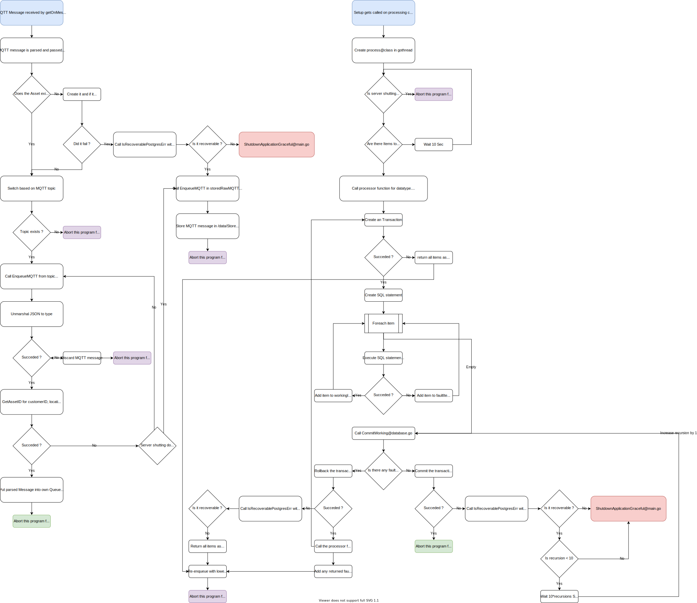

mqtt-to-postgresql subscribes to the MQTT broker (in the stack this is [VerneMQ](https://github.com/vernemq/vernemq)), parses incoming messages on the topic "ia/#" and stores them in the postgresql / [timescaleDB database](https://github.com/timescale/timescaledb) (if they are in the correct [datamodel](/docs/concepts/mqtt/))

## Getting started

Here is a quick tutorial on how to start up a basic configuration / a basic docker-compose stack, so that you can develop.

docker-compose -f ./deployment/mqtt-to-postgresql/docker-compose-mqtt-to-postgresql-development.yml --env-file ./.env up -d --build

## Message processing flow
Below diagram shows an abstract flow, of an incoming MQTT message.

## Environment variables

This chapter explains all used environment variables.

### POSTGRES_HOST

**Description:** Specifies the database DNS name / IP-address for postgresql / timescaleDB 

**Type:** string

**Possible values:** all DNS names or IP 

**Example value:**  united-manufacturing-hub

### POSTGRES_PORT

**Description:** Specifies the database port for postgresql 

**Type:** int

**Possible values:** valid port number 

**Example value:** 5432

### POSTGRES_DATABASE

**Description:** Specifies the database name that should be used 

**Type:** string

**Possible values:** an existing database in postgresql 

**Example value:**  factoryinsight

### POSTGRES_USER

**Description:** Specifies the database user that should be used 

**Type:** string

**Possible values:** an existing user with access to the specified database in postgresql 

**Example value:**  factoryinsight

### POSTGRES_PASSWORD

**Description:** Specifies the database password that should be used 

**Type:** string

**Possible values:** all

**Example value:**  changeme

### DRY_RUN

**Description:** Enables dry run mode (doing everything, even "writing" to database, except committing the changes.) 

**Type:** string

**Possible values:** true,false

**Example value:**  false

### REDIS_URI

**Description:** URI for accessing redis sentinel  

**Type:** string

**Possible values:** All valids URIs

**Example value:** united-manufacturing-hub-redis-node-0.united-manufacturing-hub-redis-headless:26379

### REDIS_URI2

**Description:** Backup URI for accessing redis sentinel  

**Type:** string

**Possible values:** All valids URIs

**Example value:** united-manufacturing-hub-redis-node-1.united-manufacturing-hub-redis-headless:26379

### REDIS_URI3

**Description:** Backup URI for accessing redis sentinel  

**Type:** string

**Possible values:** All valids URIs

**Example value:** united-manufacturing-hub-redis-node-2.united-manufacturing-hub-redis-headless:26379

### REDIS_PASSWORD

**Description:** Password for accessing redis sentinel  

**Type:** string

**Possible values:** all 

**Example value:** changeme 

### MY_POD_NAME

**Description:** The pod name. Used only for tracing, logging and  MQTT client id. 

**Type:** string

**Possible values:** all 

**Example value:** app-mqtttopostgresql-0 

### MQTT_TOPIC

**Description:** Topic to subscribe to. Only set for debugging purposes, e.g., to subscribe to a certain message type. Default usually works fine.  

**Type:** string

**Possible values:**  all possible MQTT topics 

**Example value:** $share/MQTT_TO_POSTGRESQL/ia/# 

