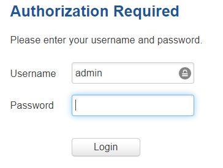
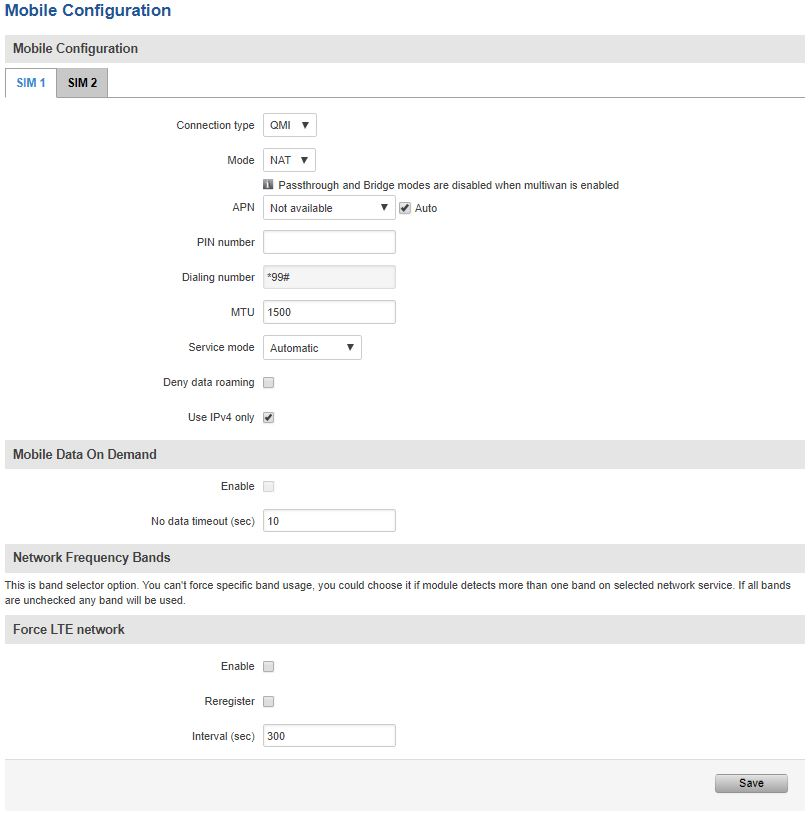
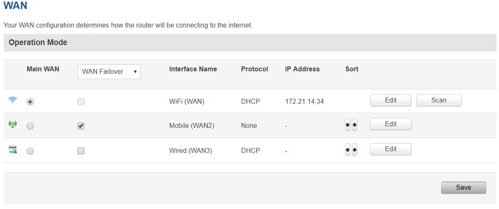

# Three step implementation plan for using the factorycube

## Contents

- [Three step implementation plan for using the factorycube](#three-step-implementation-plan-for-using-the-factorycube)
  - [Contents](#contents)
  - [Create a sensor plan](#create-a-sensor-plan)
  - [Discuss and install](#discuss-and-install)
  - [Supply your factorycube with power and turn it on](#supply-your-factorycube-with-power-and-turn-it-on)
  - [Setup sensors](#setup-sensors)
  - [Connect your factorycube to the internet](#connect-your-factorycube-to-the-internet)
    - [Instructions to login](#instructions-to-login)
    - [3 ways to connect to the internet: WiFi, 3G/4G or Ethernet](#3-ways-to-connect-to-the-internet-wifi-3g4g-or-ethernet)
      - [Instructions to setup WiFi](#instructions-to-setup-wifi)
      - [Instructions to setup 3G/4G](#instructions-to-setup-3g4g)
      - [Instructions to set up connection via Ethernet](#instructions-to-set-up-connection-via-ethernet)
  - [Outro](#outro)

Please ensure that you have read the safety information and manuals before proceeding! Failure to do so can result in damages to the product or serious injuries.

## Create a sensor plan

Please create before installing anything a sensor plan. Prior to installing take the layout of your selected line and add:

- Electricity sockets
- Internet connections (bring your own)
- Your planned sensors
- The position of the factorycube
- Your planned cabling

## Discuss and install

Setup a meeting with your line engineers and discuss your plan. Then install everything according to plan. Ensure, that all sensors and cables are mounted tightly and that they do not interfere with the production process.

## Supply your factorycube with power and turn it on

Plug in the power cable to turn the factorycube on. After a few seconds the ia: factorycube should be lit up.

## Setup sensors

Refer to [this guide](sensors/mounting-sensors.md) for instructions and tipps to setup the sensors.

## Connect your factorycube to the internet

If you want to use the cloud dashboard, you must first connect the factorycube to the internet.

You need:

- your credentials
- an Ethernet cable (provided)
- a laptop which is not connected to any VPN

### Instructions to login

Connect the factorycube with your computer via an ethernet cable using the IO-Link port (not Internet!) on the factorycube.

Open the following website on your browser: <http://172.16.x.2> (The X stands for the last number(s) of the serial number. e.g. 2019_0103 -> x=3 or 2019_0111 -> x=11)

Enter your credentials according to the information in the customer area. The username is always “admin”

### 3 ways to connect to the internet: WiFi, 3G/4G or Ethernet

Further information on how to connect the factorycube with the internet can be found in the [official router manual](https://wiki.teltonika-networks.com/view/RUT955_WAN)

#### Instructions to setup WiFi

- Select "Network" → "Wireless/Wlan". If necessary remove the old Wireless station point
- Click on "Add" next to wireless station mode
- Click on "Start Scan" next to wireless station mode
- Click on the network of your choice
- "join network”
- Afterwards enter your credentials and confirm

The computer should now be connected to the internet.

#### Instructions to setup 3G/4G

- Insert the SIM-card (if a SIM-card is already provided in the ia: factorycube, skip this step)
- For the installation of a SIM card please contact our experts
- Select "Network" → "Mobile"
- Adjust the settings under the "General" tab as follows:

- Save your settings

The computer should now be connected to the internet.

#### Instructions to set up connection via Ethernet

- Plug the Ethernet cable into the device's “Internet” port and the other side into the network access port
- Select "Network" --> "WAN"
- Select as wired as your main WAN

- Click save

The computer should now be connected to the internet. You can now the entire United Manufacturing Hub Edge Stack. For more information, take a look in the [getting started with edge devices](getting-started.md).

## Outro

Closely monitor the data and verify over the entire duration of the next days, whether the data is plausible. Things that can go wrong here:

- Sensors not mounted properly and not calibrated anymore
- The operators are using the line different from what was discussed before (e. g., doing a changeover and removing the sensors)
