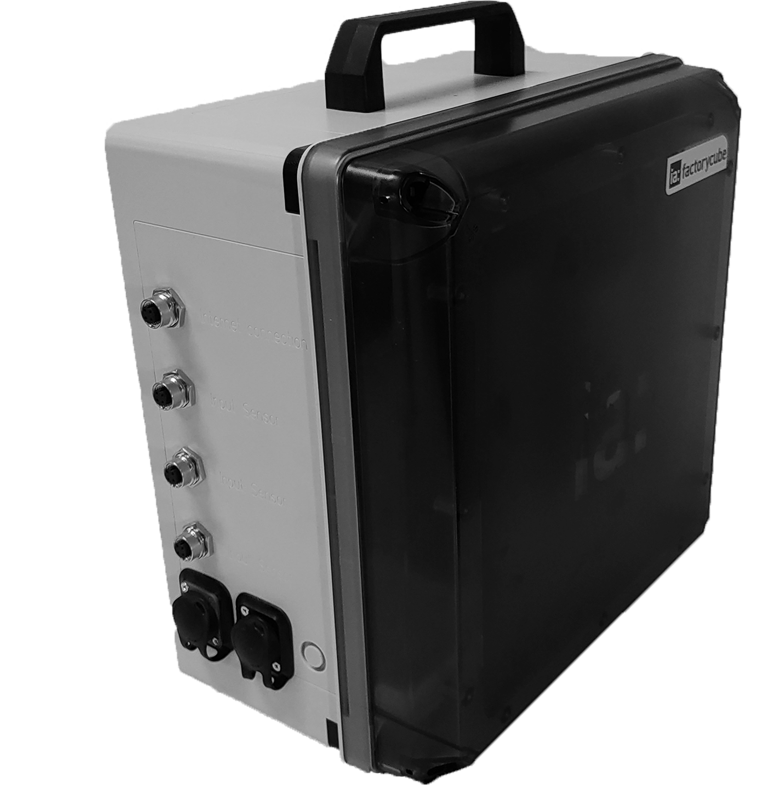
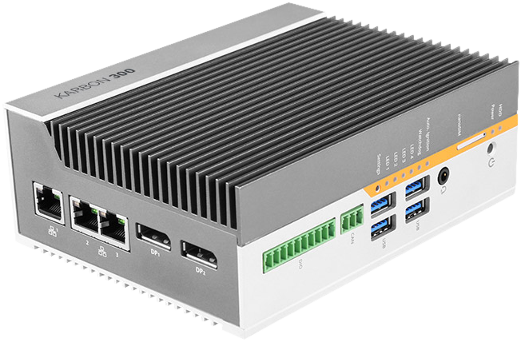
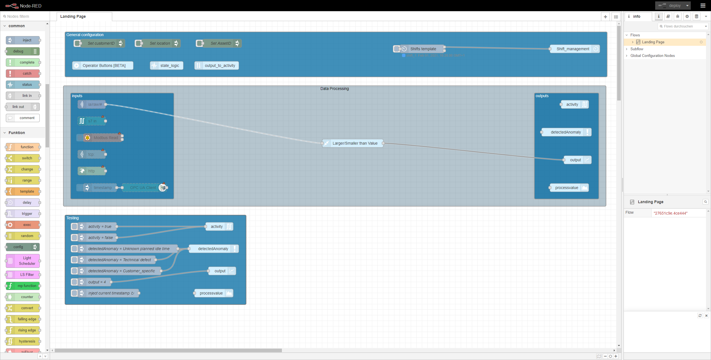
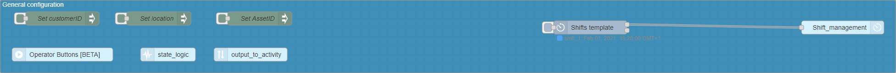
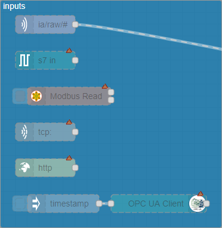
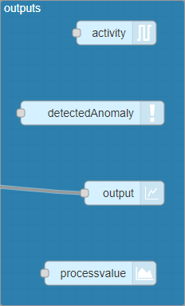
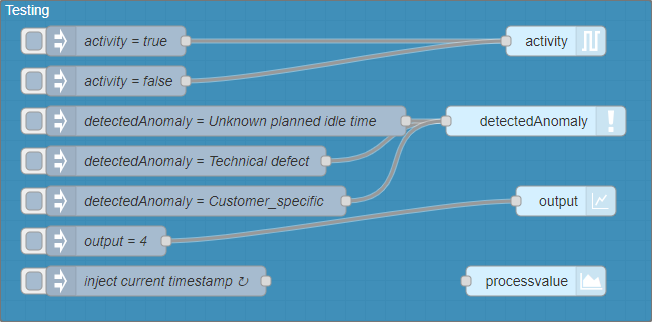

# Getting Started

## 1. Preparation

The first step to be able to use the system is to install the hardware and put it into operation.

**Use our certified Hardware:**

 

To get our hardware up and running you can follow [these instructions](factorycube.md).

**Use you own Hardware:**

If you want to use your own hardware, that is of course no problem. To install the required software on the hardware use this [guide for the core stack](installation-core.md) or this [guide for the advanced stack](installation-advanced.md).

After you have installed the required software on your hardware, you can use [these instructions](sensors/mounting-sensors.md) to install and commission any external sensors that may be required.
## 2. Configure node-red for data pre-processing

**The basic approach for data processing on the local hardware is to extract data from various data sources (OPC/UA, MQTT, Rest), extract the important information, and then make it available to the United Manufacturing Hub via a predefined interface (MQTT). For this data processing on the local hardware we use Nodered.**

To extract and pre-process the data from different data sources we use the open source software node-red. node-red is a low-code programming for event-driven applications.

If you haven't worked with node-red yet, [here](https://nodered.org/docs/user-guide/) is a good documentation from node-red!



[Here you can download the flow](../examples/flows/standard_flow.json)

### General Configuration



Basically, 3 pieces of information must be communicated to the system. For more information feel free to check [this article](../general/mqtt.md). These 3 information must be set to the system via the green configuration node-red, so that the data can be assigned exactly to an asset

The customer ID to be assigned to the asset: *customerID*

The location where the asset is located: *location*

The name of the asset: *AssetID*

Furthermore, you will find under the general settings, the state logic which determines the machine *state* with the help of the *activity* and *detectedAnomaly* topic. For more information feel free to check [this article.](../general/mqtt.md)
### Inputs:


**With the help of the inputs you can tap different data sources. Like for example:**
- OPC/UA ([documentation for this node](https://flows.nodered.org/node/node-red-contrib-opcua))
- Siemens S7 ([documentation for this node](https://flows.nodered.org/node/node-red-contrib-s7))
- TCP/IP ([documentation for this node](https://flows.nodered.org/flow/bed6f676d088670d7e1bc298943338b5))
- Rest API  ([documentation for this node](https://cookbook.nodered.org/http/create-an-http-endpoint))
- Modbus  ([documentation for this node](https://flows.nodered.org/node/node-red-contrib-modbus))
- MQTT ([documentation for this node](https://cookbook.nodered.org/mqtt/))

**Interaction with sensorconnect (Plug and Play connection of IO-Link Senosors):**

With the help of Sensorconnect, different sensors can be connected quickly and easily via an IFM gateway. The sensor values are automatically extracted from the software stack and made available via [MQTT](http://www.steves-internet-guide.com/mqtt-works/).

To get a quick and easy overview of the available MQTT messages and topics we recommend the [MQTT Explorer](http://mqtt-explorer.com/). If you don't want to install any extra software you can use the MQTT-In node to subscribe to all available topics by subscribing to  `#` and then direct the messages of the MQTT in nodes into a debugging node. You can then display the messages in the nodered debugging window and get information about the topic and available data points.


Topic structure: `ia/raw/<transmitterID>/<gatewaySerialNumber>/<portNumber>/<IOLinkSensorID>`

#### Example for ia/raw/

Topic: `ia/raw/2020-0102/0000005898845/X01/210-156`

This means that the transmitter with the serial number `2020-0102` has one ifm gateway connected to it with the serial number `0000005898845`. This gateway has the sensor `210-156` connected to the first port `X01`.

```json
{
"timestamp_ms": 1588879689394, 
"distance": 16
}
```


### Extract information and make it available to the **outputs**:
In order for the data to be processed easily and quickly by the United Manufacturing hub, the input data (OPC/UA, Siemens S7) must be prepared and converted into a standardized data format (MQTT Topic). For a deep explanation of our MQTT data model check [here](../general/mqtt.md) and [here](../general/state.md).



The 4 most important data points:
- Information whether the machine is running or not: `/activity`
- Information about anomalies or concrete reasons for a machine standstill: `/detectedAnomaly`
- The produced quantity: `/count`
- An interface to communicate any process value to the system (e.g. temperature or energy consumption) - `/processvalue`

Using the information from the topics `/activtiy` and `/detectedAnomaly` the statelogic node calculates the discrete machine state. By first checking if the machine is running or not. If the machine is not running the machine state is set equal to the last `/detectedAnomaly` analogous to [state.md](../general/state.md). The discrete machine state is then made available again via the `/state` topic.

**Implementation example: You would like to determine the output and machine condition of a filling machine.**

Used Sensors:
- Lightbarrier for counting the bottles 
- A button bar via which the machine operator can inform the system that he is on break, for example

1.  Extract via the MQTT in node the information of the light barrier whether a bottle was produced. If a bottle was produced send a message to the output/count topic analog to [mqtt.md](../general/mqtt.md).
2.  Use the output_to_activity node to use the information "a bottle was produced" to determine the information "the machine is running". E.g. If every X seconds a bottle is produced set the activity equal to true analog to [mqtt.md](../general/mqtt.md).
3.  Use the information of the button bar to tell the system why the machine is not running. e.g. Whenever button 3 is pressed send pause to the detectedAnomaly node analog to [mqtt.md](../general/mqtt.md).

Now the machine status is automatically determined and communicated to the united manufacturing hub for further analysis. Like for example the speed loss.

TODO: add example Flow
### Testing:


[See also DCC Aachen example in our showcase.](../examples/dcc-assembly-analytics.md)

## 3. Configure your Dashboard

TODO
