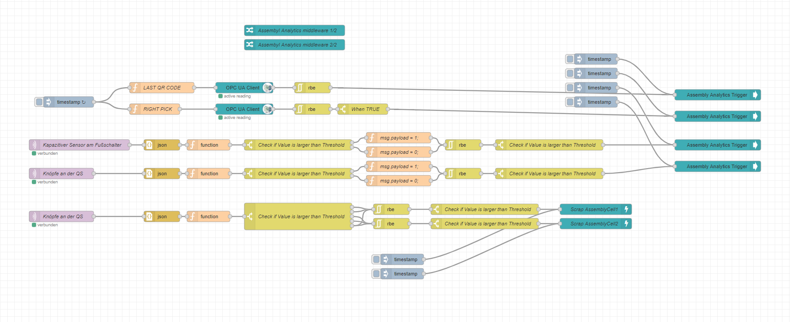

# Getting Started
## 1. Setup Hardware:
The first step to be able to use the system is to install the hardware and put it into operation.

**Use our certified Hardware:**

  

To get our hardware up and running you can follow [these instructions](factorycube.md).

**Use you own Hardware:**

If you want to use your own hardware, that is of course no problem. To install the required software on the hardware use this [guide for the core stack](installation-core.md) or this [guide for the advanced stack](installation-advanced.md).

After you have installed the required software on your hardware, you can use [these instructions](sensors/mounting-sensors.md) to install and commission any external sensors that may be required.

## 2. Configure Nodered for pre prosessing
To extract and preprocess the data from different data sources we use the open source software Nodered. Nodered is a low-code programming for event-driven applications.

If you haven't worked with Nodered yet, [here](https://nodered.org/docs/user-guide/) is a good documentation directly from Nodered!

**TODO: You can download this standard flow here**

### General Configuration:

Basically, 3 pieces of information must be communicated to the system. For more information feel free to check [this article](../general/mqtt.md). These 3 information must be set to the system via the green configuration nodered, so that the data can be assigned exactly to an asset

The customer ID to be assigned to the asset: *customerID*

The location where the asset is located: *location*

The name of the asset: *AssetID*

Furthermore, you will find under the general settings:
- The state logic which determines the machine *state* with the help of the *activity* and *detectedAnomaly* topic. For more information feel free to check [this article.](../general/mqtt.md)
  
### Inputs:

### Outputs:

### Assembly Analytics:
With the help of Assembly Analytics Nodes, it is possible to measure the cycle time of assembly cells in order to measure and continuously improve their efficiency in a similar way to machines.

**Here is an exemplary implementation of those nodes:**

There are 2 stations with a total of 4 cycles under consideration

**Station 1 (AssemblyCell1):**

1a: Starts with scanned barcode and ends when 1b starts

1b: Starts with a trigger at the pick to light station and ends when station 1a starts

**Station 2 (AssemblyCell2):**

2a: Starts when the foot switch at the 2nd station is pressed and ends when 2b starts

2b: Starts when the quality check button is pressed and ends when 2a starts.

Assumptions:
- Unrealistically long cycle times are filtered out (cycle times over 20 seconds).
- There is a button bar between the stations to end the current cycle and mark that product as scrap. The upper 2 buttons terminate the cycle of AssemblyCell1 and the lower ones of AssemblyCell2. The aborted cycle creates a product that is marked as a scrap.

**Nodes explained:**

- Assembly Analytics Trigger: Cycles can be started with the help of the "Assembly Analytics Trigger" software module.

- Assembly Analytics Scrap: With the help of the software module "Assembly Analytics Scrap", existing cycles can be aborted and that produced good can be marked as "scrap".
- With the help of the software module "Assembly Analytics Middleware", the software modules described above are processed into "unique products".

[Here you can download the flow described above](../examples/flows/AssemblyAnalytics.json)

## 3. Configure your Dashboard

Lorem ipsum dolor sit amet, consetetur sadipscing elitr, sed diam nonumy eirmod tempor invidunt ut labore et dolore magna aliquyam erat, sed diam voluptua. At vero eos et accusam et justo duo dolores et ea rebum. Stet clita kasd gubergren, no sea takimata sanctus est Lorem ipsum dolor sit amet. Lorem ipsum dolor sit amet, consetetur sadipscing elitr, sed diam nonumy eirmod tempor invidunt ut labore et dolore magna aliquyam erat, sed diam voluptua. At vero eos et accusam et justo duo dolores et ea rebum. Stet clita kasd gubergren, no sea takimata sanctus est Lorem ipsum dolor sit amet.