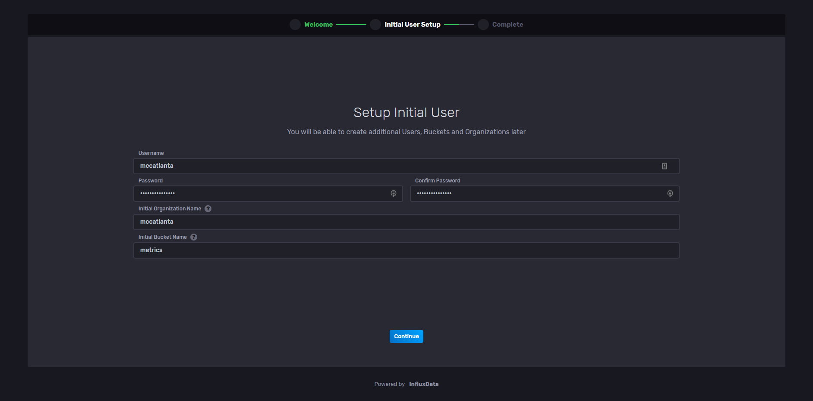

# Installing the core stack

## Contents

- [Installing the core stack](#installing-the-core-stack)
  - [Contents](#contents)
  - [Introduction](#introduction)
  - [Basic software setup](#basic-software-setup)
  - [Software configuration](#software-configuration)

## Introduction

The following steps assume that you have a copy of `/deployment/factorycube-core` repository and the MQTT SSL certificates related to the serial number and the login details of the factorycube you are setting up. For more information about how the `stack_setup.sh` script works, please see the following page.

This guide takes the serial number *2020-XXXX* as **example**. Replace it accordingly with yours.

## Basic software setup

1. We recommend using [MobaXterm](https://mobaxterm.mobatek.net/download.html) as a SSH client. If you have already installed it skip step **1**.
2. Open MobaXterm and start a new **session** 
3. Choose as session type **SSH**
4. Please type in the IP of the mini PC as shown in the picture and the username. Use **Port 22** and click on **OK** 
5. Now you are connected to the mini PC. Login with the correct credentials
6. Copy the folder `/deployment/factorycube-core`
7. Copy the certificate that you received from the server administrator as a **ZIP-File** into MobaXterm into the folder `factorycube-core`
8. Check if you are in the directory of the `factorycube-core`. If not type in this command in the terminal:

```sh
cd factorycube-core/
```

**temporary quick and dirty** :

```sh
sudo cd persistentData/mosquitto/config/
```

a. Open the .config file
b. Use the "strg f" function to search for "ia/changeme/"

c. change "changeme" for the clientid e.g (generic one! - factorycube)
d. save the file

1. Please type in the following command

```sh
chmod +x stack_setup.sh
```

2. Run the `stack_setup.sh` script with administrator rights and with the factorycube's serial number as argument.

```sh
sudo ./stack_setup.sh 2020-XXXX
```

 **For the next steps please leave MobaXterm open.**

## Software configuration

1. Open influxDB with <http://172.16.XX.2:8080/> replace for **"XX"** the last two numbers of the serial number. Afterwards click on **Get Started**
2. Type in a **Username** a **password** and a **Initial oranization Name** and extend the Wiki entry with the credentials for influxDB. Use generic usernames. Under the column **Initial Bucket Name**
 type in **metrics** as shown in the picture below. Confirm your steps by clicking **Continue**

 Always use generic usernames!(factorycube)

 
3. Choose **Configure Later** as shown in the picture below 
4. Click on **Data** and afterwards on **Tokens** 
5. Click on **+Generate** and afterwards on **Read/Write Token** 
6. Create one Token for Grafana.
7. Create a Token for Telegraf. Repeat step 5 first
8. Open Local Grafana  <http://172.16.XX.2/> replace for **"XX"** the last two numbers of the serial number. **"Account:ia" "password:ia"**. Afterwards click on the settings symbol and on **Data Sources** 
9. Click on **Add data source**
10. Choose **Flux[InfluxDB](BETA)**
11. Type in every value and compare it to the picture below. Attention: Create the same Organization you have used in step 2 and copy the Token from InfluxDB as shown in step 12 below. Add influxDBv3 to Name.
For this step you have to open InfluxDB again
12. Location where you find the token for Grafana on InfluxDB
13. Copy the Token into Grafana as shown in step 10.

14. Open the MobaXterm Terminal and type in the following command:

```bash
cd.. && sudo chmod -R 777 ia-factorycube-production
```

16. Open with MobaXterm the `.env` file and type in the Token of **Telegraf**  **(NOT THE GRAFANA TOKEN)** and the Organisation_Name as shown in the picture below. Replace for **"XX"** the correct Organization, you have created in step 2, and Token. After this step save the change.


17.  Please type in the following Command into the MobaXterm Terminal:

```bash
sudo docker-compose up -d
```
