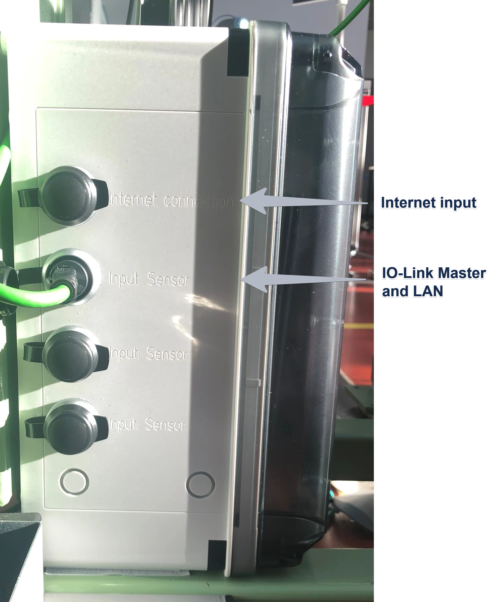
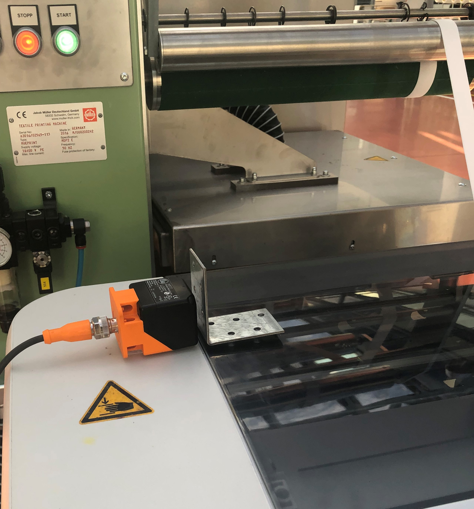
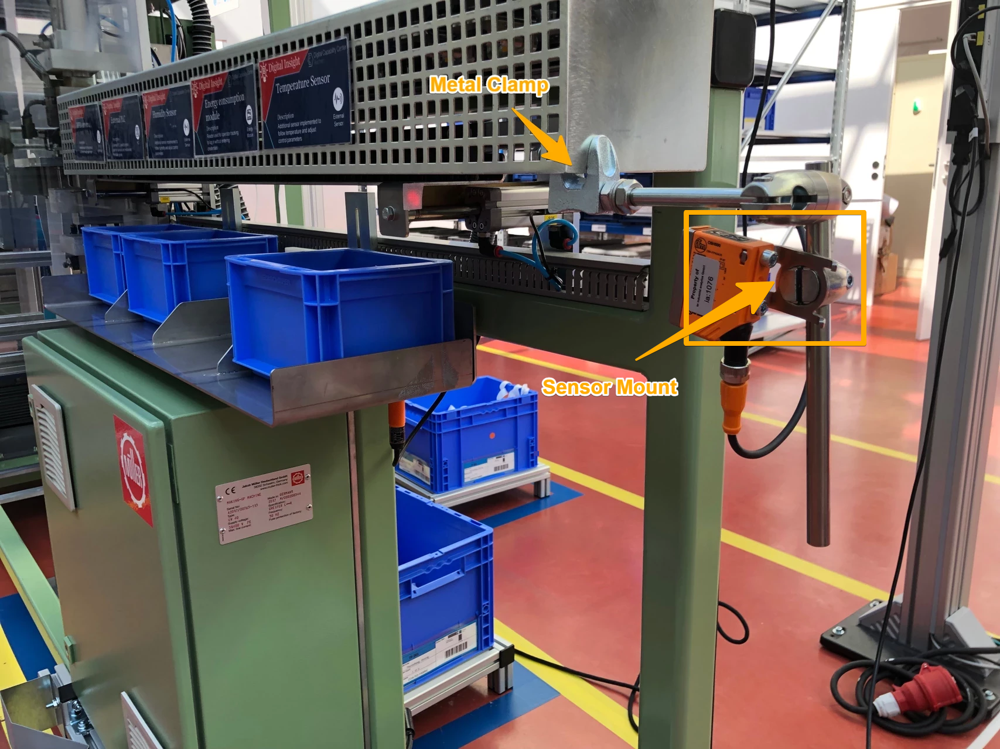
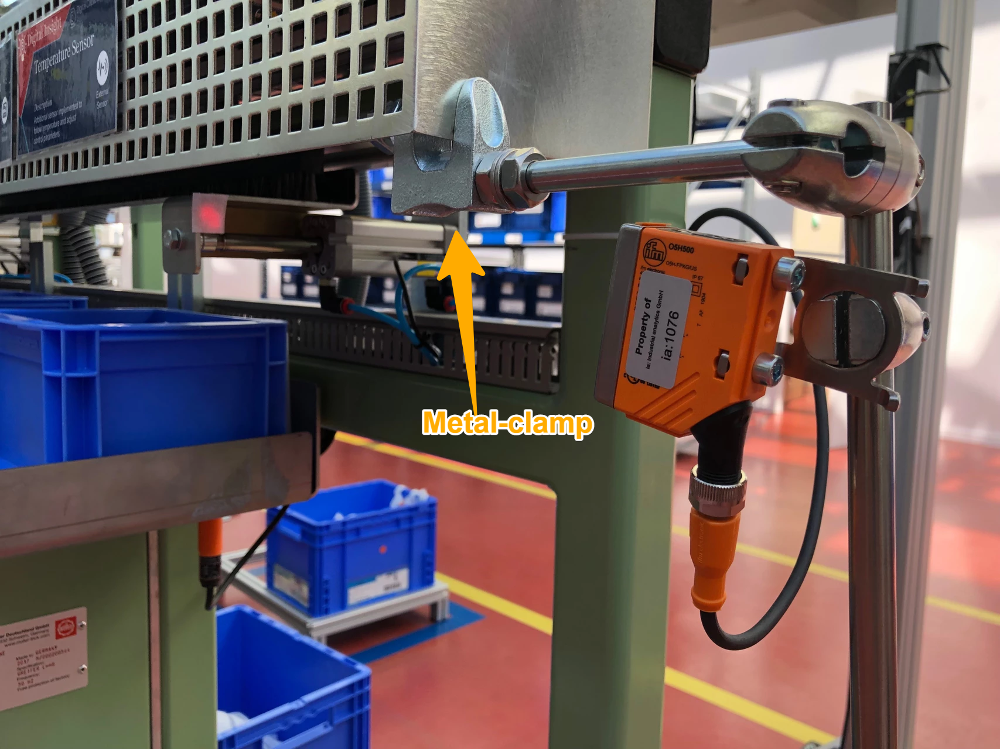

# Tips and tricks for installing and mounting ifm gateways and sensors

## Contents

- [Tips and tricks for installing and mounting ifm gateways and sensors](#tips-and-tricks-for-installing-and-mounting-ifm-gateways-and-sensors)
  - [Contents](#contents)
  - [Cabling](#cabling)
  - [Mount the sensors](#mount-the-sensors)
    - [Proximity Sensor](#proximity-sensor)
    - [Light Barrier O5H500 or O5D100](#light-barrier-o5h500-or-o5d100)
  - [Configure the sensors](#configure-the-sensors)

## Cabling

- Connect the gateway with a power supply. The LEDs should start flashing
- Connect the "IoT port" of the gateway via Ethernet with the factorycube. The IoT port should now start blinking
- Connect the sensor cable to the sensor and the IO-Link master. Align the connections using the pins in the connector. After plugging in the connector, tighten the screws. The LED should now start to shine
- The sensor is now detected automatically by the factorycube

## Mount the sensors

After connecting the sensors you need to find a suitable place to mount them. Here are some ideas on how you can mount them:

### Proximity Sensor

Use double-sided adhesive tape to attach the sensor and the metal counterpart to the machine.

### Light Barrier O5H500 or O5D100

As a first step, the sensor should be attached to the sensor mounting bracket.

.png)

With the help of rods and hinges it is possible to align the sensor with this system to achieve an optimal positioning.

If you have a flat sheet of metal at the point where the sensor is to be fixed, you can use the metal clamp to fix it.

If you have the ability to fix the sensor with cable ties you can attach it to a screw with the help of the sensor fixing.

## Configure the sensors

Some sensors, e. g. light barriers, offer you advanced configuration options. Here we will guide you through the process of setting them up.