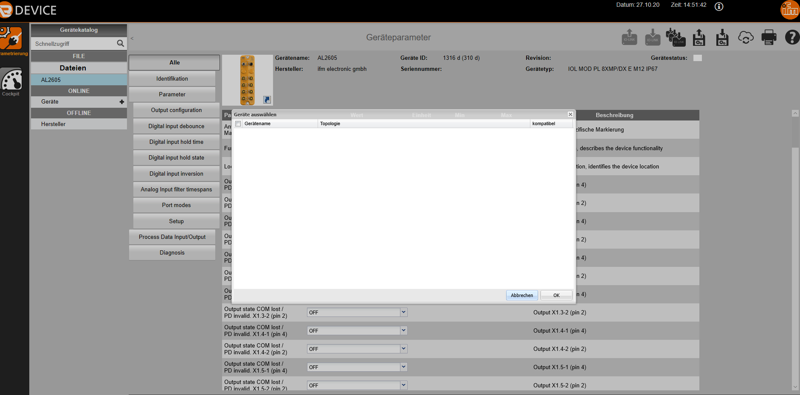

# How to Setup AL2605

The AL2605 is delivered with the "Cyclic" software and must be manually changed to Acyclic using LR Device.

"Please open the AL2605 Acyclic in the "Offline Catalog" and save the file ( see Figure 1).

Then please open the file ( It should open LR Device again in a new tab).

Then please select the icon "Write to multiple selected devices" on the top left. A window will open with the possible devices. ( See Figure 2).

Then you should find the item "Port modes" in the overview".

The port mode can then be set according to the [instructions](https://www.ifm.com/mounting/80293147DE.pdf)

## Figure 1

## Figure 2

