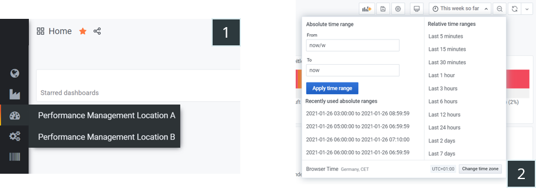

# Brewery

## Profile

| category | answer |
| :---------- | :------------- |
| Industry | Brewery |
| Employees | ~150 |
| Number of retrofitted sites | 1 |
| Project duration | 3 months |
| Number of retrofitted machines | 8 |
| Types of machines retrofitted | Entire filling line (filler, labeler, palletizer, etc.) |

### Photos

## Challenges

### Lack of transparency about production processes

- Duration and causes of machine downtimes are unclear
- High proportion of smaller microstops with unknown cause
- Exclusively reactive maintenance, as data on the condition of the components is lacking

### Moving bottleneck

- Since the production process is highly interlinked, a stoppage of a single machine can lead to a stoppage of the entire line
- The problem machine "bottleneck machine" is difficult to identify, as it can shift during a shift and is difficult to see with the eye

### High effort to collect data as part of the introduction of a continuous improvement process

- Changeover times must be recorded manually with a stop watch and are still not very standardized
- No data on past and current machine utilization available
- Maintenance actions recorded manually, no automatic system to log, store and visualize error codes from machine

## Solution

### Integration

At the beginning, a "BDE entry program" was carried out together with a lean consulting to identify optimization potentials and to present our solution. For this purpose, the [factorycube] was installed at the filler within a few hours in combination with the tapping of electrical signals from the control system and button strips. A connection of the PLC interfaces was initially out of the question due to time and cost reasons. After the customer decided on a permanent solution, the factorycube was dismounted.

All machines have been equipped with the "Weihenstephaner Standards", [a protocol commonly used in the German brewery industry](https://www.weihenstephaner-standards.de/en/home/) and were already connected within a machines network. Therefore, the installation was pretty straightforward using our enterprise plugin for that protocol and one central server.

### Installed hardware

#### Server

### Implemented dashboards

The customer opted for our SaaS offering. We created the following dashboards for the client.

#### Navigation

Default navigation options from Grafana, which we modified to allow custom menus.

1. Customizable menu lets you quickly navigate between dashboards
1. In the time selection you can adjust the times for the current dashboard

#### Plant-manager dashboard

1. Dashboard for the plant manager / shift supervisor, which gives an overview of the production in the factory
1. For each machine the current machine status
1. For each machine, the overall equipment effectiveness / OEE for the selected time period
1. For each machine, a timeline showing the machine statuses in color

#### Performance cockpit

1. Dashboard for the supervisor to get an overview of the machine
1. The current machine status 
1. The overall equipment effectiveness / OEE for the selected time period, including trend over time
1. The average changeover time
1. The average cleaning time
1. A timeline where the machine states are color coded
1. A timeline where the shifts become visible
1. A timeline with the machine speed
1. Overview of the number of individual stop reasons, excluding technical defects as they are not relevant for the shift

#### Maintenance cockpit

1. Dashboard for the head of maintenance to get an overview of the machine
1. The current machine status 
1. The overall equipment effectiveness / OEE for the selected time period, including trend over time
1. The MTTR (mean time to repeair), an important key figure for maintenance
1. The MTBF (mean time between failures), an important key figure for maintenance
1. A timeline where the machine states are color coded
1. A timeline where the process value "bottle lock open/close" is visualized. This helps the manager of the maintenance to isolate the cause of a problem more precisely.
1. A timeline with the machine speed
1. An overview of the accumulated duration of each stop reason, that is relevant for maintenance
1. Overview of the number of individual stop reasons, that is relevant for maintenance

[factorycube]: (../edge/factorycube.md)