# Cycle time monitoring in an assembly cell at the DCC Aachen

## Profile

At the Digital Capability Center (DCC) Aachen, a learning and demonstration factory on the topic of Industry 4.0, an assembly cell was retrofitted to measure and optimize cycle times. Customizable textile wristbands are produced in the assembly cell.

### Photos of the machines

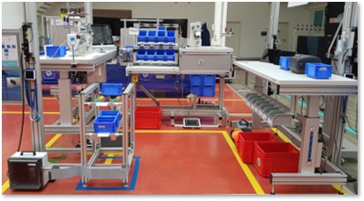

## Challenges

### Lack of information about production performance

- Cycle times are unknown
- Bottleneck of the assembly cell cannot be identified
- No information about productivity of individual employees
- Piece counts are not documented
- No comparison between target and actual performance

### Lack of transparency about downtimes

- Frequency and duration of downtimes of the assembly cell are not recorded
- Causes of downtime are often unknown and not documented

### Connection of assembly cell to conventional systems not possible

- Sewing machines do not have machine controls that could be connected

## Solution

### Integration

TODO: #66 Add integration for DCC assembly analytics

### Installed hardware

#### factorycube

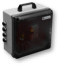

factorycube sends the collected production data to the server. See also [factorycube].

#### Gateways

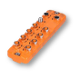

Gateways connect the sensors to the factorycube.

Models:

- ifm AL1352

#### Light barriers

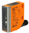

Light barriers are installed on the removal bins and are activated when the employee removes material. Used to measure cycle time and material consumption.

Models:

- ifm O5D100 (Optical distance sensor).

#### Proximity sensor

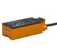

Proximity sensors on the foot switches of sewing machines detect activity of the process. Used to measure cycle time.

Models:

- ifm KQ6005

#### Barcode scanner

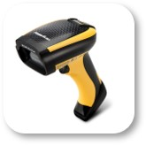

The barcode scanner is used to scan the wristband at the beginning of the assembly process. Process start and product identification.

Model:

- Datalogic PowerScan PD9531
- Datalogic USB Cable Straight 2m (CAB-438)

### Implemented dashboards

The customer opted for a combination of our SaaS offering with the building kit (and thus an on-premise option). The customer decided to go for PowerBI as a dashboard and connected it via the REST API with factoryinsight.

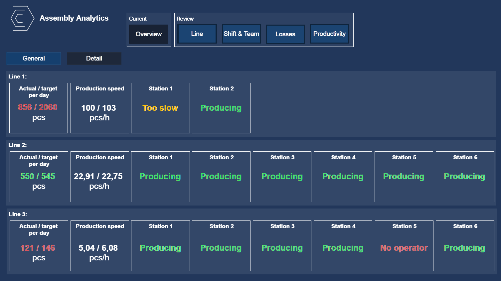
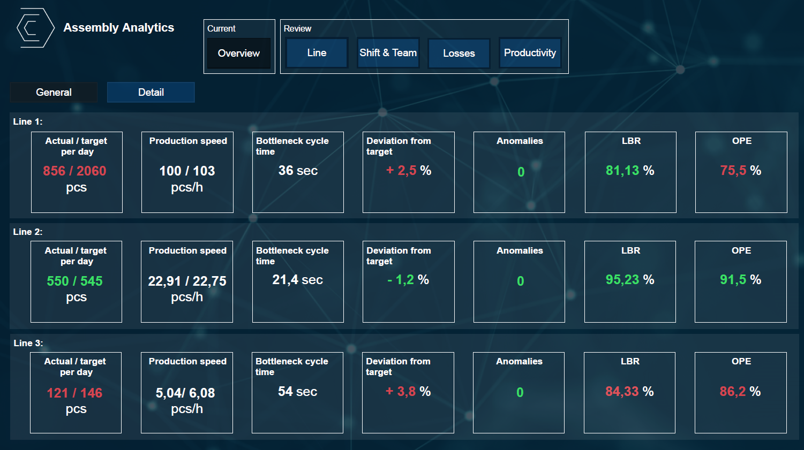
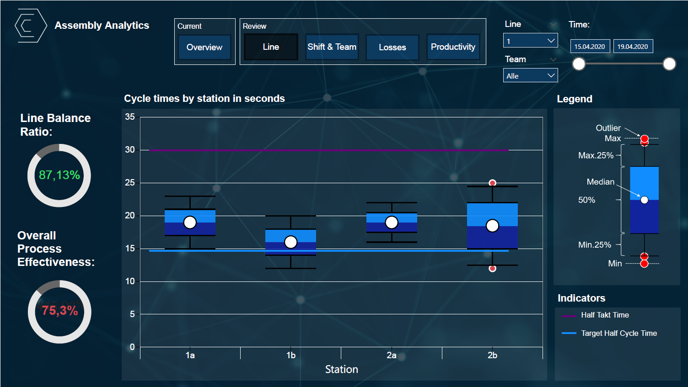
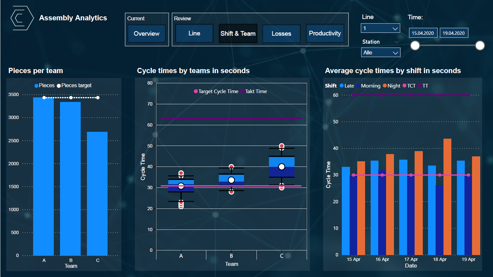
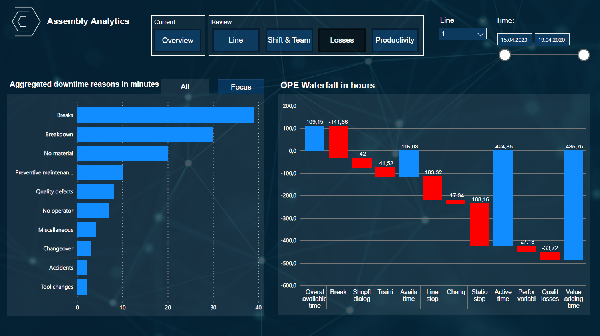
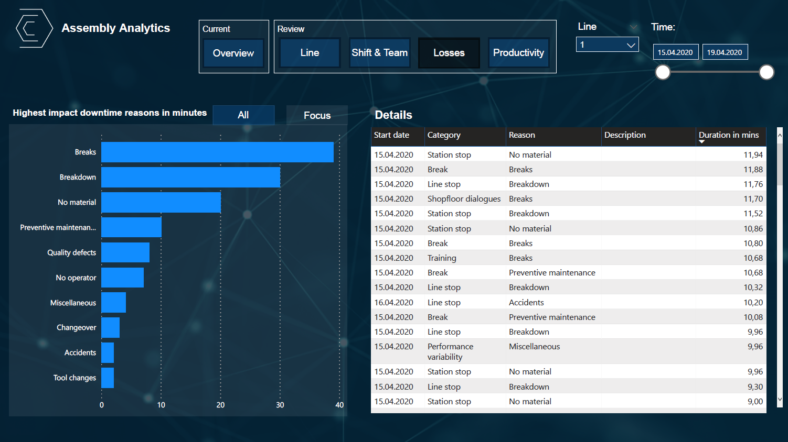
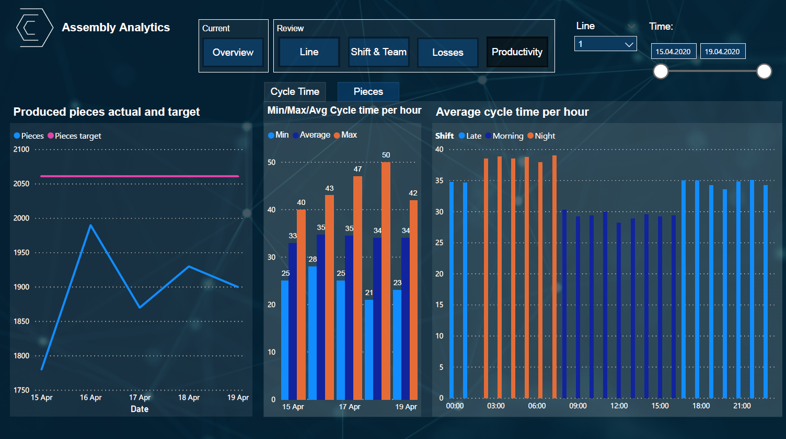

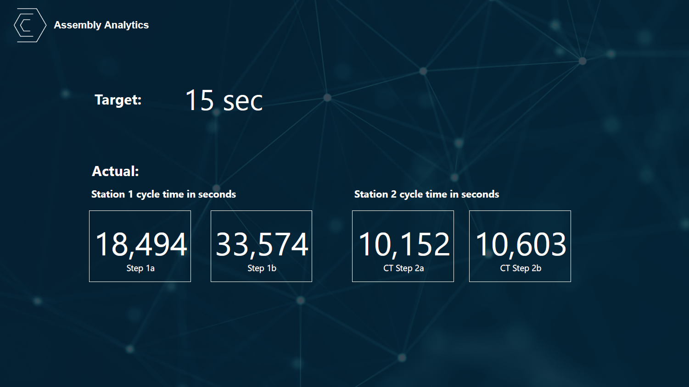

### Used node-red flows

With the help of Assembly Analytics Nodes, it is possible to measure the cycle time of assembly cells in order to measure and continuously improve their efficiency in a similar way to machines.

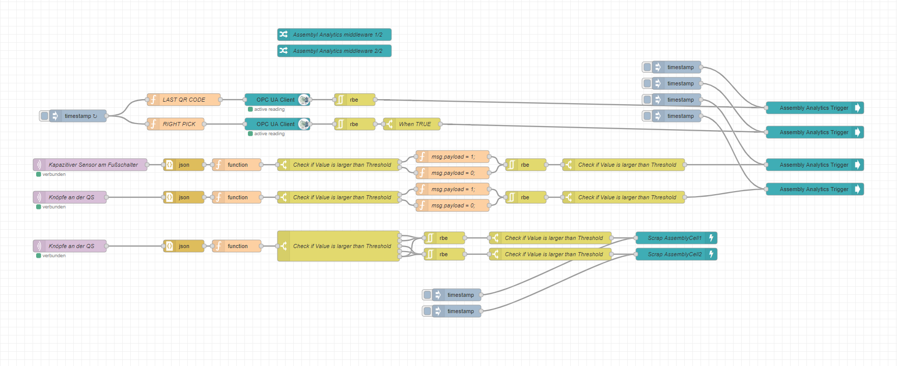

**Here is an exemplary implementation of those nodes:**

There are 2 stations with a total of 4 cycles under consideration

**Station 1 (AssemblyCell1):**

1a: Starts with scanned barcode and ends when 1b starts

1b: Starts with a trigger at the pick to light station and ends when station 1a starts

**Station 2 (AssemblyCell2):**

2a: Starts when the foot switch at the 2nd station is pressed and ends when 2b starts

2b: Starts when the quality check button is pressed and ends when 2a starts.

Assumptions:

- Unrealistically long cycle times are filtered out (cycle times over 20 seconds).
- There is a button bar between the stations to end the current cycle and mark that product as scrap. The upper 2 buttons terminate the cycle of AssemblyCell1 and the lower ones of AssemblyCell2. The aborted cycle creates a product that is marked as a scrap.

**Nodes explained:**

- Assembly Analytics Trigger: Cycles can be started with the help of the "Assembly Analytics Trigger" software module.

- Assembly Analytics Scrap: With the help of the software module "Assembly Analytics Scrap", existing cycles can be aborted and that produced good can be marked as "scrap".
- With the help of the software module "Assembly Analytics Middleware", the software modules described above are processed into "unique products".

[Here you can download the flow described above](../examples/flows/AssemblyAnalytics.json)

[factorycube]: (../edge/factorycube.md)
