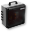

# Flame cutting & blasting

## Profile

| category | answer |
| :---------- | :------------- |
| Industry | Steel Industry |
| Employees | >1000 |
| Number of retrofitted sites | 2 |
| Project duration | 6 months |
| Number of retrofitted machines | 11 |
| Types of machines retrofitted | Plasma cutting machines, oxyfuel cutting machines, shot blasting machines |

### Photos

## Challenges

### Lack of transparency about production processes

- Lead times are unknown
- No comparison between target and actual times
- Duration and causes of machine downtimes are unclear

### Heterogeneous machinery and machine controls from different manufacturers

- Only minimal connection of the machines to the ERP system 
- Manual input of production data into the ERP system
- Machine controls are partially locked by manufacturers
- Machine controls use different protocols

### Reliable production planning and quotation generation not possible

- No data on past and current machine utilization available
- Quotation preparation is done with theoretical target times, as no information about actual times is available

## Solution

### Integration

### Installed hardware

#### factorycube

factorycube sends the collected production data to the server. See also [factorycube].

#### Gateways

Gateways connect the sensors to the factorycube.

Models:

- ifm AL1352
- ifm AL1350

#### Light barriers

Light barriers are installed on cutting machines and are activated when the cutting head is lowered and in use. Used to measure machine conditions, cycle times and piece counts.

Models:

- ifm O5D100 (Optical distance sensor)
- ifm O1D108 (Optical distance sensor)

#### Vibration sensors

TODO: PHOTO

Vibration sensors are installed on the beam attachments and detect the machine condition via vibration. Used to measure machine conditions.

Model:

- ifm VTV122 (vibration transmitter)

#### Button bar

Button bar is operated by the machine operator in case of a machine standstill. Each button is assigned a reason for standstill. Used to identify the causes of machine downtime.

Model:

- Self-made, based on Siemens TODO

#### Barcode scanner

Barcode scanners are used to scan production orders, which contain the target times. Used to scan target times for target/actual comparison.

Model:

- TODO

### Implemented dashboards

The customer opted for our SaaS offering. We created the following dashboards for the client.

#### Navigation

Default navigation options from Grafana, which we modified to allow custom menus.

1. Customizable menu lets you quickly navigate between dashboards
1. In the time selection you can adjust the times for the current dashboard

#### Plant-manager dashboard

1. Dashboard for the plant manager / shift supervisor, which gives an overview of the production in the factory
1. For each machine the current machine status
1. For each machine, the overall equipment effectiveness / OEE for the selected time period
1. For each machine, a timeline showing the machine statuses in color
1. Overview of all orders, including target/actual deviation and which stop reasons, including setup times, occurred during the order

#### Machine deep dive

1. Dashboard for the machine operator / shift supervisor, which displays the details for a machine
1. The current machine status with time stamp
1. The overall equipment effectiveness / OEE for the selected time period, including trend over time
1. An overview of the accumulated duration of each stop reason
1. A timeline where the machine states are color coded
1. A timeline where the shifts become visible
1. A timeline where the orders are displayed
1. Overview of all orders, including target/actual deviation and which stop reasons, including setup times, occurred during the order
1. Overview of the number of individual stop reasons

#### Cross-factory dashboard

1. Dashboard for the cross-factory manager, who can use this to obtain an overview of the sites
1. The overall equipment effectiveness / OEE for the selected time period for all machines.
1. The minimum overall equipment effectiveness / OEE for the selected time period for machine type A.
1. The average overall equipment effectiveness / OEE for the selected time period for machine type A
1. The maximum overall equipment effectiveness / OEE for the selected period for machine type A
1. Overview of all orders, including target/actual deviation and which stop reasons, including setup times, occurred during the order
1. Export function as .csv

[factorycube]: (../edge/factorycube.md)