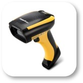

# Flame cutting & blasting

## Profile

| category | answer |
| :---------- | :------------- |
| Industry | Steel Industry |
| Employees | >1000 |
| Number of retrofitted sites | 2 |
| Project duration | 6 months |
| Number of retrofitted machines | 11 |
| Types of machines retrofitted | Plasma cutting machines, oxyfuel cutting machines, shot blasting machines |

### Photos

## Challenges

### Lack of transparency about production processes

- Lead times are unknown
- No comparison between target and actual times
- Duration and causes of machine downtimes are unclear

### Heterogeneous machinery and machine controls from different manufacturers

- Only minimal connection of the machines to the ERP system 
- Manual input of production data into the ERP system
- Machine controls are partially locked by manufacturers
- Machine controls use different protocols

### Reliable production planning and quotation generation not possible

- No data on past and current machine utilization available
- Quotation preparation is done with theoretical target times, as no information about actual times is available

## Solution

### Integration

### Installed hardware

#### factorycube

factorycube sends the collected production data to the server. See also [factorycube].

#### Gateways

Gateways connect the sensors to the factorycube.

Models:

- ifm AL1352
- ifm AL1350

#### Light barriers

Light barriers are installed on cutting machines and are activated when the cutting head is lowered and in use. Used to measure machine conditions, cycle times and piece counts.

Models:

- ifm O5D100 (Optical distance sensor)
- ifm O1D108 (Optical distance sensor)

#### Vibration sensors

TODO: PHOTO

Vibration sensors are installed on the beam attachments and detect the machine condition via vibration. Used to measure machine conditions.

Model:

- ifm VTV122 (vibration transmitter)

#### Button bar

Button bar is operated by the machine operator in case of a machine standstill. Each button is assigned a reason for standstill. Used to identify the causes of machine downtime.

Model:

- Self-made, based on Siemens TODO

#### Barcode scanner

Barcode scanners are used to scan production orders, which contain the target times. Used to scan target times for target/actual comparison.

Model:

- TODO

### Implemented dashboards

The customer opted for our SaaS offering. We created the following dashboards for the client.

TODO

[factorycube]: (../edge/factorycube.md)