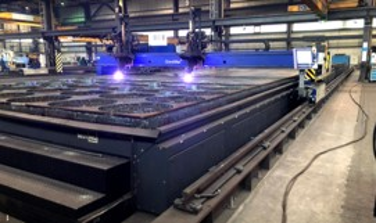
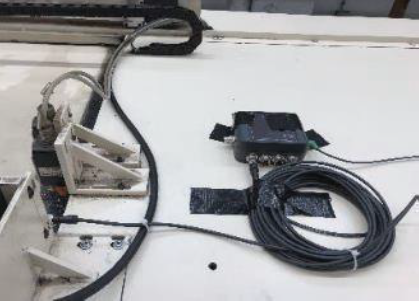
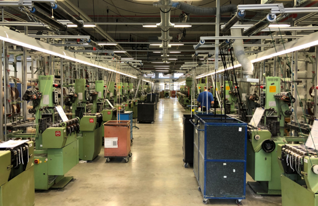
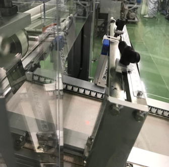
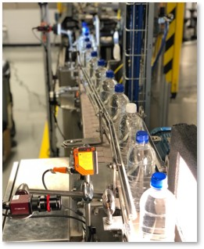

# Overview over our showcase

This document is an overview over the various showcases that we already did. It provides for every showcase a quick summary including a picture. More details can be found in the subsequent documents.

## Metalworking industry

### Flame cutting & blasting

Retrofitting of 11 flame cutting machines and blasting systems at two locations using sensors, barcode scanners and button bars to extract and analyze operating data. See also the [detailed documentation](flame-cutting.md).

### Identification of the optimization potential of two CNC milling machines

Two-month analysis of CNC milling machines and identification of optimization potentials. Automatic data acquisition coupled with interviews of machine operators and shift supervisors revealed various optimization potentials.

See also the [detailed documentation](cnc-milling.md).

## Textile industry

### Cycle time monitoring in the Digital Capability Center Aachen

See also the [detailed documentation](dcc-assembly-analytics.md).

### Retrofitting of weaving machines for OEE calculation

Retrofitting of weaving machines that do not provide data via the PLC to extract operating data. Subsequent determination of the OEE and detailed breakdown of the individual key figures

See also the [detailed documentation](weaving.md)

## Filling & packaging industry

### Performance management in a brewery

Retrofit of a bottling line for different beer types. Focus on the identification of microstops causes and exact delimitation of the bottleneck machine.

See also the [detailed documentation](brewery.md).

### Retrofit of a Japanese pharmaceutical packaging line

Retrofit of a Japanese pharmaceutical packaging line for automatic analysis of microstop causes as well as to relief the machine operators of data recording.

See also the [detailed documentation](pharma-packaging.md).

### Quality monitoring in a filling line at the Digital Capability Center Atlanta

TODO: #69 add short description for DCC quality check

See also the [detailed documentation](dcc-quality-check.md).

## Semiconductor industry

### Identification of optimization potential in the context of the COVID-19 crisis

Use of the factorycube for rapid analysis of bottleneck stations. The customer was thus able to increase the throughput of critical components for ventilators within the scope of COVID-19.

See also the [detailed documentation](semiconductor.md).
