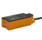

# Flame cutting & blasting

## Profile

| category | answer |
| :---------- | :------------- |
| Industry | Semiconductor industry |
| Employees | >1000 |
| Number of retrofitted sites | 1 |
| Project duration | 2 months |
| Number of retrofitted machines | 1 |
| Types of machines retrofitted | Dispensing robot |

### Photos

## Challenges

### Increasing demand could not be fulfilled

- the demand for the product, which was required for ventilators, was increasing over 1000% due to the COVID-19 crisis
- the production was struggling to keep up with the ramp up

### Production downtime needed to be avoided at all costs

- production downtime would have meant not fulfilling the demand

### A quick solution was needed

- to meet the demand, the company needed a quick solution and could not accept months of project time

## Solution

### Integration

We were given a 2h time slot by the company to install the sensors, from the time we entered the factory until the time we left (including safety briefings and ESD compliance checks). With the help of videos, we got an overview beforehand and created a sensor plan. During this time slot, we used the machine operator's break to install all the sensors and verified the data during the subsequent machine run. Through VPN we were able to access the device and fine-tune the configuration.

### Installed hardware

#### factorycube

factorycube sends the collected production data to the server. See also [factorycube].

#### Gateways

Gateways connect the sensors to the factorycube.

Models:

- ifm AL1352

#### Ultrasonic sensor

picture TODO

The ultrasonic sensor was used to measure whether the robot was currently moving and thus whether the machine was running.

Models:

- TODO

#### Proximity sensor

Proximity sensors were used to detect if the product was ready for operator removal. Together with the ultrasonic sensors, we were able to measure whether the machine was standing because the machine operator had not removed the product and was therefore not available.

Models:

- ifm KQ6005

#### Button bar

Button bar is operated by the machine operator in case of a machine standstill. Each button is assigned a reason for standstill. Used to identify the causes of machine downtime.

Model:

- Self-made, based on Siemens TODO

### Implemented dashboards

The customer opted for our SaaS offering and a additional analysis of the data.

#### Dashboard screenshot

The customer opted for SaaS solution and required only a very simple dashboard as most insights were gained from a detailed analysis. The dashboard includes the functionality to export data as .csv.

#### Additional analysis

The data was exported into .csv and then analyzed in Python & Excel. Together with interviews of the operators and supervisors we could extract multiple insights including optimization potential through alignment of the work processes and improvement of changeovers through [Single-minute exchange of die (SMED)](https://en.wikipedia.org/wiki/Single-minute_exchange_of_die).

[factorycube]: (../edge/factorycube.md)