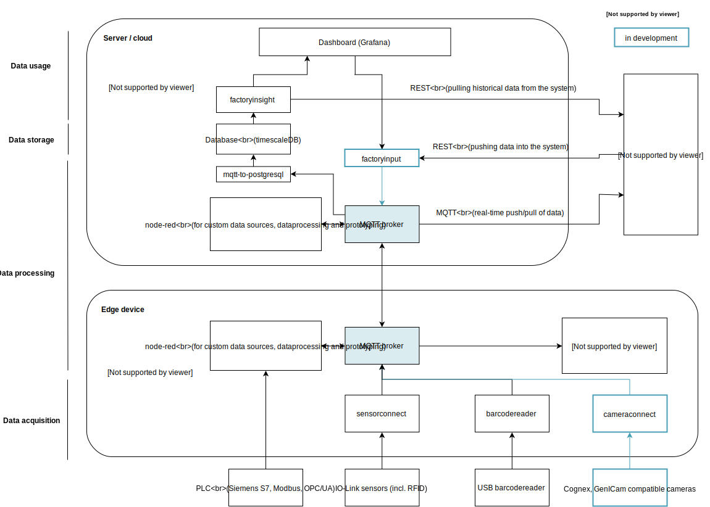

# Dataprocessing in the United Manufacturing Hub / architecture

The software of the United Manufacturing Hub is designed as a modular system. Our software serves as a basic building block for connecting and using various hardware and software components quickly and easily. This enables flexible use and thus the possibility to create comprehensive solutions for various challenges in the industry.

## Contents

- [Dataprocessing in the United Manufacturing Hub / architecture](#dataprocessing-in-the-united-manufacturing-hub--architecture)
  - [Contents](#contents)
  - [Architecture](#architecture)
    - [Edge-device / IoT gateway](#edge-device--iot-gateway)
    - [Data acquisition](#data-acquisition)
    - [Data processing](#data-processing)
    - [Data storage](#data-storage)
    - [Data usage](#data-usage)
    - [Technology](#technology)
  - [Technical approach and details](#technical-approach-and-details)
    - [Microservice approach](#microservice-approach)
    - [Services and interfaces in the UMH](#services-and-interfaces-in-the-umh)
      - [MQTT](#mqtt)
      - [REST / HTTP](#rest--http)
  - [Practical implications](#practical-implications)
    - [Edge devices](#edge-devices)
    - [Server](#server)
      - [Database access](#database-access)

## Architecture

### Edge-device / IoT gateway

As a central hardware component we use an edge device which is connected to different data sources and to a server. The edge device is an industrial computer on which our software is installed. The customer can either use the United factorycube offered by us or his own IoT gateway.

**Examples:**

- Factorycube
- Cubi

### Data acquisition

The data sources connected to the edge device provide the foundation for automatic data collection.  The data sources can be external sensors (e.g. light barriers, vibration sensors), input devices (e.g. button bars), Auto-ID technologies (e.g. barcode scanners), industrial cameras and other data sources such as machine PLCs. The wide range of data sources allows the connection of all machines, either directly via the machine PLC or via simple and fast retrofitting with external sensors.

**Examples:**

- sensorconnect
- barcodereader

### Data processing

The software installed on the edge device receives the data from the individual data sources. Using various data processing services and "node-red", the imported data is preprocessed and forwarded to the connected server via the MQTT broker.

**Examples:**

- node-red

### Data storage

The data forwarded by the edge device can either be stored on the customer's servers or, in the SaaS version, in the United Cloud hosted by us. Relational data (e.g. data about orders and products) as well as time series data in high resolution (e.g. machine data like temperature) can be stored.

**Examples:**

- database

### Data usage

The stored data is automatically processed and provided to the user via a Grafana dashboard or other computer programs via a Rest interface. For each data request, the user can choose between raw data and various pre-processed data such as OEE, MTBF, etc., so that every user (even without programming knowledge) can quickly and easily compose personally tailored dashboards with the help of modular building blocks.

**Examples:**

- Grafana
- factoryinsight

### Technology

At all of the above-mentioned levels, great importance is attached to the topics of resilience and scalability:

- Only open source projects developed by established companies are used to ensure guaranteed maintainability.
- All services are based on Docker, which enables shorter development cycles and improved resource utilization.
- The additional services offered at the server level are managed by Kubernetes software, a technology on which 95% of public cloud providers (Microsoft, Amazon, Google, etc.) also rely.

## Technical approach and details

### Microservice approach

The UMH is based on the [microservices approach](https://en.wikipedia.org/wiki/Microservices) and arranges an application as a collection of loosely coupled services. Each service is a self-contained piece of business functionality with clear interfaces.

### Services and interfaces in the UMH

A service in UMH can either be on the server or the edge device (see [general architecture](#general-architecture)). The interface between all edge and most of the server services is MQTT. The interface between Grafana (or any other BI tool) and factoryinsight is REST.

#### MQTT

Out of the [wikipedia article about MQTT](https://en.wikipedia.org/wiki/MQTT):

> MQTT (originally an acronym for MQ Telemetry Transport) is an lightweight, publish-subscribe network protocol that transports messages between devices. The MQTT protocol defines two types of network entities: a message broker and a number of clients. An MQTT broker is a server that receives all messages from the clients and then routes the messages to the appropriate destination clients. An MQTT client is any device (from a micro controller up to a fully-fledged server) that runs an MQTT library and connects to an MQTT broker over a network.

The protocol MQTT specifies not the actual content of the exchanged MQTT messages. In the UMH stack we specify them further with the [UMH datamodel](mqtt.md)

#### REST / HTTP

Out of the [wikipedia article about REST](https://en.wikipedia.org/wiki/Representational_state_transfer):

> Representational state transfer (REST) is a de-facto standard for a software architecture for interactive applications that typically use multiple Web services. In order to be used in a REST-based application, a Web Service needs to meet certain constraints; such a Web Service is called RESTful. A RESTful Web service is required to provide an application access to its Web resources in a textual representation and support reading and modification of them with a stateless protocol and a predefined set of operations. By being RESTfull, Web Services provide interoperability between the computer systems on the internet that provide these services.

factoryinsight provides a REST / HTTP access to all data stored in the database. [The entire API is well-documented](../server/factoryinsight/openapi/factoryinsight.yml).

## Practical implications

### Edge devices

Typically you have multiple data sources like `sensorconnect` or `barcodereader`, that are containered in a Docker container. They all send their data to the MQTT broker. You can now process the data in node-red by subscribing to the data sources via MQTT, processing the data, and then writing it back.

### Server

#### Database access

The database on the server side should never be accessed directly by a service except `mqtt-to-postgresql` and `factoryinsight`. Instead, these services should be modified to include the required functionalities.
