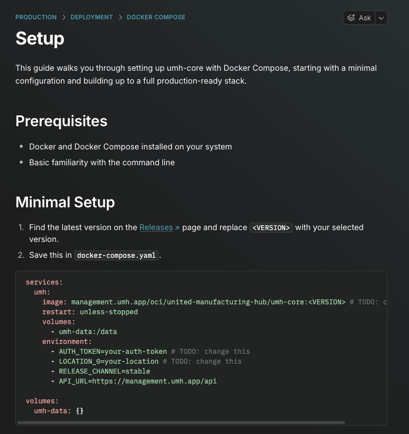
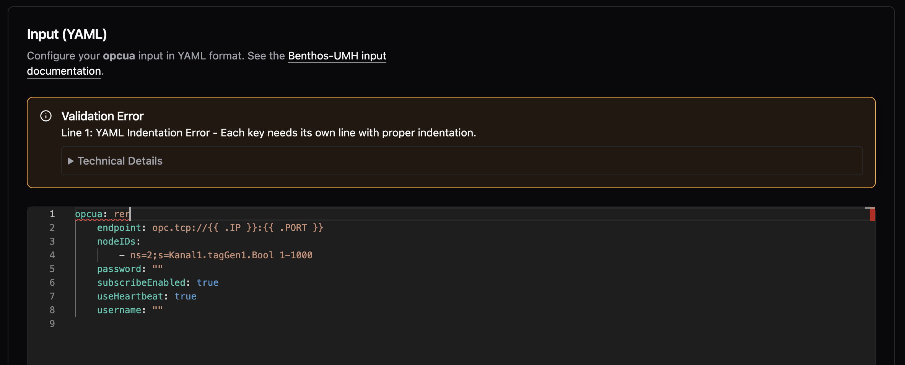
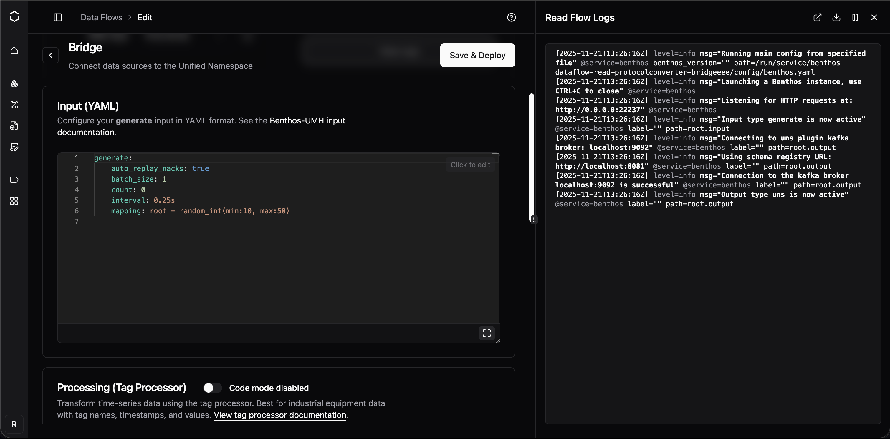
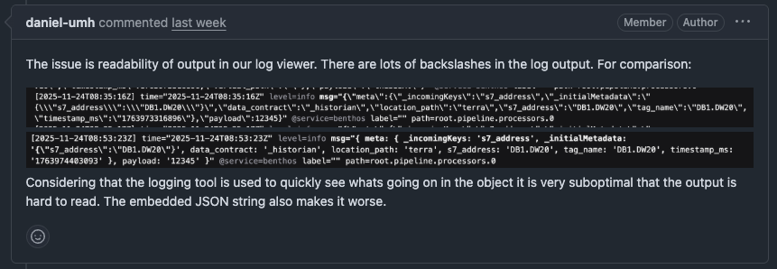

# Changelog

## Unreleased

### Internal

- FSMv2 `register.Worker` now takes a third type parameter `TDeps` (`register.Worker[TConfig, TStatus, TDeps]`). Workers with no custom dependencies use the new `register.NoDeps` alias. Per-worker `WorkerType` constants are now unexported (`workerType`). Affects in-tree framework code only; no user-facing API.
- FSMv2 transport worker migrated to `register.Worker` with typed `TDeps = *TransportDependencies`. Parent→child deps sharing moved from `extraDeps["transport_deps"]` to package-level `transport.SetChildDeps` / `transport.ChildDeps` singleton, mirroring the existing `ChannelProvider` pattern. Internal framework change only; no user-facing API.
- FSMv2 push worker migrated to `register.Worker` with typed `TDeps = *PushDependencies`. The `extraDeps["transport_deps"]` read is replaced by a call to `transport.ChildDeps()` inside the constructor, completing the typed parent→child dep seam for push. Internal framework change only; no user-facing API.
- FSMv2 pull worker migrated to `register.Worker` with typed `TDeps = *PullDependencies`. The `extraDeps["transport_deps"]` read is replaced by a call to `transport.ChildDeps()` inside the constructor, completing the typed parent→child dep seam for pull. Internal framework change only; no user-facing API.
- FSMv2 persistence worker switched from an `extraDeps["store"]` factory read to a typed `persistence.SetStore` / `persistence.Store()` package-level singleton (mirroring `transport.ChildDeps`). `cmd/main.go` publishes the triangular store via `SetStore`; the worker factory consumes it via `Store()`. `NewPersistenceWorker` now takes `*PersistenceDependencies` in the TDeps slot. Internal framework change only; no user-facing API.
- Removed dead `channelProvider` / `onAuthSuccessCallback` keys from the fsmv2Deps map in `cmd/main.go` (PR2 C6.5). No functional change -- these keys had no readers.
- Swept `fsmv2.Result[any, any]` → `fsmv2.Transition` and dropped `fsmv2.WrapAction` wrappers across PR2-migrated workers (helloworld, communicator, transport/push/pull, examples). Persistence + application pending PR2.5 refactor. PR2 C7.
- FSMv2 application worker migrated to `register.Worker` with `TDeps = register.NoDeps`, dropping the legacy `factory.RegisterWorkerAndSupervisorFactoryByType` path. The zero-value fallback in the deps registry means no `register.SetDeps` wiring is needed at `cmd/main.go`. `WorkerTypeName` is now exported to mirror the persistence pattern. Internal framework change only; no user-facing API. PR2 C12.
- FSMv2 persistence worker's `persistence.SetStore` / `persistence.Store` / `persistence.ClearStore` package-level singleton (plus its backing variable and mutex) removed. All callers now publish the triangular store through the typed `register.SetDeps[*PersistenceDependencies]` registry wired up in PR2 C10. Internal framework change only; no user-facing API. PR2 C13.
- FSMv2 exampleslow worker migrated to `register.Worker[*ExampleslowDependencies]` with a full WorkerBase shape refactor: the custom `ExampleslowObservedState` / `ExampleslowDesiredState` value types were replaced by `fsmv2.Observation[ExampleslowStatus]` + `*fsmv2.WrappedDesiredState[ExampleslowConfig]`, and state files now consume `WorkerSnapshot` via `ConvertWorkerSnapshot`. The `delaySeconds` user-spec field is now carried on the config struct and synced into the runtime dependencies via a post-parse hook. First PR3 example-worker migration. Internal framework change only; no user-facing API. PR3 C1.
- FSMv2 examplechild worker migrated to `register.Worker[*ExamplechildDependencies]` with the same WorkerBase shape refactor: custom `ExamplechildObservedState` / `ExamplechildDesiredState` / `ExamplechildSnapshot` types replaced by `fsmv2.Observation[ExamplechildStatus]` + `*fsmv2.WrappedDesiredState[ExamplechildConfig]`, and state files now consume `WorkerSnapshot` via `ConvertWorkerSnapshot`. `ExamplechildConfig` carries no custom user-spec fields, so no post-parse hook is needed. The inheritance integration scenario was updated to observe merged variables via the parent's `childrenSpecs[].userSpec` (the canonical PURE_DERIVE observation point) instead of the child's removed `originalUserSpec`. Internal framework change only; no user-facing API. PR3 C2.
- FSMv2 exampleparent worker migrated to `register.Worker[ExampleparentConfig, ExampleparentStatus, *ParentDependencies]` with the same WorkerBase shape refactor: custom `ExampleparentObservedState` / `ExampleparentDesiredState` / `ExampleparentSnapshot` types replaced by `fsmv2.Observation[ExampleparentStatus]` + `*fsmv2.WrappedDesiredState[ExampleparentConfig]`, and state files now consume `WorkerSnapshot` via `ConvertWorkerSnapshot`. Child spec construction moved to a `SetChildSpecsFactory` hook that pre-merges the parent's user variables into each child's `UserSpec` (supervisor re-merges idempotently at spawn). `WorkerSnapshot` gained a `FrameworkMetrics` field (populated from `Observation[TStatus].Metrics.Framework`) so time-gated state transitions in `StoppedState` can read `TimeInCurrentStateMs` from the typed snapshot. The inheritance integration scenario now extracts merged variables from `childrenSpecs[].UserSpec.Variables.User`; the legacy `extractUserNamespaceVariables` helper is retained as a no-op shim for call-site compatibility. Docstring/`FOLDER_WORKER_TYPE_MISMATCH` sweeps across `factory/README.md`, `supervisor/supervisor.go`, and `internal/validator/registry.go` switched the canonical example from `Exampleparent*` → `Examplefailing*`. Internal framework change only; no user-facing API. PR3 C3.

### Improvements

- Previously, a Flow only exposed a single health and throughput metric. Starting with this version, umh-core exposes separate throughput metrics and health status for read and write flows.

### Preview: FSMv2 Communicator

- Previously, healthy instances could appear offline in Management Console when earlier status messages failed to send. New status messages now continue to reach Management Console while previous ones are being retried. Only affects instances with `USE_FSMV2_TRANSPORT=true`

## [0.44.15]

Fix issue when redeploying a bridge.

### Fixes

- Previously, if a read flow had a stale error, a new deployment would always fail, even if the current state is healthy. Now, we first always stop the flow, redeploy it and only check the current state, not any stale states.

## [0.44.14]

### Improvements

- Unified Address Field for Modbus: introduces `unifiedAddresses` as a single-string alternative to the existing address object list. Format: `name.register.address.type[:key=value]*` (e.g., `temperature.holding.100.INT16:scale=0.1`). The legacy `addresses` object list continues to work with a deprecation warning. Both fields are mutually exclusive

### Fixes

- CPU health stayed Degraded permanently after any brief throttle event because the ratio used cumulative counters since pod start. Now uses a sliding window, so health recovers when throttling stops
- ADS symbol downloads failed in certain configurations -- bumped ADS plugin to v1.0.8 which fixes the issue

### Preview: FSMv2 Communicator

- Brief network interruptions during authentication (DNS failures, server errors) no longer produce Sentry warnings. If authentication keeps failing for five consecutive failures, a single `persistent_auth_failure` warning is logged. Permanent errors like invalid credentials or a deleted instance still warn immediately on first occurrence. Only affects instances with `USE_FSMV2_TRANSPORT=true`
- When authentication permanently fails (invalid credentials or deleted instance), the transport worker now enters a dedicated failed state instead of retrying indefinitely. It re-attempts authentication automatically when the configuration changes (new auth token, relay URL, or instance UUID). Only affects instances with `USE_FSMV2_TRANSPORT=true`
## [0.44.13]

### Fixes

- Updated gRPC to v1.79.3 to patch CVE-2026-33186, a critical authorization bypass where path-based access control policies could be circumvented via malformed HTTP/2 requests

## [0.44.12]

### Improvements

- Starting with this version, umh-core supports stopping and starting bridges. Previously, bridges were always active and could only be removed entirely. A Management Console update is required to expose this in the UI

### Fixes

- The container previously restarted hundreds of times per minute when config.yaml was missing or invalid and now waits 60 seconds before retrying, giving you time to fix the configuration
- Previously, memory monitoring read host-level values even inside containers, while CPU monitoring already used cgroup-aware values. Memory metrics now read cgroup v2 limits and usage, so dashboards show correct container memory utilization
- Fixed debug logging settings being lost when editing bridges or data flows -- the debug_level flag is now preserved across configuration changes

### Preview: FSMv2 Communicator

- Instances could appear permanently offline in the Management Console even though the pod was running and healthy -- only a restart would fix it. This happened because token re-authentication briefly caused child workers to enter a stopping state from which they could not recover, leaving the communicator stuck indefinitely. Workers now always complete the stop and automatically recover when the parent is healthy again. Requires `USE_FSMV2_TRANSPORT=true`

## [0.44.11]

This release reduces steady-state container memory by roughly 30% on busy systems with many bridges and data flows.

### Improvements

- Previously, internal timing metrics grew continuously in memory the longer your instance ran, consuming over 500 MB on busy systems with many bridges and data flows. These metrics now use fixed-size histogram buckets that no longer grow with uptime, reducing steady-state container memory by roughly 30%

## [0.44.10]

This release simplifies S7 addressing and fixes three edge cases in the Management Console editor and S7 data type handling.

### Improvements

- Previously, S7 addresses for PE, PA, MK, C, and T areas required a block number that served no function. You can now write `PE.X0.0` instead of `PE0.X0.0`. The old format still works but logs a deprecation warning and will be removed in a future version. Data Block addresses (`DB1.DW20`) are unchanged

### Fixes

- The S7 `DateAndTime` data type crashed due to an incorrect buffer size and now reads correctly
- Fields with children that already have default values were incorrectly marked as required when editing bridge configurations -- they are now correctly treated as optional
- Fields marked as deprecated in bridge plugin definitions were not flagged in the Management Console editor -- they now correctly appear as deprecated

### Preview: FSMv2 Communicator

- Status updates and incoming commands now use independent connections, so a connection dropped by an enterprise proxy or firewall no longer prevents the instance from sending heartbeats. Requires `USE_FSMV2_TRANSPORT=true`

## [0.44.9]

This release adds config backup as an opt-in preview and includes stability fixes for FSMv2 communicator preview users. All changes require feature flags -- if you haven't enabled any preview features, this release does not affect you.

### Preview: Config Backup

- Previously, config.yaml could be permanently lost during upgrades or crash loops with no way to recover. Timestamped backups are now created before every write, with deduplication to prevent churn during restarts, retaining the last 100 versions in /data/config-backups/

To enable, set the `ENABLE_CONFIG_BACKUP=true` environment variable and restart your container:

```bash
docker run -e ENABLE_CONFIG_BACKUP=true ...
```

To verify, check that backup files appear in /data/config-backups/ after a config change. If no files appear, confirm the environment variable is set and the container was restarted.

### Preview: FSMv2 Communicator

- The cleanup routine retained state history for 24 hours, allowing hundreds of thousands of entries to accumulate in RAM -- the retention window is now 1 hour, reducing steady-state memory by roughly 95%. Requires `USE_FSMV2_MEMORY_CLEANUP=true`

- The supervisor logged an error on every tick when the communicator temporarily had no workers during a restart cycle -- it now skips the tick and self-heals when workers return. Requires `USE_FSMV2_TRANSPORT=true`

- A nil-pointer panic could occur in ResetTransportAction under specific timing conditions -- the action now safely handles nil state. Requires `USE_FSMV2_TRANSPORT=true`

## [0.44.8]

If you enabled the FSMv2 communicator preview (introduced in v0.44.5), this release fixes three issues that could cause your instance to use a lot of memory, go offline, or restart unexpectedly. We strongly recommend upgrading.

If you have not enabled the FSMv2 preview, this release does not affect you.

### Breaking Changes

**Action Required (FSMv2 Preview Users Only)** - You need to add a new environment variable to get the memory fix.

Regardless of how you enabled FSMv2, set both of these environment variables and restart your container:

- `USE_FSMV2_TRANSPORT=true` — enables FSMv2 (unchanged from before)
- `USE_FSMV2_MEMORY_CLEANUP=true` — **new in v0.44.8**, enables the periodic memory cleanup

```bash
docker run -e USE_FSMV2_TRANSPORT=true -e USE_FSMV2_MEMORY_CLEANUP=true ...
```

**If you enabled FSMv2 via `useFSMv2Transport: true` in config.yaml**, that method no longer works — FSMv2 is silently not running. Remove that line from your config.yaml and use the environment variables above instead.

To verify FSMv2 is running after the change:
```bash
docker exec <container-name> grep "Using FSMv2 communicator" /data/logs/umh-core/current
```
If this returns no output, FSMv2 is not running. Double-check that both environment variables are set and that the container was restarted.

### Fixes

- Previously, long-running instances with FSMv2 enabled would slowly consume more and more memory because internal state changes accumulated without ever being cleaned up. One customer reported 13 GB of RAM usage at only 4 messages per second. Eventually, the system would kill the container to free memory, causing a brief data gap while it restarted. A periodic cleanup routine now keeps memory usage flat regardless of how long the instance runs. This fix requires `USE_FSMV2_MEMORY_CLEANUP=true` (see above)

- Previously, if one of the internal FSMv2 components encountered an unexpected error, it could crash the entire process, taking your instance offline until the container restarted. The system now catches these errors and automatically recovers. If the same error keeps recurring, the affected component is stopped to prevent crash loops while the rest of the system keeps running

- When you changed a configuration and the system restarted an internal component, the new component could inherit a stale "shut down" signal from the old one and immediately stop itself. This could make the instance appear stuck or unresponsive after config changes. The shutdown signal is now properly cleared before starting a replacement

The crash fix and the configuration fix are automatically active for all FSMv2 users and do not require additional configuration.

- Updated container base image to Alpine with security patches

- Updated Go dependencies

## [0.44.7]

This release removes the 20-address limit for S7 bridges and adds per-slave register mapping for Modbus gateways.

### New Features

- You can now assign specific registers to individual slaves when reading from a Modbus TCP/RTU gateway. Previously, all configured addresses were read from every slave, when different slaves expose different registers. This forced you to create separate connections per slave, which could exhaust the limited TCP connections available on many industrial gateways. Now you can add a `slaveID` field to each address entry to target a specific slave. Addresses without a `slaveID` are still read from all configured slaves, so existing configurations work without changes

### Improvements

- S7 connections now negotiate the actual PDU size with the PLC during connection and automatically split addresses into optimally-sized batches. If you previously had to create multiple connections to the same PLC because of the 20-address limit, you can now configure all addresses in a single connection. The `batchMaxSize` configuration field is deprecated and ignored — PDU size is handled automatically. Existing configs with `batchMaxSize` continue to work with a deprecation warning

### Fixes

- Updated container base image to Alpine 3.23.3, includes security patches for OpenSSL vulnerabilities

- Updated Go dependencies, includes security fixes for the Gin framework (GraphQL API) and other dependencies

## [0.44.6]

This release fixes container startup failures on fresh deployments and enables advanced variable types for bridge template configurations.

### Fixes

- Previously, containers could fail to start with "permission denied" errors when services tried to write to temporary directories. This only affected fresh installations without Docker cache - upgrades and cached deployments were not impacted. The issue was caused by a known Docker BuildKit limitation that doesn't preserve directory permissions during multi-stage builds

### Improvements

- You can now use complex variable types in your protocol converter YAML configurations, not just simple text values. This enables bulk configuration patterns like defining a list of PLC addresses with their tag names, units, and data contracts as a single variable, then iterating over them in your template with `{{ range .AddressMappings }}`. This is particularly useful for S7 and OPC UA bridges where you need to map many addresses to tags

Example usage in YAML:
```yaml
templateInfo:
  isTemplated: true
  variables:
    - label: "AddressMappings"
      value:
        - Address: "DB1.DW20"
          TagName: "temperature"
          Unit: "celsius"
        - Address: "DB1.DW24"
          TagName: "pressure"
          Unit: "bar"
```

Then in your template: `{{ range .AddressMappings }}{{ .Address }} -> {{ .TagName }}{{ end }}`

## [0.44.5]

We've made infrastructure improvements to help instances stay connected to the Management Console more reliably.

Some users have experienced instances appearing "offline" in the Management Console even though the instances were running correctly and processing data. This was caused by network interruptions that the legacy communicator couldn't recover from automatically.

### Improvements

- Backend servers are now more stable, reducing connection interruptions

### New Features

- If you've been experiencing connection issues (instances showing offline when they're actually running), you can try our completely rewritten communicator which has better recovery from network interruptions

To enable, add to your `config.yaml`:
```yaml
agent:
  communicator:
    useFSMv2Transport: true
```

Or via environment variable:
```bash
docker run -e USE_FSMV2_TRANSPORT=true ...
```

To verify it's working, exec into your container and check the logs:
```bash
docker exec -it <container-name> sh
grep fsmv2 /data/logs/umh-core/current
```

You should see log entries with `fsmv2` and states like `Syncing` or `TryingToAuthenticate`.

**Note:** To disable later, you must explicitly set `useFSMv2Transport: false` in config.yaml.

## [0.44.4]

This release fixes issues affecting OPC UA data collection and JavaScript-based data processing.

### Fixes

- Previously, if an OPC UA connection dropped and reconnected, the system would report zero detected nodes even though the server was available. Connections now correctly rediscover all nodes after network interruptions

- When using the Tag Processor or Node-RED JS processor with structured JSON data, numeric values were incorrectly treated as objects instead of numbers. Calculations and comparisons involving numbers now work as expected

## [0.44.3]

You can now deploy UMH using Docker Compose as an alternative to single-container Docker or Kubernetes. This deployment option is perfect for production setups that need persistent storage and visualization without the complexity of Kubernetes.

The Docker Compose stack includes umh-core, TimescaleDB for time-series storage, PgBouncer for connection pooling, and Grafana for visualization. An optional Nginx configuration is provided for SSL/TLS termination.



[View the Docker Compose documentation](https://docs.umh.app/production/deployment/docker-compose/setup)

### Improvements

- Redpanda now runs with the `--overprovisioned` flag enabled by default, improving performance in containerized environments where CPU resources are shared

### Fixes

- Fixed confusing documentation about Docker volume permissions when upgrading from versions before v0.44.0. Previously, the guide showed a `chown` command that didn't match the volume path in the `docker run` command. The guide now correctly explains how to fix permissions for both named volumes (using a temporary container) and bind mounts (using `chown` directly)

## [0.44.0]

**Action Required Before Upgrade**

This version runs as a non-root user (UID 1000) instead of root for better security. Your existing data directory was created by root, so you must change its ownership before starting the new container:

```bash
sudo chown -R 1000:1000 /path/to/umh-core-data
```

If you skip this step, the container will fail to start and show an error message with the exact command to fix it.

For new installations, we recommend using Docker named volumes, which handle permissions automatically:

```bash
docker volume create umh-core-data
docker run -v umh-core-data:/data ...
```

### New Features

- umh-core now runs all processes as a regular user instead of root. This limits potential damage if a vulnerability is ever exploited—even if an attacker gets into the container, they can't gain root-level access

- New documentation at docs/production/security/ explains our security approach including threat model, shared responsibility, and compliance mapping for OWASP, NIST, and IEC 62443 standards

### Breaking Changes

- Container now runs as non-root user (UID 1000). Existing data directories require ownership change before upgrade

## [0.43.18]

You can now access logs and metrics directly from any data flow component page. Click the "Logs" or "Metrics" button to open a side panel without leaving your current context. The panel appears on-demand instead of cluttering the interface with permanent tabs. Works across bridges, stream processors, and all data flow types.





**Cleaner JavaScript Debugging Output**

Bridge configuration debugging is now significantly easier. Previously, console output from JavaScript processors contained excessive escaped characters, making it difficult to read. The output now uses a Node.js-style representation that's more readable.



**OPC UA Subscriptions Without Tag Hierarchy**

Fixed an issue where subscribing directly to OPC UA child nodes (without a parent folder hierarchy) would cause validation errors or malformed topics with double dots. Topics are now properly constructed without the optional virtual path segment.

### Improvements

- Status alerts and warnings now have a more consistent look with clearer explanations and collapsible technical details
- Buttons across the platform now follow a consistent design pattern with proper visual hierarchy

### Fixes

- Delete dialogs now properly close when clicking the X button

## [0.43.17]

You can now add `debug_level: true` to your bridge or data flow configurations to enable detailed debug logging when troubleshooting connection issues. This is especially helpful for diagnosing OPC UA problems, as it automatically enables verbose protocol-level debugging.

### Improvements

- You can now use uppercase letters (A-Z) in bridge and component names, in addition to lowercase letters, numbers, dashes, and underscores

### Fixes

- Fixed a critical security vulnerability where malicious service names could potentially be used to access sensitive files on the system. Component names are now strictly validated to prevent path traversal attacks

- Fixed production build configuration to properly disable CGO, improving binary performance and security

## [0.43.16]

Browse operations now use a global worker pool instead of creating separate pools for each starting node, preventing worker exhaustion. Previously, browsing 300 nodes with MaxWorkers=20 created 6,000 concurrent workers; now uses 20 workers total.

### Improvements

- Getting started guide now uses "umh-core-data" folder name consistently across all documentation

- Automatic detection and optimization for Ignition, Kepware, Siemens S7-1200/S7-1500, and Prosys OPC UA servers with vendor-specific tuning

- Automatic detection when Siemens S7-1200 PLCs don't support DataChangeFilter (Micro Embedded Device Profile), preventing subscription errors

### Fixes

- Fixed StatusBadFilterNotAllowed errors when subscribing to S7-1200 PLCs with data filters

- Resolved potential deadlocks during high-concurrency browse operations

## [0.43.15]

Your production system no longer depends on Management Console connectivity to start. Previously, when Management Console was unreachable, the entire data infrastructure would fail to start. Now the system starts immediately and retries the connection in the background.

**Faster Deployments with Large Configurations**

Deployments complete 80-90% faster for customers with large configurations (e.g., 2,000+ OPC UA nodes). The system now logs configuration differences only at debug level instead of logging full structures on every change.

### Fixes

- Fixed issue where location-level fields (Level 2-5) showed placeholder text like "Your level 2 name" instead of actual saved values in Bridge edit views

- When Management Console is unreachable, error logging is now limited to 1 error per second instead of 100 errors per second

## [0.43.14]

Fixed critical deadlock when browsing OPC UA servers with more than 100,000 nodes. Previously, browse operations would hang indefinitely and require container restarts. Now completes in under 1 second for 110k nodes.

**OPC UA Performance Boost**

Browse operations now complete up to 173x faster with 75-90% less memory usage. Connection times for large OPC UA servers are significantly faster, and CPU usage during browse is dramatically reduced.

**Reduced Network Traffic**

OPC UA bridges now automatically suppress duplicate value notifications (deadband filtering), reducing unnecessary network traffic and processing overhead. Enabled by default for all numeric node types.

**Better JavaScript Debugging**

Fixed console.log() and other console methods in JavaScript processors to work like browser environments. You can now properly debug JavaScript transformations by logging complex objects and seeing their actual structure.

### Fixes

- Fixed timing mismatch that caused frequent EOF errors and connection failures in high-latency environments, particularly affecting sites in Japan and other regions with network latency above 200ms

## [0.43.13]

Fixed certificate generation issues that prevented connections to OPC UA servers with strict security requirements (like Ignition 8.3 using Basic256Sha256 security policy). Certificates now include all required security attributes. No configuration changes needed.

### Fixes

- Fixed array handling to preserve whether values are numbers or text when passing data between systems. Previously, arrays like [1,2,3] could be confused with ["1","2","3"], causing data processing errors

- Fixed crashes that could occur when restarting services with active Sparkplug B connections

## [0.43.12]

Resource limit blocking is now enabled by default to protect your system from overload. When your system is at capacity (high CPU/memory/disk usage), new protocol converter deployments will be blocked automatically with clear explanations.

You can disable this protection by setting `agent.enableResourceLimitBlocking: false` in your configuration, but we recommend keeping it enabled.

### Improvements

- When deployment is blocked due to resource constraints, you'll now see the actual reason (like "CPU utilization critical - Reduce system load or disable resource limits") instead of a generic timeout message

### Fixes

- Your custom Redpanda resource limits (CPU cores and memory settings) now persist correctly across restarts. Previously, MaxCores and MemoryPerCoreInBytes were being overwritten to defaults

- Protocol converters blocked by resource limits now show their configured connection details (IP address, port, flows) in the UI instead of "Connection Unavailable"

## [0.43.10]

You can now use underscores in bridge and component names. Previously only lowercase letters, numbers, and hyphens were allowed. This makes it easier to match your existing naming conventions.

**OPC UA Quality Tag Support**

OPC UA data connections now capture quality/status codes from OPC UA servers, appearing in metadata as `opcua_attr_statuscode`. This helps verify data reliability from industrial equipment, especially useful for Ignition-based OPC UA servers.

**Better Error Visibility**

Stream processors now show clear warning messages when they receive incompatible data formats (like JSON objects instead of time-series data). Previously, data would silently disappear without explanation.

**Better Health Status Display**

Idle protocol converter states now correctly show as green/active instead of appearing unhealthy. This prevents false alarms when your data sources are legitimately inactive.

### Fixes

- Container deployments no longer fail if Docker Hub is temporarily unavailable—the system now serves cached container images during outages
- The bridges interface now uses clearer terminology: "All" tab removed for simplicity, "Throughput" renamed to "Read Throughput", "Add Bridge" renamed to "Add Read Flow"
- Stream processors now generate smarter variable names for topics with the same name in different locations (e.g., area1Temperature instead of temperature_1)
- Form validation errors now clear immediately when you correct the input
- Company name now appears immediately after account registration
- Fixed critical issue where NULL-padded strings from S7 PLCs weren't being properly handled by the downsampler
- Fixed confusing IP address input instructions that made new users think they should type literal "{{ .IP }}" into form fields
- Components in idle states now correctly show as "active" health status instead of appearing degraded
