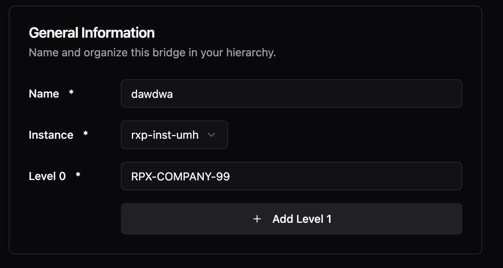
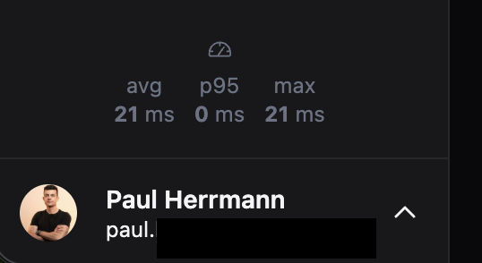
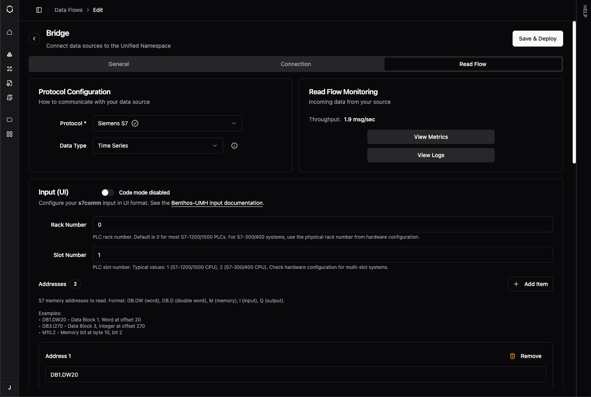
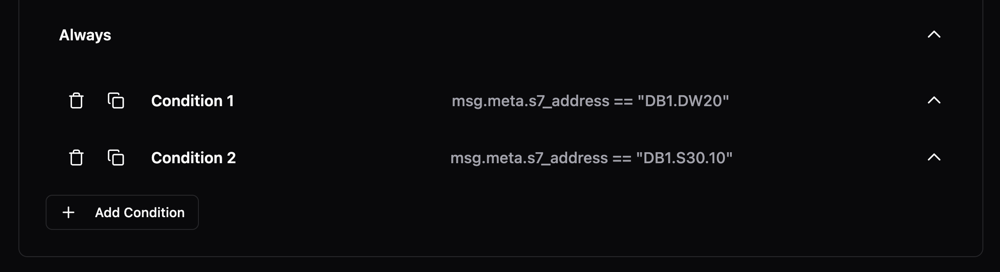
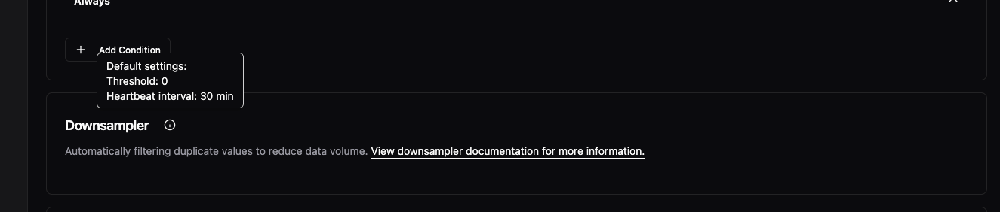
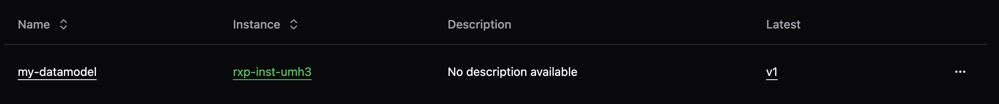
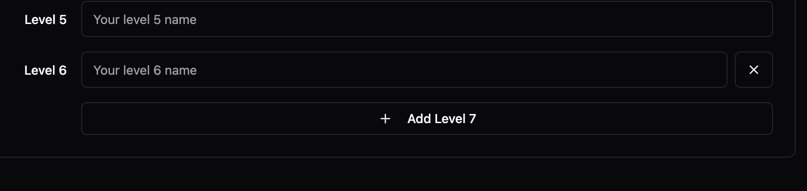
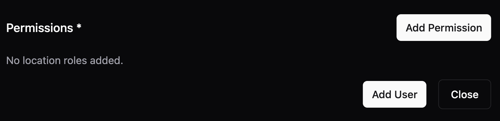
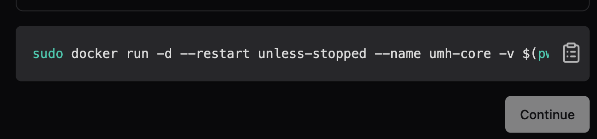

# Changelog

Release notes for UMH.

---

### January 13, 2026

**Data Flow Setup Wizard**

Creating new Data Flows is now guided and faster. When you select a protocol like OPC UA, S7, or Modbus, the form is automatically prefilled with common settings—you only need to enter your device's IP address and port. The new vendor/protocol selection cards make it easy to find your device type.

**Improvements**

- Protocol forms now display helpful examples below field descriptions, showing valid values at a glance (e.g., "Examples: ns=2;s=MyNode, ns=3;i=1001")
- The metadata panel in Topic Browser can now be resized by dragging the divider
- When creating bridges for Modbus or S7, the port field is now prefilled with the standard port (502 for Modbus, 102 for S7)
- Data Flow editors now only prompt "Unsaved changes" when you've made actual changes—formatting-only YAML changes no longer trigger false warnings
- Loading spinners now behave consistently across all pages, including when you only have umh-core instances
- The sidebar correctly remembers whether you left it open or closed between sessions

**Fixes**

- Protocol forms properly wait for prefilled data before rendering, preventing a flash of empty forms
- Fixed loading placeholder colors that changed after a recent update, restoring the original subtle appearance

---

### December 18, 2025

**Visual Refresh**

We've upgraded our UI framework to deliver a more polished experience. Input fields are now more distinguishable with cleaner styling and proper backgrounds. Buttons have improved hover states for better feedback. Dark mode colors are more vibrant and consistent. Alert and error messages have a refined appearance with improved spacing and alignment throughout.



**Code Editor Search**

You can now search within YAML configurations using Ctrl+F (or Cmd+F on Mac) in the code editor. The Monaco editor search widget helps you quickly find and navigate to specific settings in large configurations.

**Profile Picture Support**

Your profile picture from Auth0 now appears in the sidebar and user menu. If no picture is available, you'll see your first name initial instead of email initial for a more personal touch.



**Improvements**

- App filters are now properly cleared when you sign out, so the next user sees a clean state

**Fixes**

- Fixed incorrect label in Topic Browser that showed "Physical Path" instead of "Location Path"

---

### v0.44.0

**Breaking Change: Non-Root Container Security**

**Action Required Before Upgrade**

This version runs as a non-root user (UID 1000) instead of root for better security. Your existing data directory was created by root, so you must change its ownership before starting the new container:

```bash
sudo chown -R 1000:1000 /path/to/umh-core-data
```

If you skip this step, the container will fail to start and show an error message with the exact command to fix it.

For new installations, we recommend using Docker named volumes, which handle permissions automatically:

```bash
docker volume create umh-core-data
docker run -v umh-core-data:/data ...
```

**New Features**

- **Non-Root Container Security** - umh-core now runs all processes as a regular user instead of root. This limits potential damage if a vulnerability is ever exploited—even if an attacker gets into the container, they can't gain root-level access.

- **Comprehensive Security Documentation** - New documentation at docs/production/security/ explains our security approach including threat model, shared responsibility, and compliance mapping for OWASP, NIST, and IEC 62443 standards.

---

### December 8, 2025

**Improvements**

- You can now use uppercase letters in data flow names, giving you more freedom to match your existing naming conventions
- Delete buttons (like "Remove Level" in location forms) now use a warning color with appropriate hover states, making destructive actions more visually distinct
- The Docker install command for local umh-core now uses Docker named volumes instead of bind mounts, working consistently across Docker Desktop (Mac/Windows), native Linux, and Podman

**Fixes**

- Validation error messages in protocol configuration forms now display below input fields instead of beside them on narrow screens
- Fixed a visual glitch where the sidebar would briefly "pop in" when loading pages in Chrome
- Fixed inconsistent padding and hover states on icon buttons in side panels
- Fixed the chevron/arrow icon not displaying correctly when adding a stream processor
- Fixed the height and hover area of the sidebar collapse/expand toggle button

---

### v0.43.18

**On-Demand Logs and Metrics Panels**

You can now access logs and metrics directly from any data flow component page. Click the "Logs" or "Metrics" button to open a side panel without leaving your current context. The panel appears on-demand instead of cluttering the interface with permanent tabs. Works across bridges, stream processors, and all data flow types.


**Cleaner JavaScript Debugging Output**

Bridge configuration debugging is now significantly easier. Previously, console output from JavaScript processors contained excessive escaped characters, making it difficult to read. The output now uses a Node.js-style representation that's more readable.


**OPC UA Subscriptions Without Tag Hierarchy**

Fixed an issue where subscribing directly to OPC UA child nodes (without a parent folder hierarchy) would cause validation errors or malformed topics with double dots. Topics are now properly constructed without the optional virtual path segment.

**Improvements**

- Status alerts and warnings now have a more consistent look with clearer explanations and collapsible technical details
- Buttons across the platform now follow a consistent design pattern with proper visual hierarchy

**Fixes**

- Delete dialogs now properly close when clicking the X button

---

### v0.43.17

**Debug Logging for Troubleshooting**

You can now add `debug_level: true` to your bridge or data flow configurations to enable detailed debug logging when troubleshooting connection issues. This is especially helpful for diagnosing OPC UA problems, as it automatically enables verbose protocol-level debugging.

**Improvements**

- **More Flexible Component Naming** - You can now use uppercase letters (A-Z) in bridge and component names, in addition to lowercase letters, numbers, dashes, and underscores.

**Bug Fixes**

- **Security Vulnerability Fixed** - Fixed a critical security vulnerability where malicious service names could potentially be used to access sensitive files on the system. Component names are now strictly validated to prevent path traversal attacks.

- **Production Build Optimization** - Fixed production build configuration to properly disable CGO, improving binary performance and security.

---

### November 20, 2025

**Dynamic Protocol Forms**

When enabled via the Dynamic Protocol Forms feature flag, you can now configure S7, Modbus, and OPC UA bridges using a form-based UI instead of writing YAML. You'll see an "Input (UI)" / "Input (YAML)" toggle in the bridge configuration page. Click on any field to edit it directly, add addresses with the "+ Add" button, and the system automatically generates valid YAML. This is a preview feature—enable it only for testing.



**SparkplugB Template Documentation**

The default SparkplugB template now includes comprehensive documentation for all available metadata fields. You'll see inline comments explaining pre-sanitized fields that let you build custom hierarchical topic structures without writing manual sanitization functions. The template also now processes both DDATA and NDATA messages.

**Improvements**

- Your sidebar collapse/expand preference is now remembered across sessions
- The back button now works more like your browser's back button, making navigation feel more natural

**Fixes**

- Form validation errors no longer appear immediately when opening forms—they only show after you interact with a field
- Fixed an issue where flat NDATA metrics could cause filter problems

---

### November 17, 2025

**Quick Condition Duplication**

You can now duplicate conditions with a single click using the new duplicate button in the condition header. Previously, you had to manually copy and paste condition content. The delete button now includes a confirmation dialog to prevent accidental removals, and both buttons have helpful tooltips.



**Improvements**

- The code/UI toggle button in stream processors now matches the design of toggle components used elsewhere
- Fixed the tag processor editor incorrectly flagging console and other standard JavaScript APIs as errors

**Fixes**

- Instance names now appear immediately after you change them, with automatic cache refresh

---

### v0.43.16

**OPC UA Browse Performance**

Browse operations now use a global worker pool instead of creating separate pools for each starting node, preventing worker exhaustion. Previously, browsing 300 nodes with MaxWorkers=20 created 6,000 concurrent workers; now uses 20 workers total.

**Improvements**

- **Documentation Consistency** - Getting started guide now uses "umh-core-data" folder name consistently across all documentation

- **OPC UA Server Compatibility** - Automatic detection and optimization for Ignition, Kepware, Siemens S7-1200/S7-1500, and Prosys OPC UA servers with vendor-specific tuning

- **S7-1200 PLC Support** - Automatic detection when Siemens S7-1200 PLCs don't support DataChangeFilter (Micro Embedded Device Profile), preventing subscription errors

**Bug Fixes**

- **S7-1200 Subscription Errors** - Fixed StatusBadFilterNotAllowed errors when subscribing to S7-1200 PLCs with data filters

- **Browse Operation Stability** - Resolved potential deadlocks during high-concurrency browse operations

---

### v0.43.15

**Data Infrastructure Independence**

Your production system no longer depends on Management Console connectivity to start. Previously, when Management Console was unreachable, the entire data infrastructure would fail to start. Now the system starts immediately and retries the connection in the background.

**Faster Deployments with Large Configurations**

Deployments complete 80-90% faster for customers with large configurations (e.g., 2,000+ OPC UA nodes). The system now logs configuration differences only at debug level instead of logging full structures on every change.

**Bug Fixes**

- **Location Levels Now Display Correctly** - Fixed issue where location level fields (Level 2-5) showed placeholder text like "Your level 2 name" instead of actual saved values in Bridge edit views.

- **Log Spam Prevention** - When Management Console is unreachable, error logging is now limited to 1 error per second instead of 100 errors per second.

---

### v0.43.14

**OPC UA Large Server Support**

Fixed critical deadlock when browsing OPC UA servers with more than 100,000 nodes. Previously, browse operations would hang indefinitely and require container restarts. Now completes in under 1 second for 110k nodes.

**OPC UA Performance Boost**

Browse operations now complete up to 173x faster with 75-90% less memory usage. Connection times for large OPC UA servers are significantly faster, and CPU usage during browse is dramatically reduced.

**Reduced Network Traffic**

OPC UA bridges now automatically suppress duplicate value notifications (deadband filtering), reducing unnecessary network traffic and processing overhead. Enabled by default for all numeric node types.

**Better JavaScript Debugging**

Fixed console.log() and other console methods in JavaScript processors to work like browser environments. You can now properly debug JavaScript transformations by logging complex objects and seeing their actual structure.

**Bug Fixes**

- **Connection Failures in High-Latency Regions** - Fixed timing mismatch that caused frequent EOF errors and connection failures in high-latency environments, particularly affecting sites in Japan and other regions with network latency above 200ms.

---

### v0.43.13

**OPC UA Connection Improvements**

Fixed certificate generation issues that prevented connections to OPC UA servers with strict security requirements (like Ignition 8.3 using Basic256Sha256 security policy). Certificates now include all required security attributes. No configuration changes needed.

**Bug Fixes**

- **Array Data Type Preservation** - Fixed array handling to preserve whether values are numbers or text when passing data between systems. Previously, arrays like [1,2,3] could be confused with ["1","2","3"], causing data processing errors.

- **Service Restart Stability** - Fixed crashes that could occur when restarting services with active Sparkplug B connections.

---

### v0.43.12

**Resource Limit Blocking Enabled by Default**

Resource limit blocking is now enabled by default to protect your system from overload. When your system is at capacity (high CPU/memory/disk usage), new protocol converter deployments will be blocked automatically with clear explanations.

You can disable this protection by setting `agent.enableResourceLimitBlocking: false` in your configuration, but we recommend keeping it enabled.

**Improvements**

- **Clearer Resource Blocking Messages** - When deployment is blocked due to resource constraints, you'll now see the actual reason (like "CPU utilization critical - Reduce system load or disable resource limits") instead of a generic timeout message.

**Bug Fixes**

- **Redpanda Configuration Persistence** - Your custom Redpanda resource limits (CPU cores and memory settings) now persist correctly across restarts. Previously, MaxCores and MemoryPerCoreInBytes were being overwritten to defaults.

- **Blocked Converter UI Display** - Protocol converters blocked by resource limits now show their configured connection details (IP address, port, flows) in the UI instead of "Connection Unavailable".

---

### v0.43.10

**More Flexible Component Naming**

You can now use underscores in bridge and component names. Previously only lowercase letters, numbers, and hyphens were allowed. This makes it easier to match your existing naming conventions.

**OPC UA Quality Tag Support**

OPC UA data connections now capture quality/status codes from OPC UA servers, appearing in metadata as `opcua_attr_statuscode`. This helps verify data reliability from industrial equipment, especially useful for Ignition-based OPC UA servers.

**Better Error Visibility**

Stream processors now show clear warning messages when they receive incompatible data formats (like JSON objects instead of time-series data). Previously, data would silently disappear without explanation.

**Better Health Status Display**

Idle protocol converter states now correctly show as green/active instead of appearing unhealthy. This prevents false alarms when your data sources are legitimately inactive.

**Fixes**

- Container deployments no longer fail if Docker Hub is temporarily unavailable—the system now serves cached container images during outages
- The bridges interface now uses clearer terminology: "All" tab removed for simplicity, "Throughput" renamed to "Read Throughput", "Add Bridge" renamed to "Add Read Flow"
- Stream processors now generate smarter variable names for topics with the same name in different locations (e.g., area1Temperature instead of temperature_1)
- Form validation errors now clear immediately when you correct the input
- Company name now appears immediately after account registration
- Fixed critical issue where NULL-padded strings from S7 PLCs weren't being properly handled by the downsampler
- Fixed confusing IP address input instructions that made new users think they should type literal "{{ .IP }}" into form fields
- Components in idle states now correctly show as "active" health status instead of appearing degraded

---

### October 20, 2025

**Enterprise SSO Login Reliability**

Fixed login failures for enterprise customers using SAML-based single sign-on. Login now works regardless of email capitalization or verification status from SAML providers.

**Multi-Organization Account Login**

Fixed a bug that prevented users from accessing multiple organizations with the same email address. Messages are now routed correctly for all users regardless of how many organizations they access.

**Instance Communication Stability**

Fixed "All customer instances unreachable" errors for customers with many instances. The system now safely handles high-volume logging by limiting response sizes to 10MB and 200 messages per request.

**Email Consistency in Onboarding**

Email addresses are now normalized to lowercase throughout the entire onboarding process, preventing case-related mismatches.

---

### October 16, 2025

**Data Compression Visibility**

The downsampler (report-by-exception) feature that's been automatically compressing your bridge data is now visible in the UI. You'll see a new "Advanced Processing" card in bridge configurations showing that compression is enabled by default. This feature reduces storage and network usage by filtering duplicate values—now you can see it's there and access documentation about how it works.



**Faster Component Navigation**

You can now click directly on component names to edit them, instead of using the three-dot menu every time. This works across Instances, Data Flows, and Models—just click the name in the table and you'll navigate straight to the configuration page. The three-dot menu is still available for additional actions.



**Fixes**

- Fixed misaligned "Remove Level" buttons in location configuration forms with consistent heights and proper spacing



---

### October 10, 2025

**Bridge Location Handling**

- Fixed incorrect behavior when selecting or validating bridge locations
- Improved internal logic for bridge location validation to prevent mis-assigned or missing locations

**User Management**

- Added location validation when adding new users with direct feedback if the selected location doesn't meet requirements



**UI Enhancements**

- Aligned copy/paste buttons with better positioning for consistency across views
- Unified button styles throughout the interface for a cleaner look



**Fixes**

- Resolved minor visual inconsistencies in bridge configuration layout
- Cleaned up redundant validation messages

---

### October 6, 2025

**Topic Browser Live Updates**

Topics now visually highlight when they receive new data, similar to MQTT Explorer. You'll see a brief highlight animation on the entire path whenever values update, making it easy to identify active data flows at a glance. Perfect for monitoring which topics are actively publishing without manually checking each one.

---

*As a SaaS platform, Management Console improvements are automatically deployed to all customers. UMH Core updates require upgrading your container version.*
