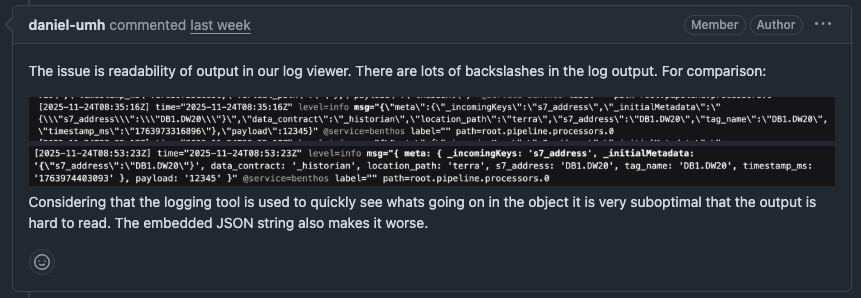

# UMH Core Changelog

Release notes for the UMH Core edge gateway.

---

## v0.44.0

*Released: December 17, 2025*

### Breaking Change

**Action Required Before Upgrade**

This version runs as a non-root user (UID 1000) instead of root for better security. Your existing data directory was created by root, so you must change its ownership before starting the new container:

```bash
sudo chown -R 1000:1000 /path/to/umh-core-data
```

If you skip this step, the container will fail to start and show an error message with the exact command to fix it.

For new installations, we recommend using Docker named volumes, which handle permissions automatically:

```bash
docker volume create umh-core-data
docker run -v umh-core-data:/data ...
```

### New Features

- **Non-Root Container Security** - umh-core now runs all processes as a regular user instead of root. This limits potential damage if a vulnerability is ever exploited—even if an attacker gets into the container, they can't gain root-level access.

- **Comprehensive Security Documentation** - New documentation at docs/production/security/ explains our security approach including threat model, shared responsibility, and compliance mapping for OWASP, NIST, and IEC 62443 standards.

---

## v0.43.18

*Released: December 1, 2025*

### Bug Fixes

- **Cleaner JavaScript Debugging Output** - Bridge configuration debugging is now significantly easier. Previously, console output from JavaScript processors contained excessive escaped characters, making it difficult to read. The output now uses a Node.js-style representation that's more readable.



- **OPC UA Subscriptions Without Tag Hierarchy** - Fixed an issue where subscribing directly to OPC UA child nodes (without a parent folder hierarchy) would cause validation errors or malformed topics with double dots. Topics are now properly constructed without the optional virtual path segment.

<details>
<summary>Technical Notes</summary>

- Updated benthos-umh to v0.11.13

</details>

---

## v0.43.17

*Released: November 25, 2025*

### New Features

- **Debug Logging for Troubleshooting** - You can now add `debug_level: true` to your bridge or data flow configurations to enable detailed debug logging when troubleshooting connection issues. This is especially helpful for diagnosing OPC UA problems, as it automatically enables verbose protocol-level debugging.

### Improvements

- **More Flexible Component Naming** - You can now use uppercase letters (A-Z) in bridge and component names, in addition to lowercase letters, numbers, dashes, and underscores.

### Bug Fixes

- **Security Vulnerability Fixed** - Fixed a critical security vulnerability where malicious service names could potentially be used to access sensitive files on the system. Component names are now strictly validated to prevent path traversal attacks.

- **Production Build Optimization** - Fixed production build configuration to properly disable CGO, improving binary performance and security.

---

## v0.43.16

*Released: November 13, 2025*

### Improvements

- **Documentation Consistency** - Getting started guide now uses "umh-core-data" folder name consistently across all documentation

- **OPC UA Browse Performance** - Browse operations now use a global worker pool instead of creating separate pools for each starting node, preventing worker exhaustion. Previously, browsing 300 nodes with MaxWorkers=20 created 6,000 concurrent workers; now uses 20 workers total.

- **OPC UA Server Compatibility** - Automatic detection and optimization for Ignition, Kepware, Siemens S7-1200/S7-1500, and Prosys OPC UA servers with vendor-specific tuning

- **S7-1200 PLC Support** - Automatic detection when Siemens S7-1200 PLCs don't support DataChangeFilter (Micro Embedded Device Profile), preventing subscription errors

### Bug Fixes

- **S7-1200 Subscription Errors** - Fixed StatusBadFilterNotAllowed errors when subscribing to S7-1200 PLCs with data filters

- **Browse Operation Stability** - Resolved potential deadlocks during high-concurrency browse operations

---

## v0.43.15

*Released: November 10, 2025*

### Improvements

- **Data Infrastructure Independence** - Your production system no longer depends on Management Console connectivity to start. Previously, when Management Console was unreachable, the entire data infrastructure would fail to start. Now the system starts immediately and retries the connection in the background.

- **Faster Deployments with Large Configurations** - Deployments complete 80-90% faster for customers with large configurations (e.g., 2,000+ OPC UA nodes). The system now logs configuration differences only at debug level instead of logging full structures on every change.

### Bug Fixes

- **Location Levels Now Display Correctly** - Fixed issue where location level fields (Level 2-5) showed placeholder text like "Your level 2 name" instead of actual saved values in Bridge edit views.

- **Log Spam Prevention** - When Management Console is unreachable, error logging is now limited to 1 error per second instead of 100 errors per second.

<details>
<summary>Technical Notes</summary>

- Fixed goroutine leaks where backend connection goroutines couldn't be cancelled during shutdown
- Fixed data race condition in GetClient() using sync.Once pattern
- Upgraded golangci-lint to v2.5.0
- Disabled flaky redpanda monitor test to improve CI/CD reliability

</details>

---

## v0.43.14

*Released: November 3, 2025*

### Improvements

- **OPC UA Large Server Support** - Fixed critical deadlock when browsing OPC UA servers with more than 100,000 nodes. Previously, browse operations would hang indefinitely and require container restarts. Now completes in under 1 second for 110k nodes.

- **OPC UA Performance Boost** - Browse operations now complete up to 173x faster with 75-90% less memory usage. Connection times for large OPC UA servers are significantly faster, and CPU usage during browse is dramatically reduced.

- **Reduced Network Traffic** - OPC UA bridges now automatically suppress duplicate value notifications (deadband filtering), reducing unnecessary network traffic and processing overhead. Enabled by default for all numeric node types.

- **Better JavaScript Debugging** - Fixed console.log() and other console methods in JavaScript processors to work like browser environments. You can now properly debug JavaScript transformations by logging complex objects and seeing their actual structure.

### Bug Fixes

- **Connection Failures in High-Latency Regions** - Fixed timing mismatch that caused frequent EOF errors and connection failures in high-latency environments, particularly affecting sites in Japan and other regions with network latency above 200ms.

---

## v0.43.13

*Released: October 30, 2025*

### Bug Fixes

- **OPC UA Connection Improvements** - Fixed certificate generation issues that prevented connections to OPC UA servers with strict security requirements (like Ignition 8.3 using Basic256Sha256 security policy). Certificates now include all required security attributes. No configuration changes needed.

- **Array Data Type Preservation** - Fixed array handling to preserve whether values are numbers or text when passing data between systems. Previously, arrays like [1,2,3] could be confused with ["1","2","3"], causing data processing errors.

- **Service Restart Stability** - Fixed crashes that could occur when restarting services with active Sparkplug B connections.

<details>
<summary>Technical Notes</summary>

- Updated benthos-umh from v0.11.7 to v0.11.8
- OPC UA certificates now comply with Part 6 specification (DigitalSignature, ContentCommitment, KeyEncipherment, DataEncipherment Key Usage bits)
- Array serialization changed from space-separated to JSON format
- Breaking change: Downstream processors using array splitting need to use JSON.parse() instead of space splitting

</details>

---

## v0.43.12

*Released: October 28, 2025*

### Important Change

**Resource limit blocking is now enabled by default** to protect your system from overload. When your system is at capacity (high CPU/memory/disk usage), new protocol converter deployments will be blocked automatically with clear explanations.

You can disable this protection by setting `agent.enableResourceLimitBlocking: false` in your configuration, but we recommend keeping it enabled.

### Improvements

- **Resource Blocking Enabled by Default** - New protocol converter deployments are now automatically blocked when your system is at capacity. You'll see clear messages explaining why deployment is blocked and how to resolve it.

- **Clearer Resource Blocking Messages** - When deployment is blocked due to resource constraints, you'll now see the actual reason (like "CPU utilization critical - Reduce system load or disable resource limits") instead of a generic timeout message.

### Bug Fixes

- **Redpanda Configuration Persistence** - Your custom Redpanda resource limits (CPU cores and memory settings) now persist correctly across restarts. Previously, MaxCores and MemoryPerCoreInBytes were being overwritten to defaults.

- **Blocked Converter UI Display** - Protocol converters blocked by resource limits now show their configured connection details (IP address, port, flows) in the UI instead of "Connection Unavailable".

---

## v0.43.11

*Released: October 27, 2025*

### Improvements

- **More Flexible Component Naming** - You can now use underscores in bridge and component names. Previously only lowercase letters, numbers, and hyphens were allowed. This makes it easier to match your existing naming conventions.

- **Better Health Status Display** - Idle protocol converter states now correctly show as green/active instead of appearing unhealthy. This prevents false alarms when your data sources are legitimately inactive.

### Bug Fixes

- **S7 Data Processing** - Fixed critical issue where NULL-padded strings from S7 PLCs weren't being properly handled by the downsampler. This could cause data processing errors when working with S7 CHAR/STRING data types.

- **Documentation Clarity** - Fixed confusing IP address input instructions that made new users think they should type literal "{{ .IP }}" into form fields. Instructions now show concrete examples like "192.168.1.100".

- **GraphQL API Documentation** - Reorganized GraphQL API documentation to show configuration requirements before usage examples.

<details>
<summary>Technical Notes</summary>

**Security Updates** - Multiple CVE vulnerabilities addressed:
- CVE-2025-22871 (critical): Arbitrary code execution via malformed certificates
- CVE-2025-4674 (high): Improper parsing of multi-line headers
- CVE-2025-22874 (high): Elliptic curve key retrieval vulnerability
- CVE-2025-47907 (high): Arbitrary file write on Windows
- Plus 6 medium severity CVEs in database/sql, os/exec, and other packages
- Alpine Linux updated to 3.22.2 (10 CVEs addressed)
- Go updated to 1.25.1 (stdlib fixes)
- Redpanda updated to v24.3.18 (rpk binary fixes)
- Docker client library updated to v28.3.3
- Zip Slip vulnerability fixed

</details>

---

## v0.43.10

*Released: October 27, 2025*

### Improvements

- **OPC UA Quality Tag Support** - OPC UA data connections now capture quality/status codes from OPC UA servers, appearing in metadata as `opcua_attr_statuscode`. This helps verify data reliability from industrial equipment, especially useful for Ignition-based OPC UA servers.

- **Better Error Visibility** - Stream processors now show clear warning messages when they receive incompatible data formats (like JSON objects instead of time-series data). Previously, data would silently disappear without explanation.

### Bug Fixes

- **Critical Firewall Security Fix** - Updated Docker engine to patch CVE-2025-54388, which could remove iptables firewall rules when firewalld is reloaded. Your container firewall protection is now secure.

- **Idle Component Health Status** - Components in idle states now correctly show as "active" health status instead of appearing degraded. This affects Redpanda, Topic Browser, Stream Processors, and Protocol Converters.

<details>
<summary>Technical Notes</summary>

- Updated benthos-umh from v0.11.5 to v0.11.6
- Updated github.com/docker/docker from v28.2.2 to v28.3.3 (security fix)
- Added comprehensive test coverage for component operational state mapping

</details>
