# Step 2: Connect Your First Data Source

Let's get some data flowing! We'll start with simulated data, then you can connect real devices later.

## Navigate to Data Flows

1. Click **"Data Flows"** in the left menu
2. Go to the "Bridges" tab. Here you find all of your bridges.
3. Click **"Add Bridge"**

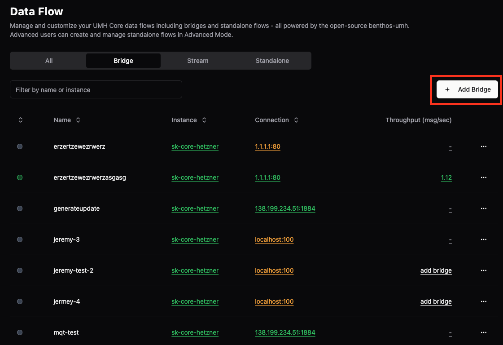

## Choose How to Create the Bridge

The UI will ask you how to start

- **From Scratch**: Start building from one of our curated templates.
- **From Existing Bridge**: Copy the configuration of an existing bridge.

For this tutorial, pick **"From Scratch"**.

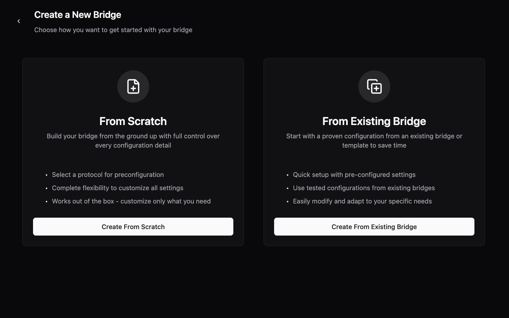

## Select the `generate` Template

You'll land on a list of curated templates. Type `generate` in the search bar and one template remains: **"Generic via Generate"** (Benthos `generate` input). Select it.

By default, this template produces `hello world` messages, so you don't need a real PLC to finish the tutorial.

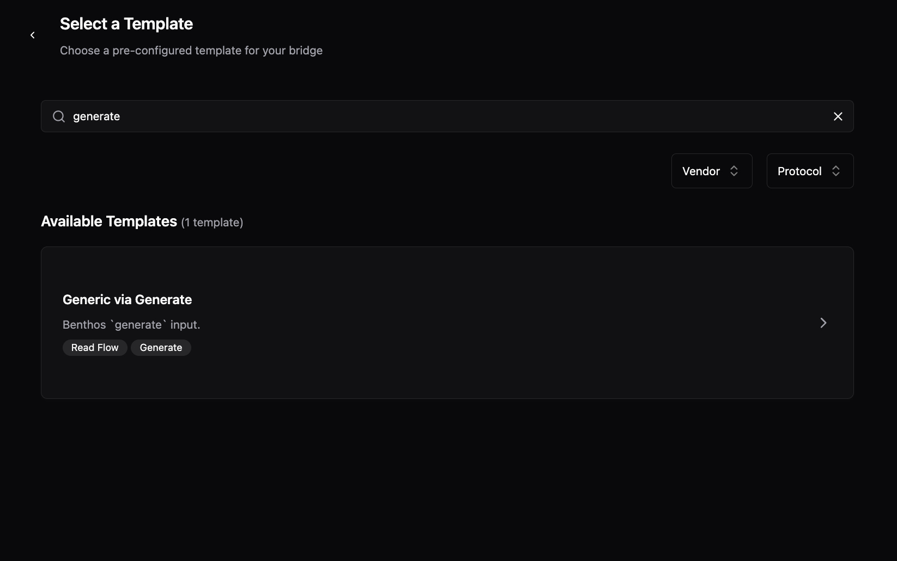

## Configure the Bridge - General Tab

The bridge editor has three tabs: **General**, **Read Flow**, and **Write Flow**.

On the **General** tab:

- **Name:** `my-first-generator-bridge`
- **Instance:** Select your UMH Core instance.
- **IP Address / Port:** The device to connect to. We have no real PLC for this tutorial, so use `localhost` and `8080`.
- **Location:** Pre-filled with your instance location. Leave it as is for now. In the screenshot we define a bridge for `enterprise.siteA`.

Once done, click **"Save & Deploy"**. A popup shows deployment progress and any errors or warnings. If everything goes well, you'll be redirected automatically.

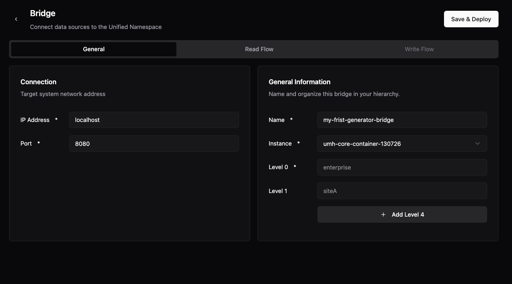

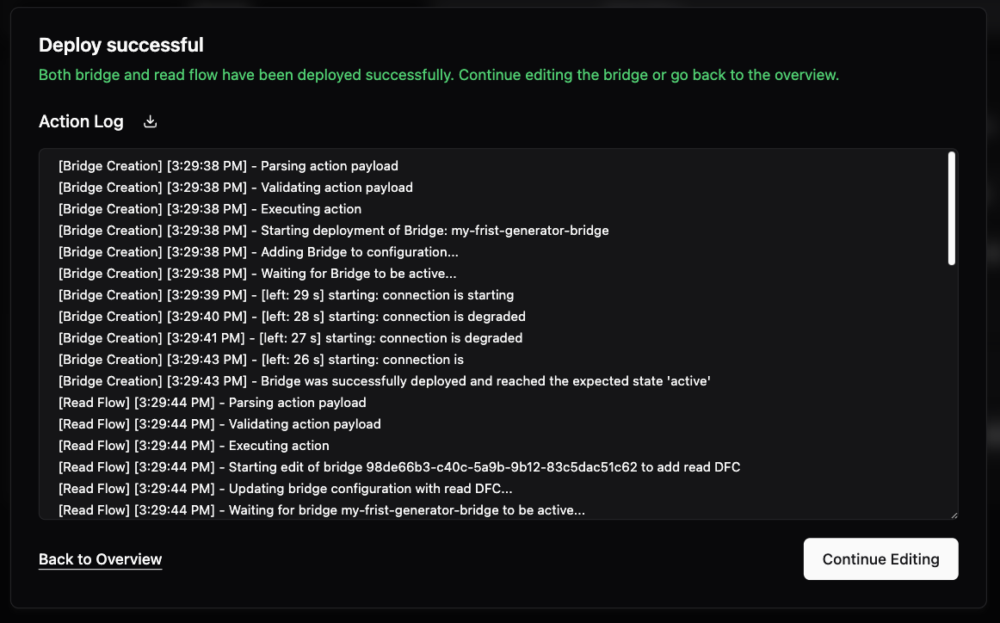

Back on the bridge, verify the connection succeeded. Here we see a latency of "0 ms" since we're connecting to localhost.

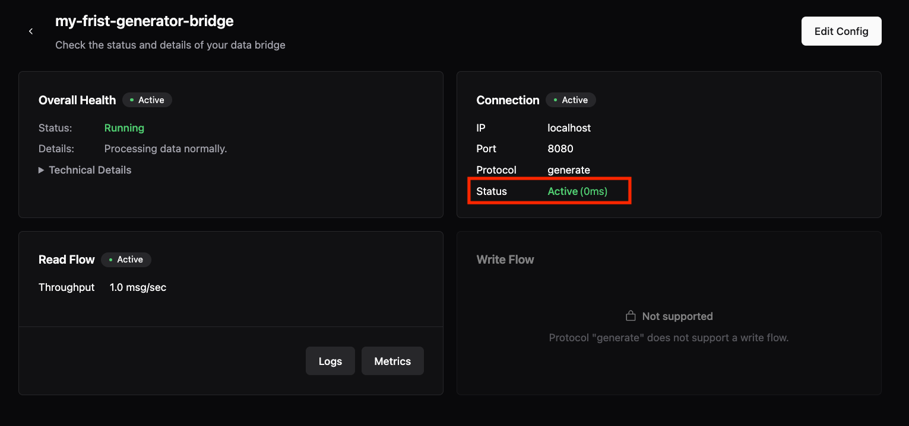

If connecting to a real PLC fails, the latency indicator turns orange:

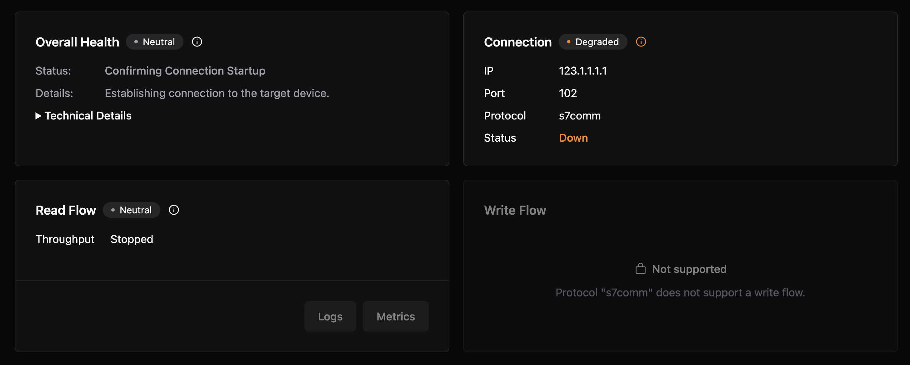

## Configure the Bridge - Read Flow Tab

Because you started from the "Generic via Generate" template, the protocol is already set to **Generate** and pre-filled with a template generator configuration.

In Data Type, make sure that **Time-Series** is selected and that the **Activate Flow** toggle is enabled.

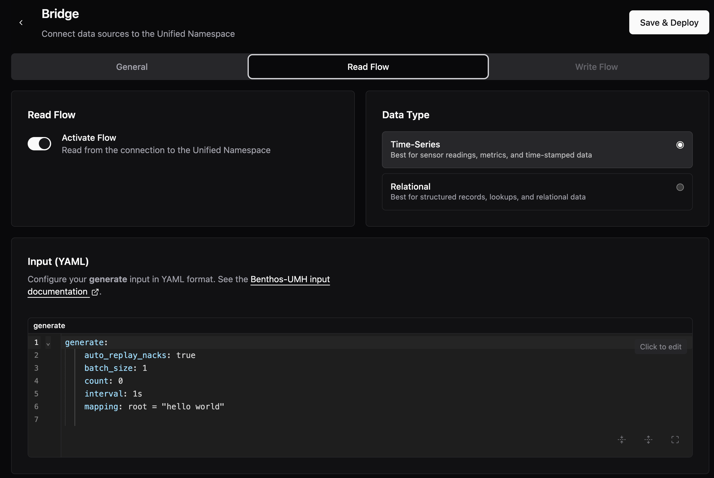


- **Input:** The template pre-fills a generator. For real protocols like "Modbus" or "Siemens S7" you'd see protocol-specific settings here. Keep the defaults: generate `hello world` every `1s`.

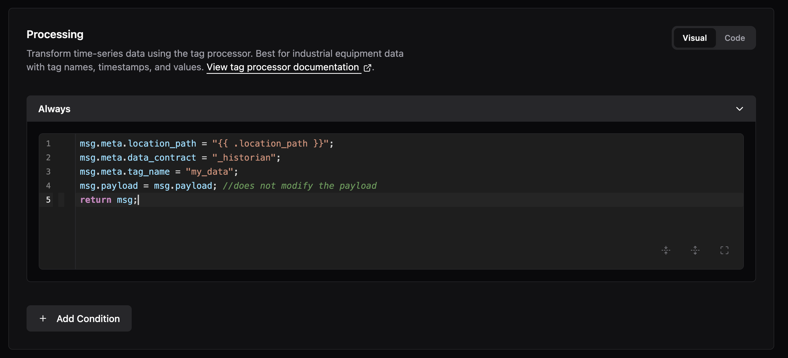

- **Processing:** The "Tag Processor" appears because we selected "Time Series" data type.

Click the **Always** expansion panel to expand the view. The expand shows the processor code.

There are three required fields:
- **location_path:** Where the data goes (auto-filled from bridge location)
- **data_contract:** Leave as `_raw` for now (no validation rules)
- **tag_name:** Name your tag (data point) - we'll use `my_data`

> 💡 **What's a tag?** In industrial systems, a "tag" is a single 
> data point - like a temperature sensor reading, motor speed, or 
> valve position. Think of it as a variable that changes over time.

The **Always** section uses JavaScript to process messages. We're not modifying anything for now, just passing the data through.

> 💡 **Tip:** You can modify data here later (e.g., unit conversions renaming). 
> If you don't know JavaScript, any LLM (ChatGPT, Claude) can help write the code.

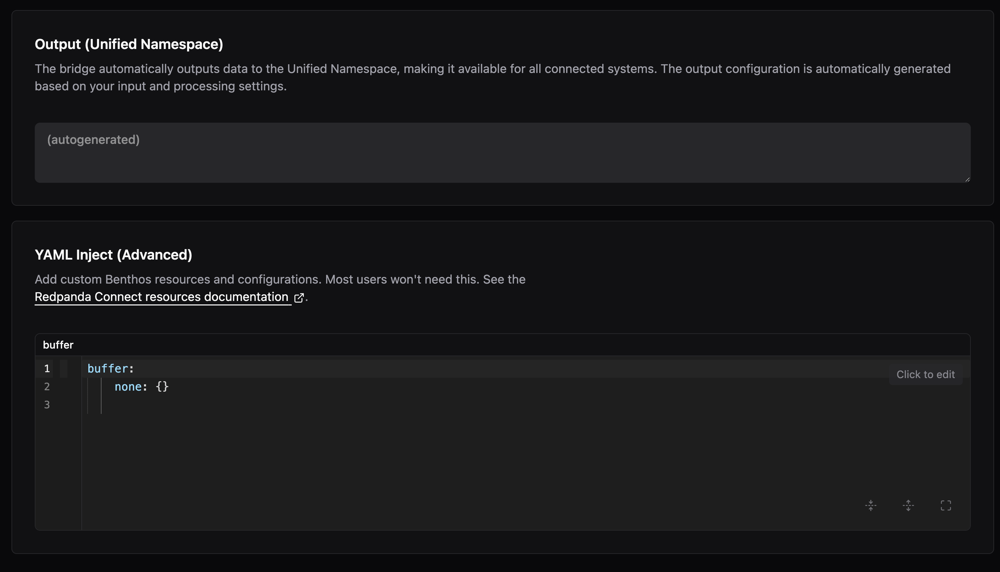

The Output section is auto-generated - it sends data to your Unified Namespace.

Click **"Save & Deploy"**.

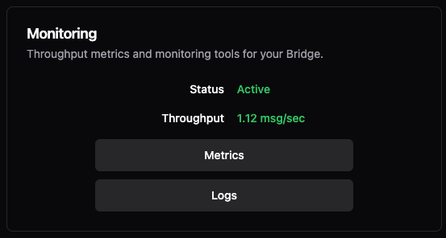

## 🎉 Success!

You should now see:
- **Status:** Active ✅
- **Throughput:** ~1 msg/sec

Your data is flowing!

## Step 3: View Your Data in the Topic Browser

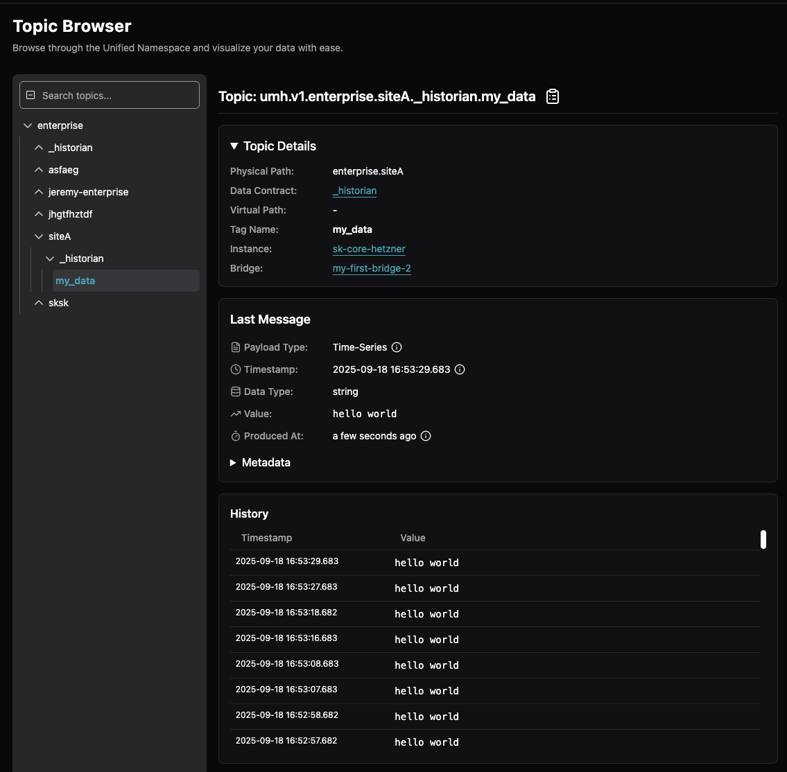

Click **"Topic Browser"** in the left menu. This shows all data in your Unified Namespace.

You'll see your data organized as a **topic**:
- `enterprise` → `siteA` → `_raw` → `my_data`

This is the full topic path: `enterprise.siteA._raw.my_data`

Exactly as we configured it! Click on `my_data` to see details.

- Topic Details shows your bridge configuration and data location
- Last Message shows the most recent `hello world` message with timestamp
- History shows a table of recent messages (would be a chart for numeric data)
- Metadata contains additional information about the data source (we'll use this later)


> 💡 **Only seeing one `hello world` row in your topics?** 
> 
> That's intended. Put simply, your data is processed by benthos-umh, which drops repeated, unchanged values. This is called **downsampling**.
> 
> [Learn more about our benthos-umh downsampler here.](https://docs.umh.app/benthos-umh/processing/downsampler)

## Understanding What You Built

You just created a complete data pipeline:

```text
Bridge → Processing → Unified Namespace → Topic Browser
```

**Key Concepts:**
- **Bridge:** The ONLY way data enters UMH (ensures quality and monitoring)
- **Location Path:** Organizes your data hierarchically (`enterprise.siteA`)
- **Data Contract:** Currently `_raw` (no validation rules)
- **Tag:** Your data point (`my_data`)
- **Topic:** Complete address in the UNS (`enterprise.siteA._raw.my_data`)

## What's Next?

**You have data flowing!** This is already production-ready for many use cases.

**Want to organize better?** → [Continue to Step 3: Organize Your Data](2-organize-data.md)

**Connect a real device?** Simply change the protocol from "Generate" to:
- **OPC UA** for modern PLCs
- **Modbus** for older equipment
- **MQTT Subscribe** for existing MQTT devices
- [See all 50+ supported protocols →](https://docs.umh.app/benthos-umh/input)

## Concepts Learned

Building on the location path from Step 1, you now understand:

- **Unified Namespace (UNS)** - Event-driven data backbone that eliminates point-to-point connections ([learn more](../usage/unified-namespace/README.md))
- **Bridge** - Gateway for external data into the UNS (the only way data enters)
- **Bridge Template** - Pre-configured starting point for a bridge (e.g. "Generic via Generate")
- **Data Flows** - Configuration area for bridges and other data pipelines
- **Protocol** - Connection method (manufacturing protocols like OPC UA, Modbus, S7, or IT protocols like HTTP)
- **Connection** - IP/hostname and port settings with latency monitoring
- **Tag** - A time-series data point (like a PLC variable)
- **Tag Processor** - JavaScript-based transformation for time-series data
- **Topic** - Complete data address: `location_path.data_contract.tag_name` ([topic convention](../usage/unified-namespace/topic-convention.md))
- **data_contract** - Data validation rules (`_raw` = no validation)
- **Topic Browser** - UI for viewing all data in the UNS
- **Downsampler** - Drops repeated unchanged values so the UNS stays clean
- **Throughput** - Tag updates per second for time-series data

---

**Pro tip:** Everything you just configured in the UI is stored as YAML. As you get comfortable, you can copy and modify these configurations for faster setup of similar devices.
