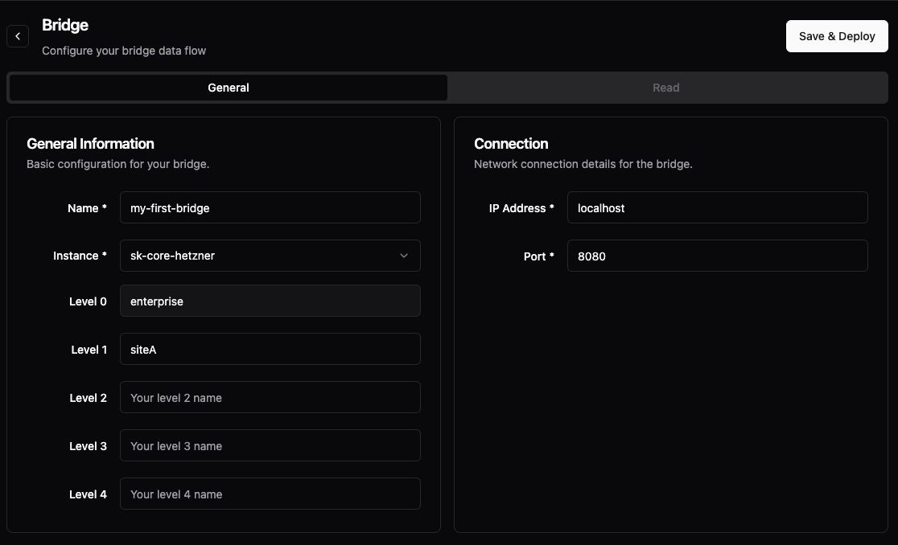
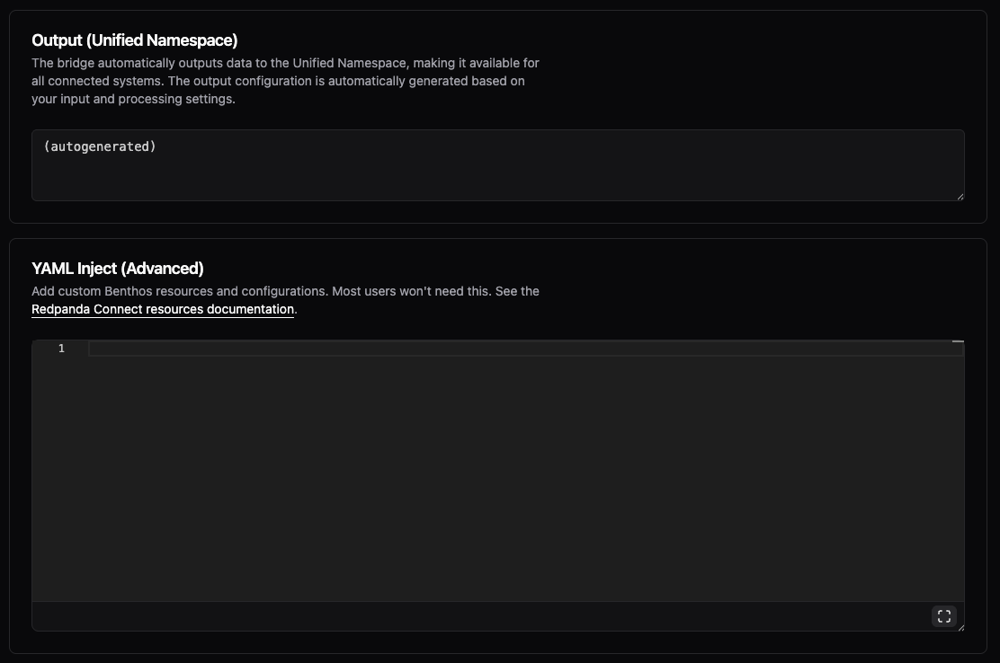

# Getting Started: Your First Data in 5 Minutes

## Step 1: Connect Your First Device (2 minutes)

Let's get some data flowing. We'll start with simulated data, then you can connect real devices later.

### In the Management Console:

1. Click **"Data Flows"** in the left menu
2. Go to the "Bridges" tab. Here you find all of your bridges.
3. Click **"Add Bridge"** (that's it - no other options to confuse you!)

### Fill in the Bridge General Tab:

**Bridge Name:** `my-first-bridge`
**Instance:** <Your UMH Core instance>
**Location:** Will be pre-filled with the location of the selected instance. You can further give the bridge a more detailed location, but for now let's leave it like this. In the screenshot, we are defining a bridge for `enterprise.siteA`
**Connection:** Here you can enter the IP / Hostname of the device you want to read or write from including the port you want to read/write from. In this tutorial, we don't have a real PLC, so we fake this by entering `localhost` as IP and `8080` as port.

Press "Save and Deploy". You now see a popup where you can follow the "Save and Deploy" flow and receive errors or warnings if these should occur. If everything goes well, you will be automatically redirected.

If you go back to the "General" tab, you can see whether the connection was successful. In this case, we can see a latency of "0 ms" as we are connecting to the local endpoint of UMH Core.

If you are connecting to a PLC and we cannot make a network connection, you will see that as the latency will go orange.

You might ask yourself what "Starting_failed_dfc_missing" means. This means, you have not configured a flow yet. So far, we only checked whether the connection is working. Now, lets actually make "some data flow" by reading from the endpoint. Go to the "Read" tab, as we want to read from the connection.

**Protocol:** Now you can select the protocol which you want to read from and the type of data you want to read out. For this example, select "generate" so that we don't have to connect to a real PLC.
**Data Type:** For PLCs you typically want to read out "tags" which are always "Time Series" (if you want to learn more about this, understand unified-namespace/payload-formats.md).
**Monitoring:** Under Monitoring you can see the state of the entire bridge (which is "Starting_failed_dfc_missing") as well as the throughput (which is zero as well).

**Input:** Because we selected "generate", we can generate here new messages. If you would have selected "Modbus" or "Siemens S7" you would see here protocol specific settings. For now, let's just take the default values here and generate every `1s` a message of `hello world`. You can open the [benthos-umh input documentation](https://docs.umh.app/benthos-umh/input) for more details.

**Processing:** Because we selected under **Data Type** "Time Series", we get now the Tag Processor here.

Under **Always** you can define using JavaScript / NodeRED syntax how you want to process each of the incoming messages. This gets executed always.

In the Tag Processor you always have to define the
- `location_path` which identifies which location you want the data to
- `data_contract` which allows you to fill in an existing data model for a specific location. Leave this to the default for now.
- `tag_name` which is the name of the tag. In the example, we use `my_data`.

There are more options available like `virtual_path` to organize your tags within a location into folders, but we will talk about this later. If you want to understand how these parameters are used to create the final topic, check out ../unified-namespace/topic-convention.md To understand how the tag processor work you can check out its documentation: https://docs.umh.app/benthos-umh/processing/tag-processor

In the example, we don't change the payload, but you could now use JavaScript to modify the payload, e.g., convert the incoming `hello world` to uppercase or similar. If you don't know JavaScript, don't worry. You can use the LLM of your choice (ChatGPT, Claude, etc.) for that.

You could also click on **Add Condition** to add a condition under which data gets additionally processed. This is helpful for example if you want to handle specific datapoints, e.g., from a specific OPC UA folder differently and move it to a different location. For now, let's ignore it.

You can also click on the `<>` symbol besides `Tag Processor` to switch to the full code mode. But that is for advanced users and therefore later.

The other fields can be ignored. The Output will be autogenerated for you (it will technically use the [UNS Output Plugin](https://docs.umh.app/benthos-umh/output/uns-output) for benthos-umh, but we will talk about that later).

Press Save & Deploy.

If everything was successful, you should now see "Status: Active" and a throughput of roughly 1 msg/sec.

## View the data

Now you can go in the left menu to "Topic Browser". Here you can find all the data that you have sent to your Unified Namespace.

You should now see your `enterprise` and `siteA` with a data contract of `_historian` and a tag name of `my_data`. Exactly how we defined it earlier! Click on it.

Under **Topic Details** you should now see everything you have entered in the Bridge before. You can even see from which bridge it is coming from.

Under **Last Message** you can see the last message. Because we selected `Time Series` and used the `Tag Processor` we see here `Time Series`. You can additionally view its timestamp, the data type, its value, etc.

Under **Metadata** you can see all the metadata of the tag, so everything you have manually added in the Tag Processor using `msg.meta` as well as everything that was automatically generated. We can ignore this for now, but it will become handy later.

Under **History** you can see either as a chart (if you have a data type of number) or a table (which we have as we send in `hello world` so a string).

### What Just Happened?

You created a "bridge" - the ONLY way data enters UMH. The bridge:
- Generates fake `hello world` messages
- Adds location information automatically from your bridges location
- Sends data to the Unified Namespace

That's it for now! In the next step, we will modify this to allow you to select multiple locations.
