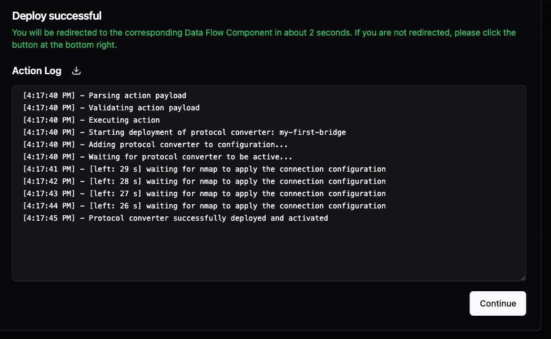

# Step 2: Connect Your First Data Source

Let's get some data flowing! We'll start with simulated data, then you can connect real devices later.

## Navigate to Data Flows

1. Click **"Data Flows"** in the left menu
2. Go to the "Bridges" tab. Here you find all of your bridges.
3. Click **"Add Bridge"** (that's it - no other options to confuse you!)


## Configure the Bridge - General Tab

- **Bridge Name:** `my-first-bridge`
- **Instance:** Your UMH Core instance
- **Location:** Pre-filled with your instance location. You can add more detail later, but for now leave it as is. In the screenshot, we're defining a bridge for `enterprise.siteA`.
- **Connection:** Enter the IP/hostname and port of the device you want to connect to. Since we don't have a real PLC for this tutorial, we'll use `localhost` as IP and `8080` as port.


Click **"Save and Deploy"**. A popup will show the deployment progress and any errors or warnings. If everything goes well, you'll be automatically redirected.



Back on the "General" tab, you can verify the connection was successful. Here we see a latency of "0 ms" since we're connecting to localhost.


If connecting to a real PLC fails, the latency indicator will turn orange:


The status "Starting_failed_dfc_missing" means we haven't configured a data flow yet - we've only tested the connection. Let's actually get data flowing by configuring the "Read" tab.


- **Protocol:** Select the protocol to read from. Choose "Generate" to simulate data without a real PLC.
- **Data Type:** Select "Time Series" (the standard for PLC tags).
- **Monitoring:** Shows the bridge state (currently "Starting_failed_dfc_missing") and throughput (currently zero).


- **Input:** Since we selected "Generate", we can create test messages. With real protocols like "Modbus" or "Siemens S7", you'd see protocol-specific settings here. For now, use the defaults: generate `hello world` every `1s`.


- **Processing:** The "Tag Processor" appears because we selected "Time Series" data type.

Three required fields:
- **location_path:** Where the data goes (auto-filled from bridge location)
- **data_contract:** Leave as `_raw` for now (no validation rules)
- **tag_name:** Name your tag (data point) - we'll use `my_data`

💡 **What's a tag?** In industrial systems, a "tag" is a single data point - like a temperature sensor reading, motor speed, or valve position. Think of it as a variable that changes over time.

The **Always** section uses JavaScript to process messages. We're not modifying anything for now, just passing the data through.

💡 **Tip:** You can modify data here later (e.g., unit conversions, renaming). If you don't know JavaScript, any LLM (ChatGPT, Claude) can help write the code.


The Output section is auto-generated - it sends data to your Unified Namespace.

Click **"Save & Deploy"**.


## 🎉 Success!

You should now see:
- **Status:** Active ✅
- **Throughput:** ~1 msg/sec

Your data is flowing!

## Step 3: View Your Data in the Topic Browser


Click **"Topic Browser"** in the left menu. This shows all data in your Unified Namespace.

You'll see your data organized as a **topic**:
- `enterprise` → `siteA` → `_raw` → `my_data`

This is the full topic path: `enterprise.siteA._raw.my_data`

Exactly as we configured it! Click on `my_data` to see details.

- Topic Details shows your bridge configuration and data location
- Last Message shows the most recent `hello world` message with timestamp
- History shows a table of recent messages (would be a chart for numeric data)
- Metadata contains additional information about the data source (we'll use this later)

## Understanding What You Built

You just created a complete data pipeline:

```text
Bridge → Processing → Unified Namespace → Topic Browser
```

**Key Concepts:**
- **Bridge:** The ONLY way data enters UMH (ensures quality and monitoring)
- **Location Path:** Organizes your data hierarchically (`enterprise.siteA`)
- **Data Contract:** Currently `_raw` (no validation rules)
- **Tag:** Your data point (`my_data`)
- **Topic:** Complete address in the UNS (`enterprise.siteA._raw.my_data`)

## What's Next?

**You have data flowing!** This is already production-ready for many use cases.

**Want to organize better?** → [Continue to Step 3: Organize Your Data](2-organize-data.md)

**Connect a real device?** Simply change the protocol from "Generate" to:
- **OPC UA** for modern PLCs
- **Modbus** for older equipment
- **MQTT Subscribe** for existing MQTT devices
- [See all 50+ supported protocols →](https://docs.umh.app/benthos-umh/input)

## Concepts Learned

Building on the location path from Step 1, you now understand:

- **Unified Namespace (UNS)** - Event-driven data backbone that eliminates point-to-point connections ([learn more](../usage/unified-namespace/README.md))
- **Bridge** - Gateway for external data into the UNS (the only way data enters)
- **Data Flows** - Configuration area for bridges and other data pipelines
- **Protocol** - Connection method (manufacturing protocols like OPC UA, Modbus, S7, or IT protocols like HTTP)
- **Connection** - IP/hostname and port settings with latency monitoring
- **Tag** - A time-series data point (like a PLC variable)
- **Tag Processor** - JavaScript-based transformation for time-series data
- **Topic** - Complete data address: `location_path.data_contract.tag_name` ([topic convention](../usage/unified-namespace/topic-convention.md))
- **data_contract** - Data validation rules (`_raw` = no validation)
- **Topic Browser** - UI for viewing all data in the UNS
- **Throughput** - Tag updates per second for time-series data

---

**Pro tip:** Everything you just configured in the UI is stored as YAML. As you get comfortable, you can copy and modify these configurations for faster setup of similar devices.
