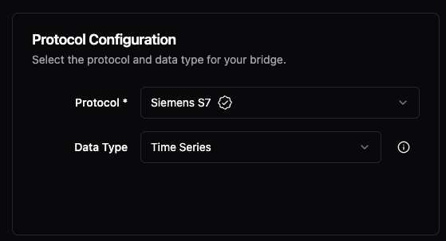
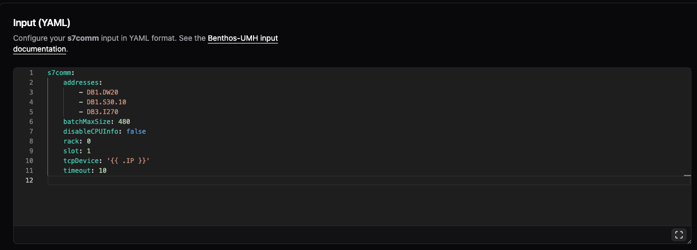
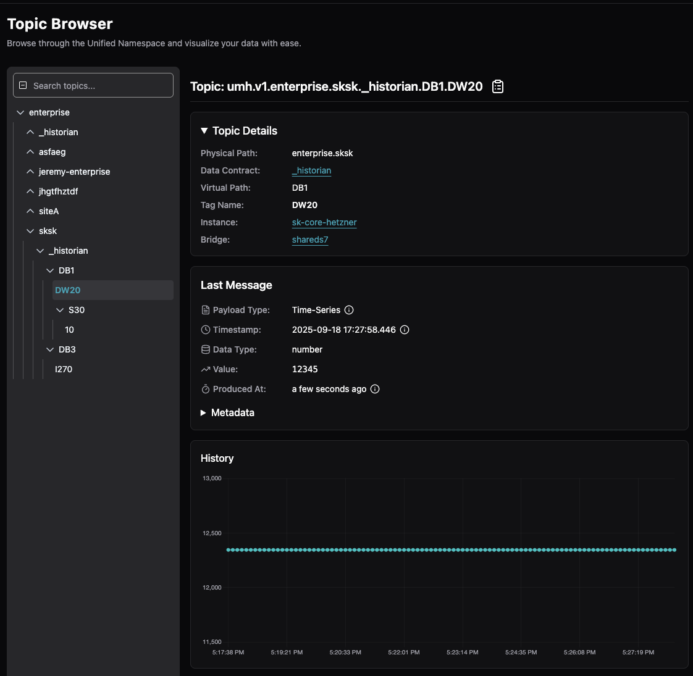
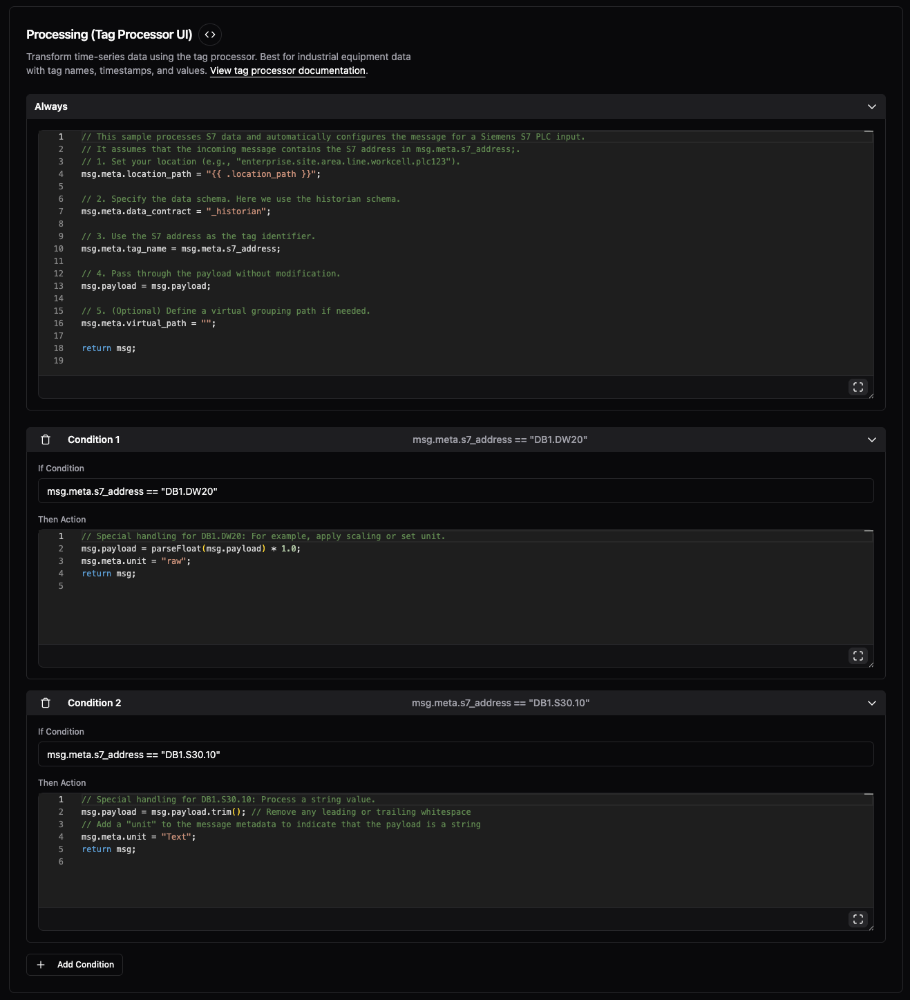

# Step 3: Organize Your Data

> **Prerequisite:** You should have data flowing from [Step 2](1-connect-data.md). If not, go back and complete that first!

## Understanding Messages

When data flows through bridges, each message contains:
- **payload**: The actual data value
- **meta**: Information about the message (source, destination, tag names, etc.)

In the processing code, you'll work with these as `msg.payload` and `msg.meta`.

## The Challenge

Right now you have one measurement going to one place:
```text
enterprise.siteA._raw.my_data
```

But real PLCs have:
- Hundreds of data points with various address formats
- Different data types (numbers, strings, booleans)
- Multiple machines on the same line

**Do you need to map each tag manually?** No! Let's connect a real PLC and see how automatic mapping works.

## Part 1: Connect a Real PLC (Or Simulate One)

### Create a New Bridge for a Real PLC

We'll use Siemens S7 as an example, but this works identically with OPC UA, Modbus, or any other protocol.

1. Go to **Data Flows** → **Add Bridge**
2. **Name:** `s7-plc`
3. **Protocol:** Select **Siemens S7** (or your protocol)
4. **Connection:**
   - **IP:** Enter your PLC's IP address (example: 192.168.1.100)
   - **Rack:** 0
   - **Slot:** 1



### Configure What to Read

In the **Input** section, you'll see protocol-specific settings:

```yaml
s7comm:
    addresses:
        - DB1.DW20      # Example address
        - DB1.S30.10    # Another address
        - DB3.I270      # Third address
    tcpDevice: '{{ .IP }}'
    rack: 0
    slot: 1
```



### Automatic Tag Mapping

In the **Processing** section, look at the **Always** code:

```javascript
// Set location from bridge config
msg.meta.location_path = "{{ .location_path }}";

// Use _raw (no validation - data passes through as-is)
msg.meta.data_contract = "_raw";

// Key concept: Protocol address becomes the tag name automatically
msg.meta.tag_name = msg.meta.s7_address;  // For OPC UA: msg.meta.opcua_tag_name

// Pass the value through
msg.payload = msg.payload;

return msg;
```

**Key line:** `msg.meta.tag_name = msg.meta.s7_address`

Each protocol provides its address in metadata:
- Siemens S7: `msg.meta.s7_address`
- OPC UA: `msg.meta.opcua_tag_name`
- Modbus: `msg.meta.modbus_address`

The addresses automatically become tags - no manual mapping needed!

### Template Variables

When you entered `192.168.1.100` in the Connection settings, it automatically became available as `{{ .IP }}` in your configuration code. Template variables connect your Connection settings to the processing code:
- `{{ .IP }}` - The IP address you entered in Connection settings
- `{{ .PORT }}` - The port you entered in Connection settings
- `{{ .location_path }}` - The location from Bridge configuration

This makes configurations reusable across different sites - just change the Connection settings and the template variables update automatically.

Learn more: [Template Variables Reference](../reference/variables.md)

Click **Save & Deploy**.

### See Your PLC Data

In **Topic Browser**, you now see ALL your PLC data automatically organized:

```text
enterprise.sksk._raw.DB1.DW20     [12345]
enterprise.sksk._raw.DB1.S30.10   ["Product ABC"]
enterprise.sksk._raw.DB3.I270     [789]
```

(These are S7 addresses, but OPC UA NodeIDs or Modbus registers would appear the same way)

**Result:** One bridge reads your entire PLC. Every address becomes a tag automatically.



## Part 2: Special Handling with Conditions

Some PLC tags need special treatment - scaling, unit conversion, or validation. Let's use **Conditions** to handle specific addresses differently.

### Add Your First Condition

1. Below the **Always** section, click **Add Condition**
2. **If Condition:** `msg.meta.s7_address == "DB1.DW20"` (use the appropriate metadata field for your protocol)
3. **Then Action:**

```javascript
// Scale the value and add engineering unit
msg.payload = parseFloat(msg.payload) * 1.0;
msg.meta.unit = "bar";  // This is pressure in bar
return msg;
```

### Add Another Condition for String Data

1. Click **Add Condition** again
2. **If Condition:** `msg.meta.s7_address == "DB1.S30.10"`
3. **Then Action:**

```javascript
// Clean up string data
msg.payload = msg.payload.trim();
msg.meta.unit = "Text";  // Mark as text data
return msg;
```



### What Conditions Do

- **Always section:** Runs for EVERY tag (sets basics)
- **Conditions:** Run ONLY for specific tags (special handling)

You can handle hundreds of tags with just a few conditions for the special cases.

### View the Enhanced Data

In **Topic Browser**, click on `DB1.DW20`. Notice:
- The value might be scaled
- **Metadata** now shows `unit: "bar"`
- Special handling applied ONLY to this tag


## Part 3: Organize with Virtual Folders

Right now all tags are at the root level. Let's organize them into logical folders using virtual paths.

### Add Organization with Conditions

1. **Add Condition** for production data
2. **If Condition:** `msg.meta.s7_address.startsWith("DB1")`
3. **Then Action:**

```javascript
// Group all DB1 data under "production" folder
msg.meta.virtual_path = "production";  // Creates organizational folder
return msg;
```

4. **Add Condition** for quality data
5. **If Condition:** `msg.meta.s7_address.startsWith("DB3")`
6. **Then Action:**

```javascript
// Group all DB3 data under "quality" folder
msg.meta.virtual_path = "quality";  // Creates organizational folder
return msg;
```

### The Result: Organized Folders

In **Topic Browser**, your data is now organized:

```text
enterprise.sksk._raw.production.DB1.DW20     [12345]
enterprise.sksk._raw.production.DB1.S30.10   ["Product ABC"]
enterprise.sksk._raw.quality.DB3.I270        [789]
```

- All DB1 tags → production folder
- All DB3 tags → quality folder
- Automatically organized by data block

You organize entire data blocks with one condition, not individual tags.

## Part 4: Route to Different Machines

What if different data blocks belong to different machines? Let's route them!

### Dynamic Location Routing

Add conditions to route data blocks to different machines:

1. **Add Condition** for Machine 1
2. **If Condition:** `msg.meta.s7_address.startsWith("DB1")`
3. **Then Action:**

```javascript
// DB1 belongs to machine-1
msg.meta.location_path = "{{ .location_path }}.machine-1";
msg.meta.virtual_path = "sensors";
return msg;
```

4. **Add Condition** for Machine 2
5. **If Condition:** `msg.meta.s7_address.startsWith("DB3")`
6. **Then Action:**

```javascript
// DB3 belongs to machine-2
msg.meta.location_path = "{{ .location_path }}.machine-2";
msg.meta.virtual_path = "quality";
return msg;
```

### Result

**ONE bridge now routes to MULTIPLE machines:**

```text
enterprise.sksk.machine-1._raw.sensors.DB1.DW20     [12345]
enterprise.sksk.machine-1._raw.sensors.DB1.S30.10   ["Product ABC"]
enterprise.sksk.machine-2._raw.quality.DB3.I270     [789]
```

## Understanding the Complete Picture

You now control every part of the topic:

```text
umh.v1.enterprise.sksk.machine-1._raw.sensors.DB1.DW20
       └─ fixed ─┘└─ location_path ─┘     └virtual┘└tag┘
                                             path   name
```

- **location_path**: WHERE the device is (can be dynamic)
- **virtual_path**: HOW you organize (folders for grouping)
- **tag_name**: WHAT you're reading (automatic from S7 address!)

## What You've Learned

✅ **Protocol addresses become tag names** - No manual mapping needed!
✅ **Conditions handle special cases** - Not every tag, just the exceptions
✅ **Folders organize automatically** - Group entire data blocks at once
✅ **Dynamic routing is simple** - Send different PLCs to different locations
✅ **Variables make it reusable** - `{{ .IP }}` works for any PLC

## Concepts Learned

Building on previous guides, you now understand:

- **Template variables** - Dynamic configuration using `{{ .IP }}`, `{{ .PORT }}`, `{{ .location_path }}`
- **Message structure** - msg.meta (metadata) and msg.payload (actual value)
- **Conditions** - If-then rules in Tag Processor for special handling
- **virtual_path** - Additional folder organization within topics
- **Dynamic routing** - One bridge serving multiple locations
- **Automatic tag mapping** - Protocol addresses become tag names automatically
- **Metadata** - Additional context in msg.meta (units, sources, custom fields)

## What's Next?

You can now:
- Connect entire PLCs with one bridge
- Organize hundreds of tags with a few conditions
- Route to different locations dynamically

**But there's still a risk:** What if DB1.DW20 suddenly sends a string instead of a number? Or DB3.I270 goes out of range?

**Ready to add data validation?** → [Step 4: Validate Your Data](3-validate-data.md)
