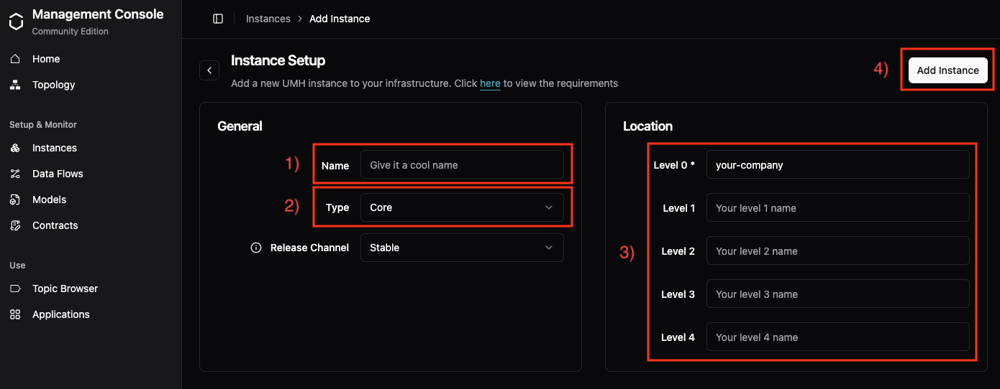

# Step 1: Install UMH Core

**60 seconds — that's all it takes to launch UMH Core.**

No kubectl, no Kubernetes setup, just a single Docker container. Almost anything that runs Docker works — from your MacBook to enterprise edge boxes.

> **Note:** This getting-started guide follows the common PLC/sensor path (raw → device models). For ERP integration and other patterns, see the [Data Modeling documentation](../usage/data-modeling/).

## System requirements

**Minimum:**

* 2 vCPU
* 4 GB RAM
* 40 GB SSD

**Architecture:**

* x86_64 (Intel/AMD 64-bit)
* ARM64 (64-bit ARM, but NOT Raspberry Pi - Redpanda requires 48-bit virtual address space)

For detailed sizing recommendations, see the [Sizing Guide](../production/sizing-guide.md).

## Option 1: Using the Management Console (Recommended)

1. **Sign up** at [management.umh.app](https://management.umh.app)
2. Click **"Add a new instance"**



3. **Configure your instance:**
   - **Name** (1): Give it a cool name (e.g., `my-first-umh`)
   - **Type** (2): Select "Core" from the dropdown
   - **Location** (3): Enter your location path:
     - **Level 0**: `your-company` (required - your enterprise name)
     - **Level 1**: `Your level 1 name` (optional - e.g., site or plant)
     - **Level 2-4**: Leave empty for now (optional)
   - Click **"Add Instance"** (4)

4. **Copy the Docker command** that appears
5. **Run it** on any machine with Docker installed

## 🎉 Success!

Your instance will appear as **"Online"** in the Management Console within seconds.

**Next step:** [Connect your first data source →](1-connect-data.md)

## Option 2: Local Installation (Without Management Console)

If you can't use the cloud Management Console:

```bash
mkdir umh-core-data && cd umh-core-data
docker run -d --name umh-core \
  -v $(pwd):/data \
  management.umh.app/oci/united-manufacturing-hub/umh-core:latest
```

**Note:** Without the Management Console, you'll need to edit configuration files directly. We strongly recommend using Option 1 for the best experience.

---

## Troubleshooting

**Volume permission errors**  
If you see `s6-svscan: warning: unable to stat benthos-dataflow-*` or protocol converters failing to activate, the container cannot write to the mounted volume. Test without the `-v` flag to confirm, then fix permissions with the `:z` flag on SELinux systems or ensure write access for the container user.

**SELinux volume permissions**  
On RHEL, Rocky, or other SELinux-enabled systems, append `:z` to the volume mount so Docker can relabel the directory:

```bash
-v "$(pwd):/data:z"
```

If you omit this, you might see `chmod: /data/config.yaml: no such file or directory` and the container fails to start.

**Corporate firewall/proxy issues**  
If your corporate network intercepts TLS traffic, see the [Corporate Firewalls Guide](../production/corporate-firewalls.md) to add your CA certificate or, as a last resort, set `allowInsecureTLS: true` in `config.yaml` or use `-e ALLOW_INSECURE_TLS=true` in your docker run command.

For proxy configuration, see the [Corporate Firewalls Guide](../production/corporate-firewalls.md) or add these arguments to your docker run:

```bash
-e HTTP_PROXY=http://proxy.company.com:8080 \
-e HTTPS_PROXY=https://proxy.company.com:8080 \
-e NO_PROXY=localhost,127.0.0.1,.local
```

---

## Coming from UMH Classic?

See the [Migration Guide](../production/migration-from-classic.md) for step-by-step migration instructions, including data contract changes and configuration updates.

---

## Concepts Learned

- **UMH Core** - Single-container Industrial IoT platform
- **Management Console** - Cloud UI for managing instances
- **Instance** - A running UMH Core deployment
- **Location hierarchy** - Organizational structure (enterprise → site → area → line)
- **Docker container** - How UMH Core runs

## Ready to Connect Data?

**You've successfully installed UMH Core!** 🚀

**Next step:** [Connect your first data source →](1-connect-data.md)
