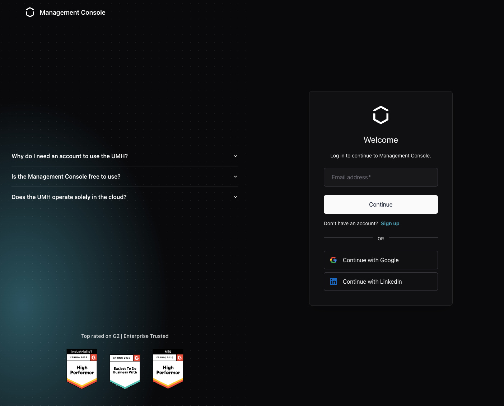

# Management Console

The Management Console at [management.umh.app](https://management.umh.app) is where you create UMH Core instances, configure what they do, and decide who in your company may change it. UMH Core itself runs on your own hardware. The console is the account layer around it.

## How it works together with UMH Core

```text
Management Console (cloud)                       Your site
──────────────────────────                       ─────────

Account, organization, users, licence
Instance configuration        ───── pull ─────▶  UMH Core ──▶ Unified Namespace
Status, logs, metrics, topics  ◀──── push ─────   (container)   (your data)
```

An instance registers itself once, using a token you generate in the console. After that, configuration travels down and status travels up:

- You edit a bridge in the console, the console queues the change, and the instance picks it up on its own schedule.
- The instance reports health, logs, metrics, and the topic data behind the [Topic Browser](../usage/unified-namespace/topic-browser.md).

The instance opens outbound HTTPS to `management.umh.app`, and by default nothing listens for connections from the internet, see [Deployment Model](../production/security/umh-core/deployment-security.md#deployment-model-edge-only-architecture). It needs that outbound connection, so UMH Core does not run air-gapped.

## Signing in

1. Go to [management.umh.app](https://management.umh.app) and enter your email address.
2. Complete the sign-in method your company uses. Which one you get depends on your account and your plan, see [Authentication](authentication/README.md).
3. Create an instance, or open one that a colleague already created.



## What you manage here

| Area | Where |
| --- | --- |
| Instances, bridges, data models, topics | [Usage](../usage/README.md) |
| Sign-in methods | [Authentication](authentication/README.md) |
| Roles, locations, emergency access | [Users and Permissions](users-and-permissions/README.md) |
| Threat model, responsibilities, compliance | [Security](security/README.md) |

Companies, membership, licences and editions are not documented yet. Ask your account executive in the meantime.

Everything you build with the console is documented under [Usage](../usage/README.md), because it works the same whether you configure it in the console or by editing the instance's config file.

## Account and settings

Open the account menu at the bottom of the sidebar, then **Settings**, for three tabs:

- **Account** shows your name, email, company, and licence state.
- **Settings** holds **Advanced Mode**, which reveals options for power users, and **Early Access Features**, which switches on features that are still being finished. Early access features can change or break without notice. 
- In addition, **Settings** lets you set up a Demo-Environment with a single click, allowing you to see our Management Console in action.
- **Permissions** (only available for Enterprise) shows your current role and what it allows, see [Users and Permissions](users-and-permissions/README.md).
