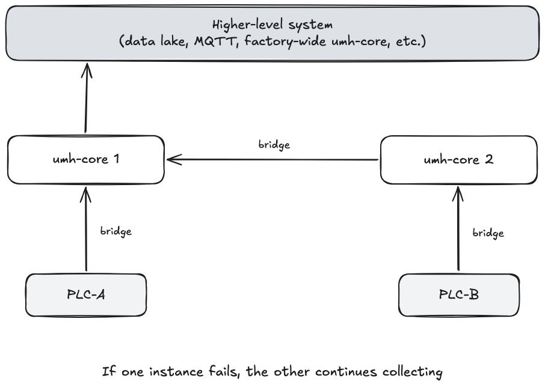

# Redundant Data Collection


This pattern applies to sites with **redundant PLCs** -- two physical controllers publishing the same data. Redundant PLCs are common in process manufacturing (oil and gas, chemicals, power generation, pharmaceuticals) where the process cannot be safely stopped. If you run standard, non-redundant PLCs -- as most discrete manufacturing sites do -- this page does not apply to you. A single umh-core instance already provides sub-second process recovery via S6, and your container manager handles container-level restarts. See [High Availability](../high-availability.md).


## The problem

When a site has redundant PLCs, each controller independently reads the same sensors. If the single umh-core instance collecting data goes down, data is lost until it recovers -- even though a second PLC could have provided the same readings.

## The solution

Run two umh-core instances, each connected to one of the redundant PLCs. Each instance collects into its own [Unified Namespace](../../usage/unified-namespace/README.md) under a PLC-specific topic:

```text
umh.v1.enterprise.line.PLC-A._historian   (umh-core 1, from its own bridge)
umh.v1.enterprise.line.PLC-B._historian   (umh-core 2, from its own bridge)
```

umh-core 2 pushes its data into umh-core 1's UNS. umh-core 1 now has both PLC-specific topics. A [stream processor](../../usage/data-flows/stream-processor.md) then does redundancy resolution: it selects the primary source from the two streams and writes a single consolidated topic:

```text
umh.v1.enterprise.line._historian         (consolidated, PLC-agnostic)
```

The higher-level system (a data lake, an MQTT broker, or another factory-wide umh-core instance) consumes this consolidated topic. It does not need to track which PLC provided each reading, but the original source is always traceable through the PLC-specific topics and message metadata.



All original data from both collectors is retained in the PLC-specific source topics. Redundancy resolution selects the primary source for downstream processing. It does not delete or modify the original records.

If one instance fails, the other continues collecting into its own UNS. When the failed instance recovers, the bridge resumes pushing data and redundancy resolution continues.

## Prerequisites

- **Two redundant PLCs.** Two physical or logical controllers that publish the same data. A single PLC with two IP addresses does not qualify -- you need hardware designed for redundancy. The redundant PLCs must produce equivalent data: the same sensors, the same values, and ideally synchronized timestamps.
- **High-availability deployment.** Both umh-core instances must be deployed so that a single infrastructure failure does not take both down at the same time. See [High Availability](../high-availability.md) for storage and deployment requirements.
- **A redundancy resolution strategy.** The stream processor needs a rule for selecting the primary source. The strategy depends on the protocol and what timestamps the PLCs provide. OPC UA subscriptions provide a device-level SourceTimestamp. If both PLCs are synchronized to a common time source (for example PTP/IEEE 1588), timestamp-based resolution works well. Clock synchronization between the redundant PLCs is a site prerequisite, not something OPC UA or umh-core provides. Polling-based protocols (Modbus, S7) do not provide device-level timestamps and require a different approach, for example last-value-wins within a time window.

## Recovery behavior

Two terms used in the table below:

- **MTTR** (Mean Time To Recovery): how long until data collection resumes after a failure.
- **RPO** (Recovery Point Objective): how much data is lost during the failure. RPO = 0 means no data is lost.

| Failure | MTTR | RPO | What happens |
|---------|------|-----|--------------|
| Process crash inside container | Seconds to minutes | 0 | S6 restarts the process in sub-second, but data collection resumes only after the bridge reconnects to the PLC (seconds to minutes depending on protocol and number of nodes). The other instance was never affected. |
| Container or pod crash | 30-60 seconds | 0 | Container manager restarts the container. The other instance continues. |
| Full instance failure | 2-5 minutes | 0 | Infrastructure reschedules the instance (depends on failure detection timeout and storage reattachment). The other instance continues. Data already in each instance's UNS is preserved. |

RPO is zero in all three cases because the second instance is always collecting independently. Even during the rescheduling window, one instance is still publishing. This guarantee covers single-instance failure only. Simultaneous failure of both instances (for example, a site-wide power loss) is not covered by this pattern. See [High Availability](../high-availability.md) for infrastructure-level mitigations.

**Note on OPC UA reconnection.** After a connection loss, the OPC UA client must re-establish the TCP connection, create a new session, re-browse the node tree, and re-create subscriptions. This typically takes seconds to minutes depending on the server and number of nodes. This is why the redundant pattern matters: the second instance bridges the gap while the first reconnects.

## When this pattern does not apply

- **Your PLC is not redundant.** Connecting two bridges to a single PLC doubles the load on it without improving availability. Redundant collection requires two separate endpoints publishing the same data. A single PLC with two IP addresses does not qualify -- if the controller fails, both addresses go down. (If your goal is to avoid data gaps during planned updates rather than hardware failure, a single PLC with multiple addresses may be sufficient for a zero-downtime update strategy instead.)
- **You only need process-level or container-level recovery.** A standard single umh-core deployment already provides sub-second process recovery and 30-60 second container recovery. No additional topology is needed. See [High Availability](../high-availability.md).
- **You are in discrete manufacturing.** Automotive assembly lines, packaging lines, and machine tools typically use standard PLCs without redundancy. This pattern adds complexity without benefit in those environments.

## Related

- [High Availability](../high-availability.md) -- infrastructure-level recovery (container restarts, storage, node rescheduling)
- [Architecture Patterns](README.md) -- overview of all deployment patterns
