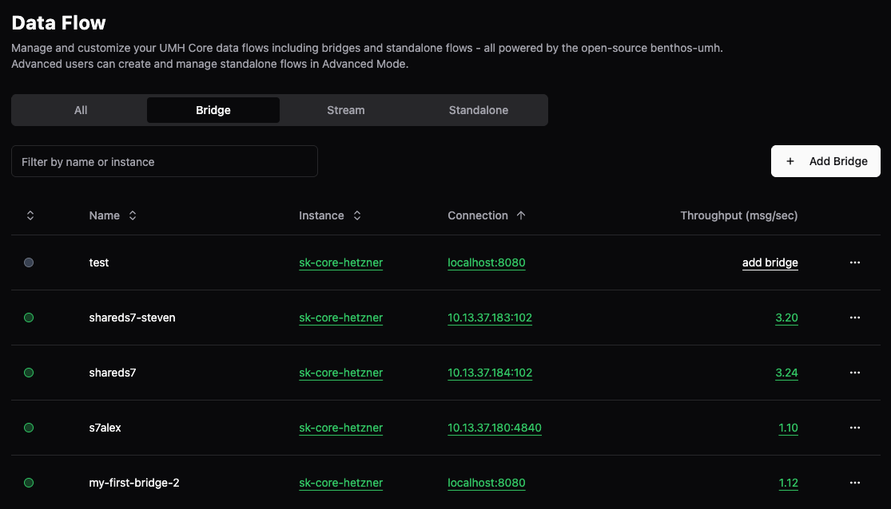
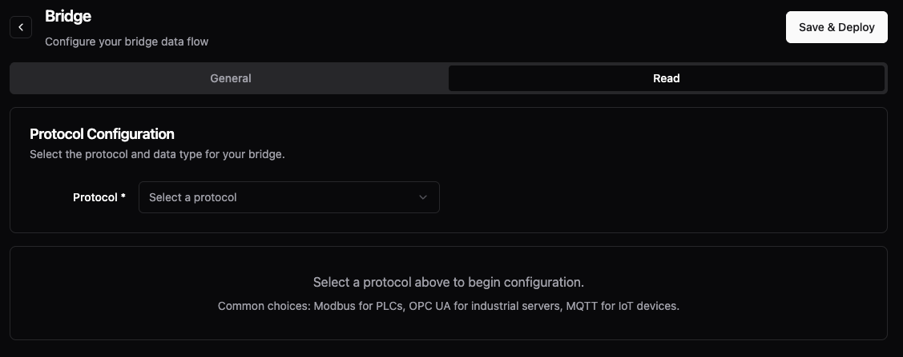
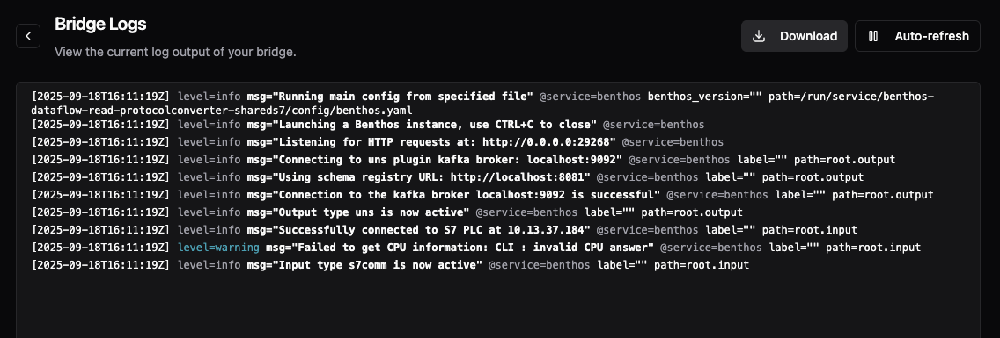
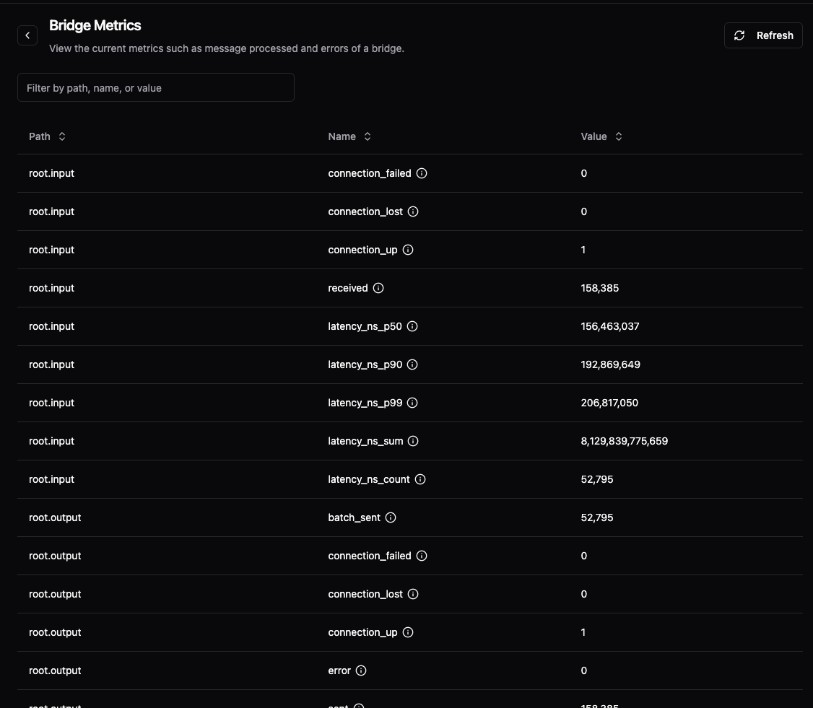

# Bridges

> **Prerequisite:** Understand [Data Flow concepts](README.md) and complete the [Getting Started guide](../../getting-started/).

Bridges move data into and out of the Unified Namespace, providing connection monitoring and automatic data organization. While read flows work with any protocol, write flows are not yet implemented - use [stand-alone flows](stand-alone-flow.md) for writing to external systems.

## UI Capabilities

| Action | Available | Notes |
|--------|-----------|-------|
| Create bridges | ✅ | Visual protocol configuration |
| Select protocols | ✅ | OPC UA, Modbus, S7, MQTT, 50+ more |
| Configure location path | ✅ | ISA-95 levels (0-4) |
| Monitor connection health | ✅ | Real-time status |
| View logs | ✅ | Live log streaming |
| View metrics | ✅ | Throughput monitoring |
| Edit bridges | ✅ | Modify and redeploy |
| Delete bridges | ✅ | Clean removal |
| Advanced mode | ✅ | Direct YAML editing |

## Creating a Bridge (UI)

### Step 1: Navigate to Data Flows

Go to **Data Flows** and click **Add Bridge**:



### Step 2: Configure General Settings

Fill in the basic information and press **Save & Deploy**. A popup will appear. Only then you can proceed with Step 3.


**General Information:**
- **Name**: Unique identifier for your bridge
- **Instance**: Select your UMH instance
- **Level 0-4**: Location path (e.g., enterprise → site → area → line → machine)

**Connection:**
- **IP Address**: Device IP (becomes `{{ .IP }}` variable)
- **Port**: Connection port (becomes `{{ .PORT }}` variable)

### Step 3: Select Protocol

Click the **Read** tab and select your protocol:



We support **50+ industrial protocols** through [Benthos-UMH](https://docs.umh.app/benthos-umh/input) plus everything from [Redpanda Connect](https://docs.redpanda.com/redpanda-connect/components/inputs/about/):

Common industrial protocols:
- **Modbus**: For PLCs and RTUs
- **OPC UA**: For industrial servers
- **S7**: For Siemens PLCs
- **Ethernet/IP**: For Allen-Bradley
- **And many more**: See full list at [Benthos-UMH Inputs](https://docs.umh.app/benthos-umh/input)

### Step 4: Configure Protocol Settings

Each protocol has specific settings. For example, S7:


### Step 5: Deploy

Click **Save & Deploy**. The bridge will start connecting to your device.

## Managing Bridges

### View Status

The main view shows all bridges with connection status and throughput:


- **Green dot**: Connected and running
- **Yellow dot**: Starting or warning state
- **Grey dot**: Intermediate states (starting, stopping, or stuck in starting state)

### Context Menu

Right-click any bridge for quick actions:


### View Logs

Monitor bridge activity in real-time:



### View Metrics

Track performance and throughput:



## Important: Data Types from Different Protocols

**Industrial protocols (OPC UA, Modbus, S7) only provide time-series data** - snapshots of values at points in time. They cannot directly provide relational records.

**IT protocols (MQTT, HTTP, Kafka) can provide relational data** - when you select "relational" as the data type in the UI, the bridge automatically uses [`nodered_js` processor](https://docs.umh.app/benthos-umh/processing/node-red-javascript-processor) to handle complex business records like work orders or batch reports.

For converting time-series to relational data, see [Stream Processors](stream-processor.md#time-series-to-relational-challenges) or use [Stand-alone Flows](stand-alone-flow.md) with state management.

## Configuration (YAML)

Advanced users can edit the YAML directly:

```yaml
protocolConverter:
  - name: my-plc-bridge
    desiredState: active
    protocolConverterServiceConfig:
      location:
        2: "production-line"
        3: "plc-01"
      config:
        connection:
          nmap:
            target: "{{ .IP }}"
            port: "{{ .PORT }}"
        dataflowcomponent_read:
          benthos:
            input:
              s7comm:
                addresses:
                  - DB1.DW20
                  - DB3.I270
                tcpDevice: "{{ .IP }}"
                rack: 0
                slot: 1
            pipeline:
              processors:
                - tag_processor:
                    defaults: |
                      msg.meta.location_path = "{{ .location_path }}";
                      msg.meta.data_contract = "_raw";
                      msg.meta.tag_name = msg.meta.s7_address;
                      return msg;
            output:
              uns: {}
      variables:
        IP: "192.168.1.100"
        PORT: "102"
```

### Key Configuration Elements

**Location Path:**
```yaml
location:
  0: enterprise   # Optional: inherits from agent
  1: site        # Optional: inherits from agent
  2: area        # Required: your addition
  3: line        # Required: your addition
  4: cell        # Optional: further subdivision
```

**Template Variables:**
```yaml
variables:
  IP: "192.168.1.100"      # Available as {{ .IP }}
  PORT: "502"              # Available as {{ .PORT }}
  SCAN_RATE: "1s"          # Custom variable {{ .SCAN_RATE }}
```

**Connection Monitoring:**
```yaml
connection:
  nmap:
    target: "{{ .IP }}"    # Uses IP variable
    port: "{{ .PORT }}"    # Uses PORT variable
```


## Next Steps

- Try the [Getting Started guide](../../getting-started/) to connect your first device
- Learn about [Data Models](../data-modeling/data-models.md) to structure your data
- Explore [Metadata and Tracing](../unified-namespace/metadata-and-tracing.md) for debugging
- Use [Stand-alone Flows](stand-alone-flow.md) for custom processing
- Configure [Stream Processors](stream-processor.md) to transform data