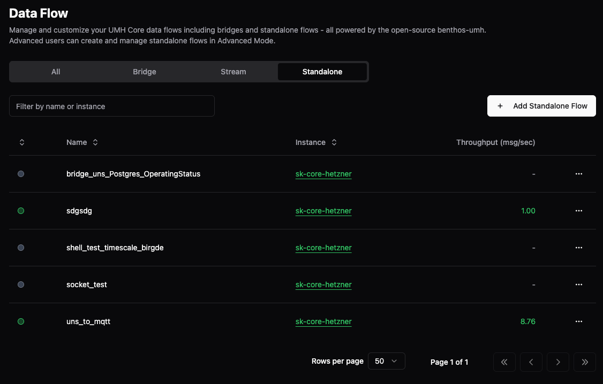

# Stand-alone Flows

> **Prerequisite:** Understand [Data Flow concepts](README.md) and [Bridges](bridges.md).

Stand-alone flows provide raw Benthos access for custom data processing when bridges or stream processors aren't sufficient. They're the fallback mechanism for write flows, external integrations, and specialized transformations.

## When to Use

Use stand-alone flows for:
- Point-to-point data transformation
- External system integration (databases, APIs, files)
- Custom processing that doesn't fit bridge patterns

Use bridges instead for:
- Industrial device connections
- Data that needs UNS organization
- Connections requiring health monitoring

## UI Capabilities

| Action | Available | Notes |
|--------|-----------|-------|
| Create flows | ✅ | Via UI with YAML editor |
| View flows | ✅ | Listed in Standalone tab |
| Edit configuration | ✅ | Direct YAML editing |
| Control state | ✅ | Active/Stopped toggle |
| Use example templates | ✅ | Pre-built samples available |
| Monitor status | ✅ | Throughput and state |
| View logs | ✅ | Real-time log streaming |
| View metrics | ✅ | Performance monitoring |
| Delete flows | ✅ | Via context menu |

## Creating a Stand-alone Flow (UI)

### Step 1: Navigate to Data Flows

Go to **Data Flows** → **Standalone** tab and click **Add Standalone Flow**:



### Step 2: Configure the Flow

The configuration interface has multiple sections:


**Key sections:**
- **General**: Name, instance, and state control (Active/Stopped)
- **Input (YAML)**: Configure data source (see [Benthos-UMH inputs](https://docs.umh.app/benthos-umh/input))
- **Processing (YAML)**: Transform data with processors
- **Output (YAML)**: Send to any destination (generic, not auto-generated like bridges)
- **Examples**: Pre-built templates including database bridges

### Step 3: Use Example Templates

Click the **Examples** tab to access pre-built configurations:


Available examples include:
- **mqtt_to_kafka_historian_bridge**: MQTT to Kafka with historian pattern
- **kafka_to_postgresql_historian_bridge**: Write to TimescaleDB (like Classic)
- **opcua_to_umh_core**: OPC UA integration
- **generate_to_stdout**: Testing pattern

### Step 4: Control Flow State

Use the state dropdown to control execution:


- **Active**: Flow is running
- **Stopped**: Temporarily disabled (useful for maintenance)

### Managing Stand-alone Flows

Right-click any flow for quick actions:


Options include:
- **Standalone Flow**: Edit configuration
- **Logs**: View real-time logs
- **Metrics**: Monitor performance
- **Delete**: Remove the flow

### Detail View

Click on any stand-alone flow to open the detail view with multiple tabs:

**Overview Tab**: Shows the flow configuration and current state:


**Logs Tab**: Stream real-time logs from the flow for debugging:


**Metrics Tab**: Monitor performance metrics including throughput and processing times:


### Enable Debug Logging

For troubleshooting data processing issues in stand-alone flows, enable the `debug_level` configuration option:

**Via YAML:**
```yaml
dataFlow:
  - name: custom-processor
    desiredState: active
    dataFlowComponentConfig:
      debug_level: true  # Enable detailed logging (default: false)
      benthos:
        # ...
```

**What it controls:**
- Log level: DEBUG (when `true`) vs INFO (when `false`, default)
- Detailed operational logging for input/output operations
- Processing step execution details
- Data transformation trace information

**Important:** Debug logging generates significantly more log data and may impact performance. **Use only during active troubleshooting** and disable afterward.

View logs via right-click → **Logs**. For comprehensive debug_level configuration reference, see [Configuration Reference](../../reference/configuration-reference.md).

## Configuration (YAML)

Stand-alone flows use standard Benthos configuration:

```yaml
dataFlow:
  - name: custom-processor
    desiredState: active
    dataFlowComponentConfig:
      benthos:
        input:
          # Any Benthos input
        pipeline:
          processors:
            # Processing logic
        output:
          # Any Benthos output
```


## Migrating from Benthos

Existing Benthos configurations work with minimal changes:

```yaml
# Original Benthos config
input:
  mqtt:
    urls: ["tcp://broker:1883"]
output:
  stdout: {}

# As UMH Core stand-alone flow
dataFlow:
  - name: migrated-flow
    desiredState: active
    dataFlowComponentConfig:
      benthos:
        input:
          mqtt:
            urls: ["tcp://broker:1883"]
        output:
          stdout: {}
```

## Next Steps

- Learn about [Bridges](bridges.md) for device connectivity
- Explore [Stream Processors](stream-processor.md) for data transformation
- See [Benthos-UMH Documentation](https://docs.umh.app/benthos-umh) for all processors