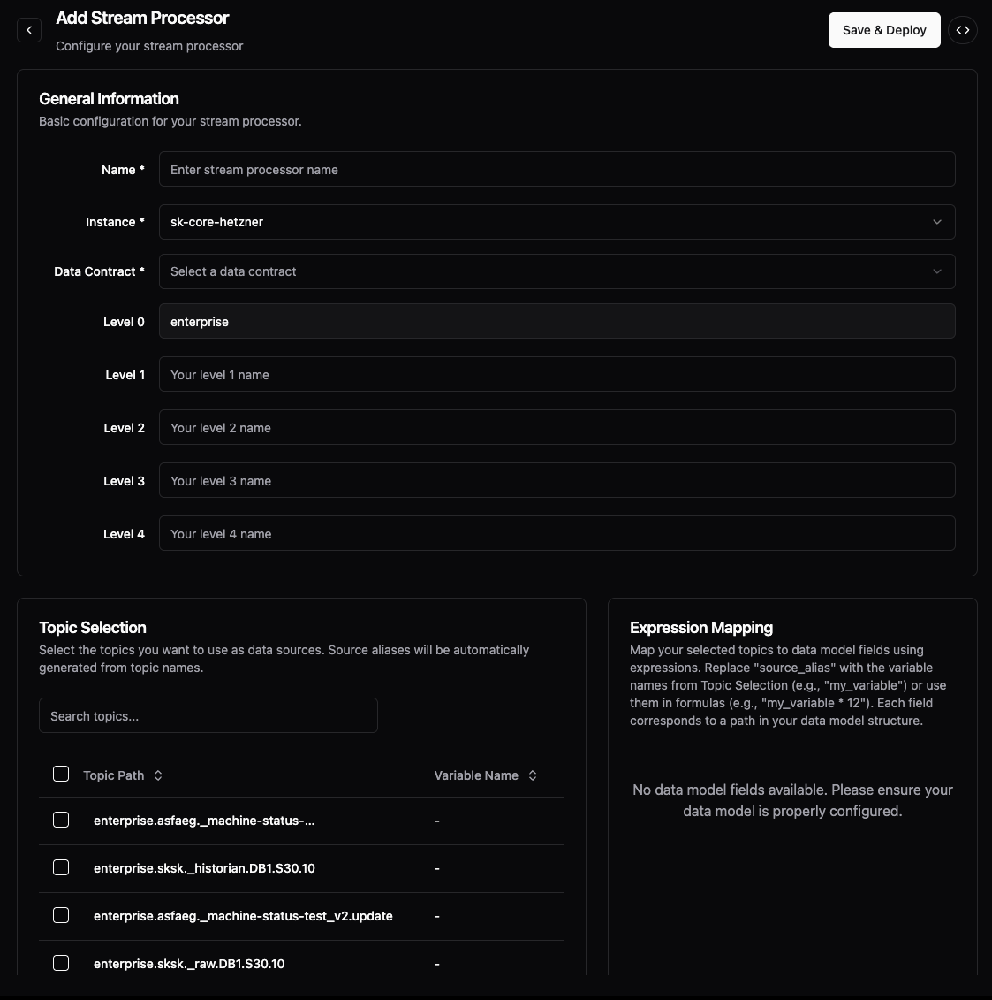

# Stream Processors

> **Prerequisite:** Understand [Data Flow concepts](README.md) and complete the [Getting Started guide](../../getting-started/).

Stream processors transform data already inside the Unified Namespace, aggregating multiple device streams into business KPIs and metrics. They're the third type of data flow, specialized for transforming device models into business models.

## When to Use

Use stream processors for:
- Aggregating data from multiple devices into KPIs
- Creating business metrics from raw sensor data
- Calculating OEE, efficiency, or other derived values
- Reducing data volume for cloud transmission

Use bridges instead for:
- Getting data into the UNS initially
- Single device to model mapping
- Direct protocol connections

## UI Capabilities

| Action | Available | Notes |
|--------|-----------|-------|
| Create processors | ✅ | Visual configuration with topic browser |
| Select source topics | ✅ | Browse and multi-select |
| Map to model fields | ✅ | Expression-based mapping |
| View processors | ✅ | Listed in Stream tab |
| Monitor throughput | ✅ | Real-time message rates |
| Edit processors | ✅ | Modify configuration |
| Delete processors | ✅ | Remove when not needed |
| Code mode | ✅ | Direct YAML editing |

## Creating a Stream Processor

Stream processors are created through the **Data Flows → Stream** tab:


### Step 1: General Configuration

Configure basic settings and location hierarchy:



- **Name**: Unique identifier for your processor
- **Instance**: The UMH Core instance to run on
- **Data Contract**: Select the output model (creates validated structure)
- **Location Levels**: Set where in the hierarchy to output data (Level 0-4)

### Step 2: Topic Selection

Select source topics and they'll automatically get variable names:


- Browse available topics in your UNS
- Select multiple sources with checkboxes
- Variables auto-generated (e.g., `_10` for first topic, `_10_2` for second)
- Use "Show Selected Only" to filter view
- Copy variable names for use in expressions

### Step 3: Expression Mapping

Map source variables to model fields using expressions:


- Each field in your data model appears on the right
- Enter expressions using the source variables
- Simple passthrough: `source_alias`
- Calculations: `_10 + _10_2` or more complex formulas
- The expressions support standard mathematical operations

### Step 4: Code Mode (Advanced)

Switch to Code Mode to see or edit the generated YAML configuration:


The UI automatically generates YAML with:
- **sources**: Your selected topics with location_path templates
- **mapping**: Field-to-expression mappings
- Comments explaining the structure

You can switch between UI and Code Mode anytime to fine-tune configurations.

**For detailed configuration instructions**, see the comprehensive [Stream Processors guide](../data-modeling/stream-processors.md) in Data Modeling.

## How It Works

Stream processors subscribe to multiple UNS topics and output to a single model-based topic:

```text
Multiple Device Model Topics → Stream Processor → Business Model Topic
(e.g., _pump_v1, _cnc_v1)        (aggregation)     (e.g., _maintenance_v1)
```

Example: Combining temperature and pressure from different sensors into a pump model:
- Input: `enterprise.site._raw.temp_sensor_1`, `enterprise.site._raw.pressure_gauge_2`  
- Output: `enterprise.site._pump_v1` with calculated efficiency

The system handles:
- Consumer group management for offset tracking
- Dependency-based processing (waits for all required inputs)
- Guaranteed output structure via data models

## Configuration (YAML)

While the UI is the primary way to create stream processors, they're stored as YAML:

```yaml
streamprocessors:
  - name: pump_efficiency_calc
    model:
      name: pump
      version: v1
    sources:
      - topic: enterprise.site._raw.inlet_temp
      - topic: enterprise.site._raw.outlet_temp
    mapping:
      efficiency: "(outlet_temp - inlet_temp) / inlet_temp * 100"
```

See the [Stream Processors configuration guide](../data-modeling/stream-processors.md) for detailed YAML structure.

## Key Differences from Other Data Flows

| Data Flow Type | Purpose | Input Source | Output |
|----------------|---------|--------------|--------|
| **Bridges** | Get data INTO the UNS | External devices (PLCs, sensors) | UNS topics |
| **Stream Processors** | Transform data WITHIN the UNS | UNS topics | UNS model topics |
| **Stand-alone Flows** | Custom processing | Any source | Any destination |

## Learn More

For comprehensive stream processor configuration and examples, see the [Stream Processors guide](../data-modeling/stream-processors.md) in Data Modeling documentation.