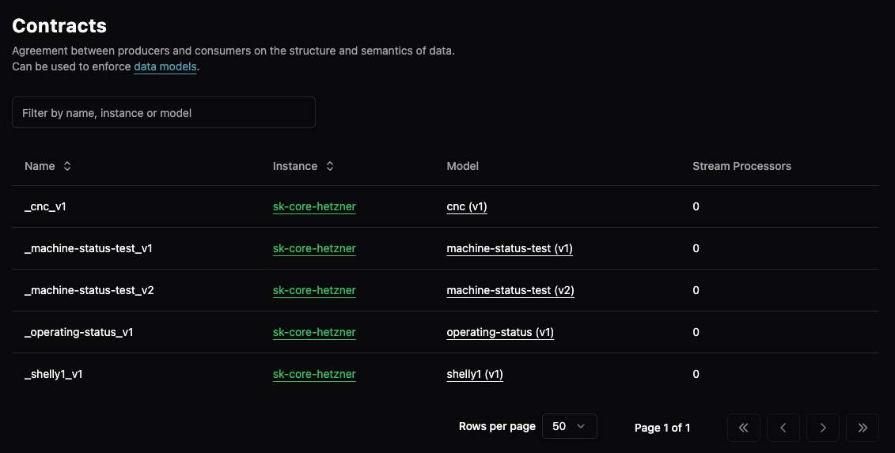

# Data Contracts

> This article assumes you've completed the [Getting Started guide](../../getting-started/) and understand the [data modeling concepts](README.md).

Data contracts are the enforcement mechanism that makes data models mandatory. Without a contract, models are just documentation - contracts make validation happen.

## Overview

In the [component chain](README.md#the-component-chain), contracts sit between models and execution:

```text
Payload Shapes → Data Models → Data Contracts → Data Flows
                                      ↑
                              Enforcement happens here
```

When you specify a data contract in a bridge, the UNS output plugin validates every message against the associated model.

## UI Capabilities

The Management Console provides read-only access to contracts:

| Feature | Available | Notes |
|---------|-----------|-------|
| View contract list | ✅ | Shows all contracts with their models |
| Filter/search | ✅ | Filter by name, instance, or model |
| View associations | ✅ | See which model version each contract enforces |
| View usage | ✅ | Shows count of stream processors using contract |
| Create contracts | ❌ | Auto-created when creating models in UI |
| Edit contracts | ❌ | Immutable once created |
| Delete contracts | ❌ | Must be done via config.yaml |



**What you see in the UI:**
- **Name**: Contract identifier (e.g., `_cnc_v1`, `_pump_v2`)
- **Instance**: Which UMH Core instance owns the contract
- **Model**: The model and version being enforced (e.g., `cnc (v1)`)
- **Stream Processors**: Count of processors using this contract

### Auto-Creation via UI

When you create a model in the UI, it automatically generates a matching contract:

1. Create model `pump` version `v1` in UI
2. System auto-creates contract `_pump_v1`
3. Contract immediately available for use in bridges

## Configuration

Access configuration via: Instances → Select instance → `...` → Config File

### Basic Structure

```yaml
datacontracts:
  - name: _pump_v1          # Contract name (used in bridges)
    model:
      name: pump            # References a data model
      version: v1           # Specific version to enforce
```

### Naming Convention

Contracts follow the pattern `_modelname_version`:
- Always start with underscore
- Include model name
- End with version number
- Examples: `_pump_v1`, `_temperature_sensor_v2`, `_workorder_v1`

## Enforcement Mechanism

### Where Validation Happens

```text
Bridge → UNS Output Plugin → [Contract Check] → Kafka/Redpanda
                                    ↑
                            Validation happens here
```

The UNS output plugin (`output: uns: {}`) performs validation:

1. **Reads metadata**: Extracts `data_contract` from message
2. **Looks up contract**: Finds the associated model
3. **Validates structure**: Checks topic path matches model
4. **Validates payload**: Ensures data types match shapes
5. **Result**:
   - ✅ Valid → Message published to topic
   - ❌ Invalid → Message rejected, bridge degraded

### Validation Failures

When validation fails:

```text
ERROR: schema validation failed for message with topic 'umh.v1.enterprise.site._pump_v1.invalid.path':
Valid virtual_paths are: [pressure, temperature, motor.rpm].
Your virtual_path is: invalid.path
```

Result:
- Message rejected (not published)
- Bridge enters degraded state
- Error logged with details
- Bridge retries with backoff

## Contract Types

### The Special _raw Contract

```yaml
# No explicit definition needed - always available
msg.meta.data_contract = "_raw";
```

- Accepts any structure
- No validation performed
- Use for exploration and development
- Bridge never goes degraded from data issues

### Model-Based Contracts

```yaml
datacontracts:
  - name: _pump_v1
    model:
      name: pump
      version: v1
```

- Enforces exact model structure
- Validates data types via payload shapes
- Rejects non-conforming messages
- Use for production systems

### Relationship to Data Types

| Data Type | Common Contracts | Validation |
|-----------|------------------|------------|
| Raw/Exploration | `_raw` | No validation |
| Device Models | `_pump_v1`, `_sensor_v1`, `_cnc_v1` | Model-based validation |
| Business Models | `_workorder_v1`, `_maintenance_v1` | Always strict |

## Examples

### Simple Device Contract

```yaml
# Model definition
datamodels:
  - name: temperature-sensor
    version:
      v1:
        structure:
          celsius:
            _payloadshape: timeseries-number

# Contract (auto-created or manual)
datacontracts:
  - name: _temperature-sensor_v1
    model:
      name: temperature-sensor
      version: v1

# Usage in bridge
msg.meta.data_contract = "_temperature-sensor_v1";
msg.meta.tag_name = "celsius";
msg.payload = 23.5;
```

## Relationship to Stream Processors

Stream processors don't use contracts directly - they reference models:

```yaml
templates:
  streamProcessors:
    pump_aggregator:
      model:           # Direct model reference
        name: pump
        version: v1
```

However, if a matching contract exists (`_pump_v1`), the stream processor's output will be validated against it automatically.
