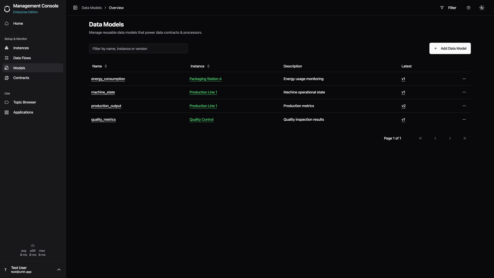
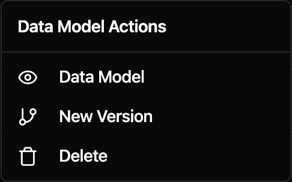
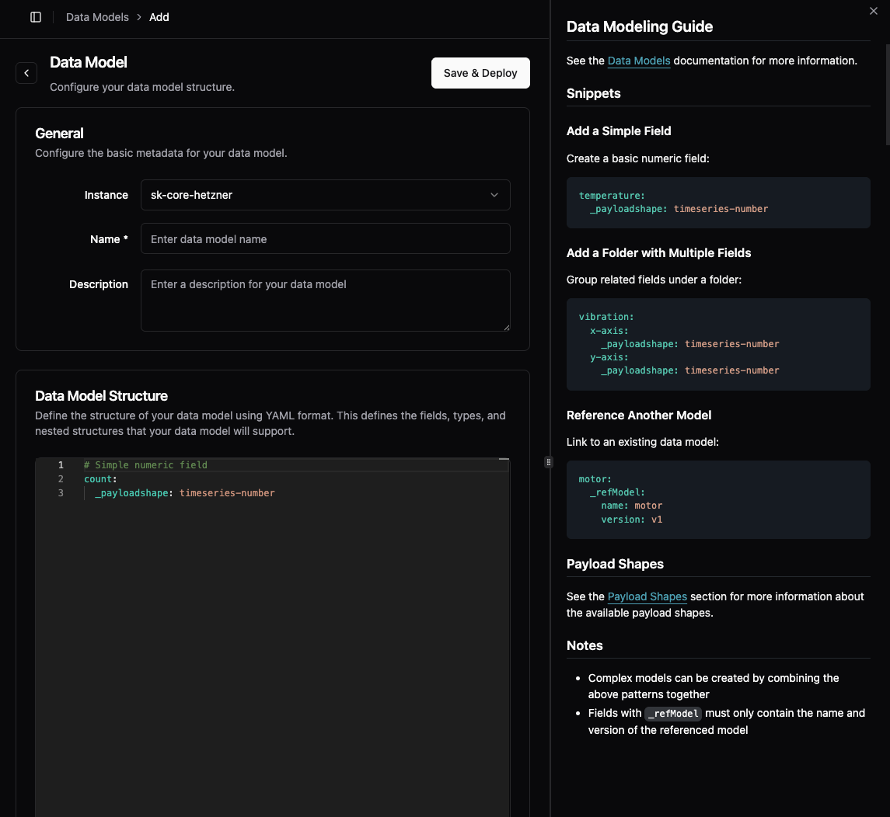

# Data Models

> This article assumes you've completed the [Getting Started guide](../../getting-started/) and understand the [data modeling concepts](README.md).

Data models define the structure of your industrial data. They create the virtual paths and fields that organize raw data into meaningful information. UMH supports two kinds:

- **[Timeseries Models](#timeseries-models)** — for sensor readings, machine states, counters. Each topic carries one value over time.
- **[Relational Models](#relational-models)** — for business records like work orders or quality reports. Each topic carries a structured object with multiple fields.

The Management Console editor automatically scopes its in-editor docs to the model type you are creating, so you only see the section that applies.

## Overview

In the [component chain](README.md#the-component-chain), models provide the structure:

```text
Data Models → Data Contracts → Data Flows
     ↑
Structure defined here
```

When you create a data model, you're defining:
- Virtual paths - organizational folders (e.g., `vibration`, `motor.electrical`)
- Fields - data endpoints (e.g., `temperature`, `pressure`, or a relational record like `order`)
- Relationships - how components nest and reference each other

## UI Capabilities

The Management Console provides full control over data models:

| Feature | Available | Notes |
|---------|-----------|-------|
| View model list | ✅ | Shows all models with versions |
| Create models | ✅ | Visual editor with YAML preview |
| View model details | ✅ | Inspect structure and configuration |
| Create new versions | ✅ | Models are immutable, edit by versioning |
| Reference sub-models | ✅ | Link to other models via `_refModel` |
| Delete models | ✅ | Remove unused model versions |
| Direct editing | ❌ | Use "New Version" to modify |



**What you see in the UI:**
- **Name**: Model identifier (e.g., `cnc`, `pump`, `temperature-sensor`)
- **Instance**: Which UMH Core instance owns the model
- **Description**: Optional description of the model's purpose
- **Latest**: Current version number (v1, v2, etc.)

### Model Actions

Click the three-dot menu (⋮) on any model to access actions:



- **Data Model**: View the model's structure and YAML configuration
- **New Version**: Create a new version with modifications (since models are immutable)
- **Delete**: Remove the model (only if not in use by contracts or bridges)



---

## Timeseries Models

Timeseries models describe topics that emit one value at a time — temperature, pressure, vibration, machine state. Each field becomes its own UNS topic. Each message carries `{timestamp_ms, value}`.

### Basic Structure

```yaml
datamodels:
  - name: pump                    # Model name
    description: "Pump monitoring" # Optional description
    version:
      v1:                         # Version identifier
        structure:                # Hierarchical definition
          pressure:
            inlet:
              _payloadshape: timeseries-number
            outlet:
              _payloadshape: timeseries-number
```

### How Structure Becomes Topics

Model structure directly maps to UNS topics:

```yaml
structure:
  vibration:        # Creates: .../_pump_v1.vibration
    x-axis:         # Creates: .../_pump_v1.vibration.x-axis
```

**Complete topic path:**
```text
umh.v1.enterprise.site._pump_v1.vibration.x-axis
       └─ fixed ─┘     └contract┘└─from model─┘
```

### The Three Building Blocks

#### Fields

```yaml
temperature:
  _payloadshape: timeseries-number  # Accepts numeric values
```

**Characteristics:**
- Has `_payloadshape` property
- Creates a topic endpoint that accepts data
- Built-in shapes: `timeseries-number`, `timeseries-string`
- Cannot have child elements

#### Folders

```yaml
vibration:           # Folder - no _payloadshape
  x-axis:           # Field inside folder
    _payloadshape: timeseries-number
  y-axis:           # Field inside folder
    _payloadshape: timeseries-number
```

**Characteristics:**
- No `_payloadshape` property
- Groups related fields or other folders
- Creates hierarchy in topic path
- Can nest multiple levels deep

#### Sub-Models

Define once, use everywhere:

```yaml
# Define reusable motor model
datamodels:
  - name: motor
    version:
      v1:
        structure:
          rpm:
            _payloadshape: timeseries-number
          temperature:
            _payloadshape: timeseries-number

# Reference in pump model
datamodels:
  - name: pump
    version:
      v1:
        structure:
          pressure:
            inlet:
              _payloadshape: timeseries-number
          motor:           # Include the motor model
            _refModel:
              name: motor
              version: v1
```

Topics created:
- `_pump_v1.pressure.inlet`
- `_pump_v1.motor.rpm`
- `_pump_v1.motor.temperature`

**Benefits:**
- Single source of truth
- Consistent structure across models
- Update once, reflected everywhere

### Built-in Payload Shapes

Two built-in shapes cover virtually all timeseries data — no configuration needed:

| Shape | Payload | Use cases |
|-------|---------|-----------|
| `timeseries-number` | `{"timestamp_ms": int, "value": <number>}` | Temperature, pressure, speed, counters |
| `timeseries-string` | `{"timestamp_ms": int, "value": <string>}` | Machine states, batch IDs, operator names |

See [Payload Formats](../unified-namespace/payload-formats.md) for the on-wire envelope.

---

## Relational Models

Relational models describe **business records** — work orders, quality inspections, batch reports — where multiple related fields must stay together in one message. Each topic carries a structured JSON object whose columns are declared inline on the field via `_relational`.

Use relational models when:
- The record only makes sense as a whole (work order with `orderId`, `productId`, `quantity`)
- Fields belong together as one message, not as separate timeseries topics

### Basic Structure

Mark a field as relational with `_relational.fields`. Each column has a `_type` of `string` or `number`. `_relational` is mutually exclusive with `_payloadshape` and `_refModel` on the same field, and the field cannot have subfields.

```yaml
dataModels:
  - name: work-order
    version:
      v1:
        structure:
          order:                       # Field name → becomes topic suffix
            _relational:
              fields:
                orderId:
                  _type: string
                productId:
                  _type: string
                quantity:
                  _type: number
                status:
                  _type: string
```

This creates topic `enterprise.site._work-order_v1.order`. Each message on that topic carries the full record:

```json
{
  "orderId": "WO-2026-001",
  "productId": "Widget-A",
  "quantity": 1000,
  "status": "created"
}
```

### Mixing Timeseries and Relational

A single model can hold both kinds. Each leaf is independent:

```yaml
dataModels:
  - name: line
    version:
      v1:
        structure:
          throughput:                  # Timeseries leaf
            _payloadshape: timeseries-number
          activeOrder:                 # Relational leaf
            _relational:
              fields:
                orderId:
                  _type: string
                quantity:
                  _type: number
```

### When to Use Timeseries vs Relational

| Scenario | Model type |
|----------|-----------|
| Single value over time (sensor, status) | Timeseries |
| Business record (work order, inspection, batch) | Relational |

---

## Version Evolution

Models are immutable once created. To add fields, create a new version:

### Why Immutability?

From the [README](README.md#why-are-models-immutable):
- Models are contracts between teams
- Dashboards depend on stable structure
- Historical data queries must not break

### Evolution Pattern

**Version 1 - Basic:**
```yaml
version:
  v1:
    structure:
      temperature:
        _payloadshape: timeseries-number
```

**Version 2 - Add pressure:**
```yaml
version:
  v2:
    structure:
      temperature:
        _payloadshape: timeseries-number
      pressure:                          # New field
        _payloadshape: timeseries-number
```

**Migration steps:**
1. Create v2 with additions
2. Deploy new bridges using v2
3. Update dashboards to v2
4. Keep v1 running during transition
5. Deprecate v1 when safe

## Relationship to Contracts

Models define structure, but don't enforce it. That's where [data contracts](data-contracts.md) come in:

| Component | Purpose | Example |
|-----------|---------|----------|
| **Model** | Defines structure | `pump` model with fields |
| **Contract** | Enforces structure | `_pump_v1` validates messages |

When you create a model in the UI:
1. Model `pump` version `v1` is created
2. Contract `_pump_v1` is auto-generated
3. Contract becomes available in bridges

Without a contract, a model is just documentation. With a contract, it becomes validation.

## Next Steps

- [Data Contracts](data-contracts.md) — Make models mandatory
- [Stream Processors](stream-processors.md) — Transform device models to business models
