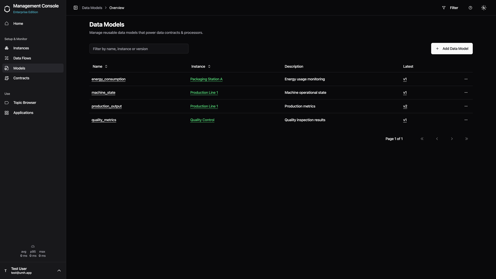
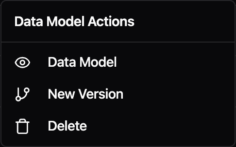
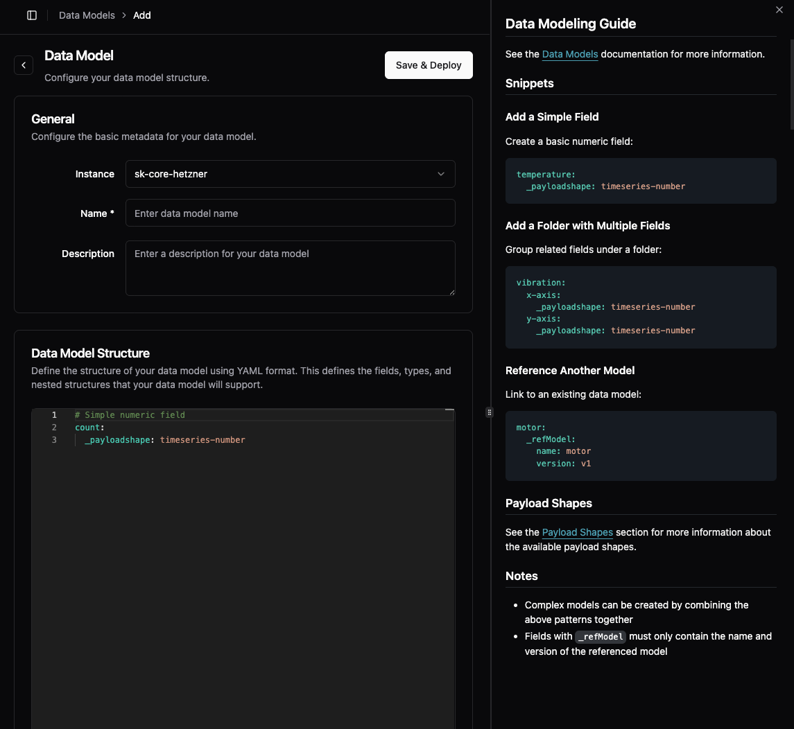

# Data Models

> This article assumes you've completed the [Getting Started guide](../../getting-started/) and understand the [data modeling concepts](README.md).

Data models define the hierarchical structure of your industrial data. They create the virtual paths and fields that organize raw data into meaningful information.

## Overview

In the [component chain](README.md#the-component-chain), models provide the structure:

```text
Payload Shapes → Data Models → Data Contracts → Data Flows
                      ↑
                 Structure defined here
```

When you create a data model, you're defining:
- Virtual paths - organizational folders (e.g., `vibration`, `motor.electrical`)
- Fields - data endpoints with specific types (e.g., `temperature`, `pressure`)
- Relationships - how components nest and reference each other

## UI Capabilities

The Management Console provides full control over data models:

| Feature | Available | Notes |
|---------|-----------|-------|
| View model list | ✅ | Shows all models with versions |
| Create models | ✅ | Visual editor with YAML preview |
| View model details | ✅ | Inspect structure and configuration |
| Create new versions | ✅ | Models are immutable; a new version can only add tags and becomes the next minor (see [Version Keys](../../reference/data-model-type-definitions.md#version-keys)) |
| Reference sub-models | ✅ | Link to other models via `_refModel` |
| Delete models | ✅ | Remove unused model versions |
| Direct editing | ❌ | Use "New Version" to modify |



**What you see in the UI:**
- **Name**: Model identifier (e.g., `cnc`, `pump`, `temperature-sensor`)
- **Instance**: Which UMH Core instance owns the model
- **Description**: Optional description of the model's purpose
- **Latest**: Current version key (`v1_0`, `v1_1`, etc. — or a legacy bare `v2` for a model created before minor versions existed)

### Model Actions

Click the three-dot menu (⋮) on any model to access actions:



- **Data Model**: View the model's structure and YAML configuration
- **New Version**: Add fields as the next minor version — a new version can only add tags, never remove, rename, or retype one (see [Data Model Type Definitions](../../reference/data-model-type-definitions.md#a-new-version-may-only-add-tags))
- **Delete**: Remove the model (only if not in use by contracts or bridges)



## Configuration

### Basic Structure

```yaml
datamodels:
  - name: pump                    # Model name
    description: "Pump monitoring" # Optional description
    version:
      v1:                         # Version identifier
        structure:                # Hierarchical definition
          pressure:
            inlet:
              _payloadshape: timeseries-number
            outlet:
              _payloadshape: timeseries-number
```

### How Structure Becomes Topics

Model structure directly maps to UNS topics:

```yaml
structure:
  vibration:        # Creates: .../_pump_v1_0.vibration
    x-axis:         # Creates: .../_pump_v1_0.vibration.x-axis
```

**Complete topic path:**
```text
umh.v1.enterprise.site._pump_v1_0.vibration.x-axis
       └─ fixed ─┘     └─contract─┘└─from model─┘
```

## The Three Building Blocks

### Fields

```yaml
temperature:
  _payloadshape: timeseries-number  # Accepts numeric values
```

**Characteristics:**
- Has `_payloadshape` property
- Creates a topic endpoint that accepts data
- References a [payload shape](payload-shapes.md) for validation
- Cannot have child elements

### Folders

```yaml
vibration:           # Folder - no _payloadshape
  x-axis:           # Field inside folder
    _payloadshape: timeseries-number
  y-axis:           # Field inside folder
    _payloadshape: timeseries-number
```

**Characteristics:**
- No `_payloadshape` property
- Groups related fields or other folders
- Creates hierarchy in topic path
- Can nest multiple levels deep

### Sub-Models

Define once, use everywhere:

```yaml
# Define reusable motor model
datamodels:
  - name: motor
    version:
      v1:
        structure:
          rpm:
            _payloadshape: timeseries-number
          temperature:
            _payloadshape: timeseries-number

# Reference in pump model
datamodels:
  - name: pump
    version:
      v1:
        structure:
          pressure:
            inlet:
              _payloadshape: timeseries-number
          motor:           # Include the motor model
            _refModel:
              name: motor
              version: v1_0
```

Topics created:
- `_pump_v1_0.pressure.inlet`
- `_pump_v1_0.motor.rpm`
- `_pump_v1_0.motor.temperature`

**Benefits:**
- Single source of truth
- Consistent structure across models
- Update once, reflected everywhere

## Version Evolution

Models are immutable once created. To add fields, create a new version:

### Why Immutability?

From the [README](README.md#why-are-models-immutable):
- Models are contracts between teams
- Dashboards depend on stable structure
- Historical data queries must not break

### Evolution Pattern

Adding a field appends the next **minor** version — it does not bump the major version. A model at
`v1` (that is, `v1_0`) gains `v1_1`, not `v2`. The new version repeats everything the previous version
had and adds the new field on top, because a new version may only add tags. See
[Version Keys](../../reference/data-model-type-definitions.md#version-keys) in the type definitions
reference for the full grammar.

**v1_0 - Basic:**
```yaml
dataModels:
  - name: pump
    version:
      v1_0:
        structure:
          temperature:
            _payloadshape: timeseries-number
```

**v1_1 - Add pressure:**
```yaml
dataModels:
  - name: pump
    version:
      v1_0:
        structure:
          temperature:
            _payloadshape: timeseries-number
      v1_1:
        structure:
          temperature:
            _payloadshape: timeseries-number
          pressure:                          # New field
            _payloadshape: timeseries-number
```

This produces contract `_pump_v1_1` alongside the existing `_pump_v1_0`.

**Migration steps:**
1. Create `v1_1` with the addition
2. Deploy new bridges using contract `_pump_v1_1`
3. Update dashboards to `_pump_v1_1`
4. Keep bridges on `_pump_v1_0` running during the transition — it keeps validating `v1_0`'s tags and
   doesn't gain `pressure` automatically
5. Retire `_pump_v1_0` bridges when safe

Removing, renaming, or retyping a tag is a different situation: it's refused before anything is
written, and major bumps aren't supported, so there's no version number a breaking change could
occupy. A genuinely breaking change needs a separate data model, not a new version of this one — see
[A new version may only add tags](../../reference/data-model-type-definitions.md#a-new-version-may-only-add-tags)
for the exact rule and refusal error. Don't delete and recreate this model to force the change
through instead: the Historian keeps tag history keyed to the old contract name, and a recreated
model that reuses a tag name with a different type will have that tag's data silently dropped.

## Relationship to Contracts

Models define structure, but don't enforce it. That's where [data contracts](data-contracts.md) come in:

| Component | Purpose | Example |
|-----------|---------|----------|
| **Model** | Defines structure | `pump` model with fields |
| **Contract** | Enforces structure | `_pump_v1_0` validates messages |

When you create a model in the UI:
1. Model `pump` version `v1_0` is created
2. Contract `_pump_v1_0` is auto-generated
3. Contract becomes available in bridges

Adding a version later gets its own contract too — see
[Contract naming](../../reference/data-model-type-definitions.md#contract-naming) for the full rule.

Without a contract, a model is just documentation. With a contract, it becomes validation.

## Next Steps

- [Data Contracts](data-contracts.md) - Make models mandatory
- [Payload Shapes](payload-shapes.md) - Specify data types for fields
- [Stream Processors](stream-processors.md) - Transform device models to business models
