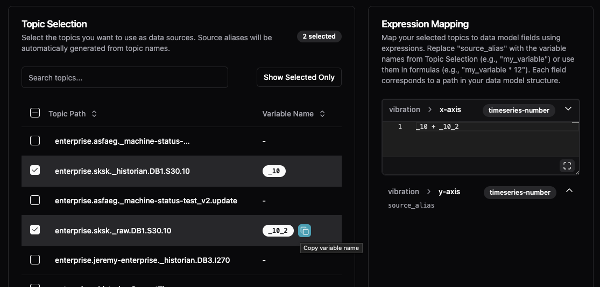
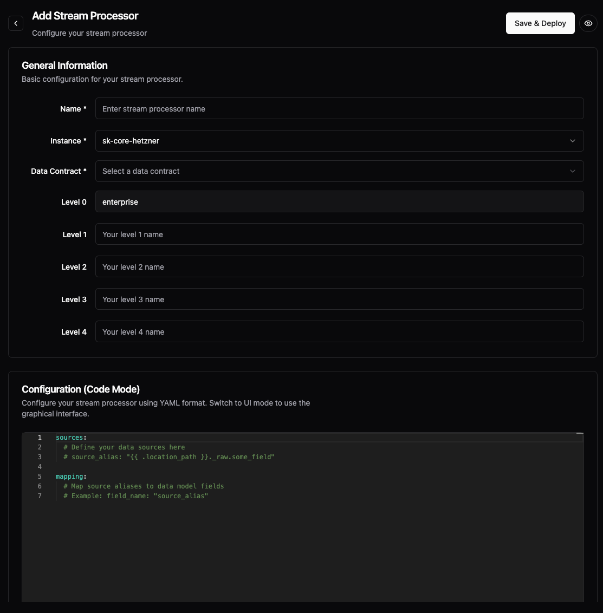

# Stream Processors

> This article assumes you've completed the [Getting Started guide](../../getting-started/) and understand the [data modeling concepts](README.md).

Stream processors transform multiple device model streams into business models, creating KPIs and metrics from equipment data.

## Overview

Stream processors aggregate device data into business KPIs:

```
Multiple Device Model Topics → Stream Processor → Business Model Topic
                                     ↑
                           Aggregation happens here
```

Stream processors are for:
- **Aggregating** data from multiple devices
- **Creating** business KPIs from raw metrics
- **Calculating** derived values across equipment
- **Reducing** data volume for cloud transmission

## UI Capabilities

The Management Console provides visual stream processor creation:

| Feature | Available | Notes |
|---------|-----------|-------|
| View processor list | ✅ | Shows all processors with throughput |
| Create processors | ✅ | Visual or code mode |
| Topic selection | ✅ | Browse and select source topics |
| Expression mapping | ✅ | Map topics to model fields |
| Edit processors | ✅ | Modify existing processors |
| Delete processors | ✅ | Remove unused processors |


**What you see in the UI:**
- **Name**: Processor identifier
- **Instance**: Which UMH instance runs the processor
- **Throughput**: Messages processed per second

## Creating a Stream Processor (UI)

The UI is the primary way to create stream processors. It generates the YAML configuration automatically.

### Step 1: Basic Configuration


1. Click **Add Stream Processor**
2. Enter **Name**: Descriptive identifier
3. Select **Instance**: Where to run the processor
4. Choose **Data Contract**: Output structure (e.g., `_production_v1`)
5. Set **Location levels**: Where in the UNS hierarchy (enterprise, site, etc.)

### Step 2: Topic Selection



Select source topics to aggregate:
- Browse available topics
- Select multiple sources
- Variable names auto-generated (e.g., `_10` for each topic)

### Step 3: Expression Mapping

Map source data to output fields:
- Use variable names from selected topics
- Write expressions (e.g., `_10 + _10_2` for sum)
- Each field in your model needs a mapping

### Step 4: Code Mode (Advanced)



Switch to code mode to see or edit the generated YAML:
```yaml
sources:
  # Define your data sources (specific topics)
  source_alias: "{{ .location_path }}._raw.some_field"
mapping:
  # Map source aliases to data model fields
  field_name: "source_alias"
```

**Note**: The UI generates this YAML configuration. You can switch between visual and code modes.

## Configuration

Access configuration via: Instances → Select instance → `...` → Config File

### How Stream Processors Work

Stream processors use templates for reusability and subscribe to specific topics:

```yaml
templates:
  streamProcessors:
    production_aggregator:
      model:
        name: production-metrics
        version: v1
      sources:  # Specific topics to subscribe to
        cnc1: "{{ .location_path }}.cnc-01._cnc_v1.vibration.x-axis"
        cnc2: "{{ .location_path }}.cnc-02._cnc_v1.vibration.x-axis"
        cnc3: "{{ .location_path }}.cnc-03._cnc_v1.vibration.x-axis"
      mapping:  # Transform to model fields
        total-vibration: "cnc1 + cnc2 + cnc3"
        avg-vibration: "(cnc1 + cnc2 + cnc3) / 3"
        machines-running: "(cnc1 > 0 ? 1 : 0) + (cnc2 > 0 ? 1 : 0) + (cnc3 > 0 ? 1 : 0)"
```

**Key concepts:**
- Each processor gets a unique consumer group (for offset tracking)
- Sources define exact topics to subscribe to (not patterns)
- Outputs go to: `umh.v1.{{ .location_path }}._<model>_<version>.<field>`

### Deploying Stream Processors

```yaml
streamprocessors:
  - name: line_a_metrics
    _templateRef: "production_aggregator"
    location:
      0: enterprise
      1: site
      2: line-a
```

### Expression Language

Mappings use JavaScript expressions with dependency-based evaluation:

```yaml
mapping:
  # Direct pass-through
  value: "source1"

  # Math operations
  total: "source1 + source2 + source3"
  average: "(source1 + source2) / 2"

  # Conditionals
  status: "value > 100 ? 'HIGH' : 'NORMAL'"

  # Complex logic
  efficiency: |
    var produced = source1;
    var planned = source2;
    return (produced / planned) * 100;
```

**Evaluation behavior:**
- Static mappings (no dependencies) evaluate on every message
- Dynamic mappings only evaluate when their dependencies arrive

## Relationship to Other Components

Stream processors work with:
- **[Data Models](data-models.md)**: Define output structure via `model` reference
- **[Data Contracts](data-contracts.md)**: Enforce output validation
- **[Bridges](../data-flows/bridges.md)**: Provide input data (device model topics)

## Next Steps

- **Create device data**: [Bridges](../data-flows/bridges.md) - Connect devices first
- **Define structures**: [Data Models](data-models.md) - Create output models
- **Learn concepts**: [README](README.md) - Understand data modeling approach
