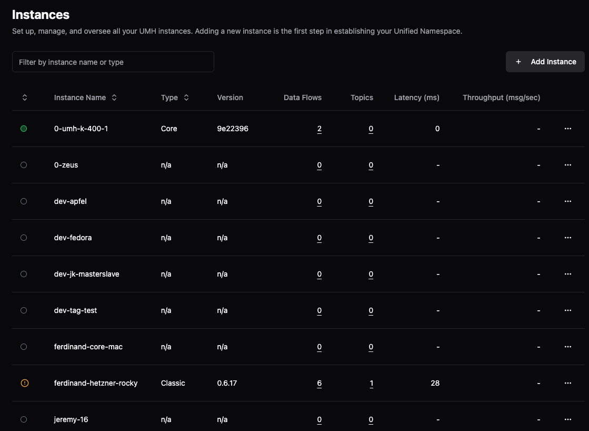
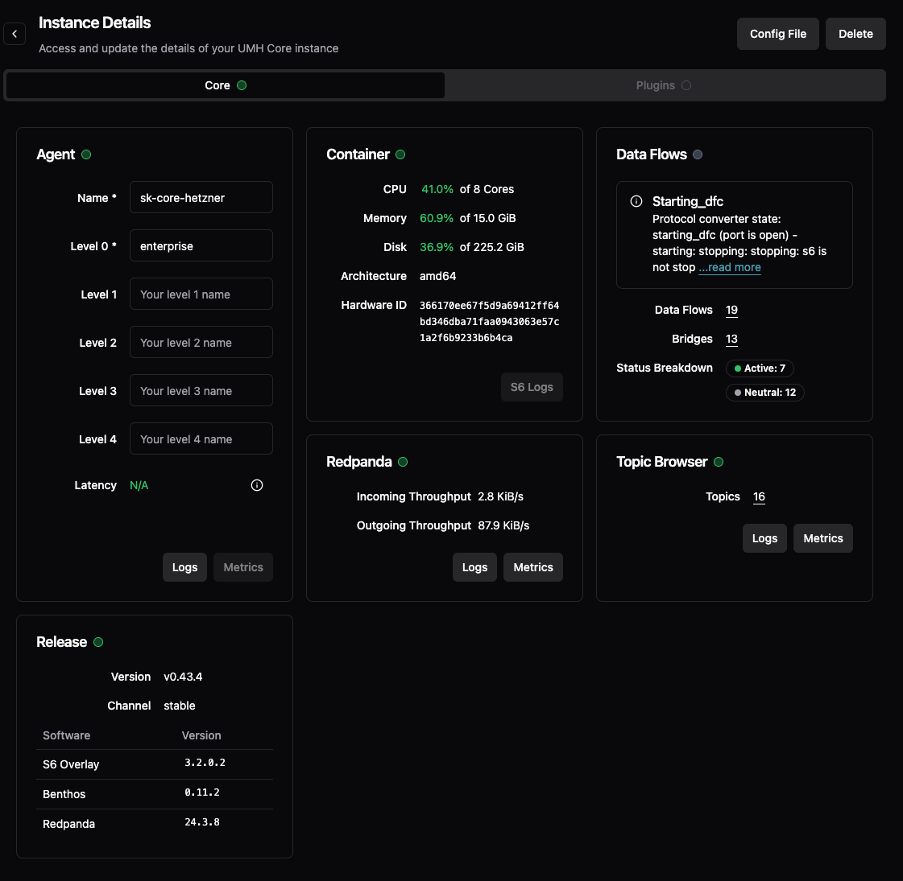

# Instances

## What is an Instance?

An instance is a running UMH Core container - a single Docker container that hosts your entire Unified Namespace. Each instance is identified by its location hierarchy (like `enterprise.site.area.line`) which determines where data is organized in your industrial data infrastructure.

## Instance Overview Page

The instance overview shows all your UMH instances at a glance:

- **Instance Name**: Your chosen identifier for the instance
- **Type**: 
  - **Core**: Single container deployment (UMH Core)
  - **Classic**: Kubernetes-based deployment (legacy)
- **Version**: Container version identifier (e.g., `9e22396`)
- **Data Flows**: Number of configured bridges and stand-alone flows
- **Topics**: Total data points in your Unified Namespace
- **Latency**: Network response time in milliseconds
- **Throughput**: Messages per second flowing through the system

**Status indicators:**
- Green dot: Instance is online and reachable
- Gray dot: Instance is offline or unreachable

**Quick actions:** Click the context menu (⋮) on any instance for:
- Instance Details
- Config File
- Delete

## Instance Details Page

The instance details page provides comprehensive monitoring and management:

### Agent Panel
- **Name**: Instance identifier (e.g., `sk-core-hetzner`)
- **Location hierarchy**: Your organizational structure
  - Level 0: Enterprise (required)
  - Level 1-4: Site, Area, Line, etc. (optional)
- **Latency**: Connection health indicator (N/A when healthy)
- **Logs button**: Access S6 system logs for diagnostics

### Container Panel
Real-time resource monitoring:
- **CPU**: Usage percentage of available cores
- **Memory**: Usage of available RAM (GiB)
- **Disk**: Storage usage (GiB)
- **Architecture**: System architecture (e.g., `amd64`)
- **Hardware ID**: Unique container identifier

### Data Flows Panel
Bridge and flow status breakdown based on [state machines](../../reference/state-machines.md):
- **Active**: Currently processing data (messages flowing)
- **Neutral**: Includes:
  - `idle`: Healthy but no data for 30+ seconds
  - `stopped`: Intentionally disabled
  - `starting`: Initialization in progress
  - Various transition states

Example states:
- `starting_dfc (port is open)`: Connection verified, waiting for Benthos initialization
- `starting: stopping: stopping`: Complex state transition in progress

**Bridges count**: Total configured with active/neutral breakdown

### Redpanda Panel
The message broker powering your [Unified Namespace](../unified-namespace/README.md):
- **Incoming Throughput**: Data rate into the broker (KiB/s)
- **Outgoing Throughput**: Data rate from the broker (KiB/s)
- **Logs/Metrics buttons**: Direct access to Redpanda diagnostics

### Topic Browser Panel
- **Topics count**: Total number of data topics
- Quick access to the [Topic Browser](../unified-namespace/topic-browser.md) for data exploration

### Release Panel
Version information for support and updates:
- **Version**: Full semantic version (e.g., `v0.43.4`)
- **Channel**: Release channel (`stable`, `beta`, etc.)
- **Software versions**: Individual component versions (S6 Overlay, Benthos, Redpanda)

## Next Steps

- **Configure your instance**: [Edit the config file](config-file.md)
- **Connect devices**: [Create bridges](../data-flows/bridges.md)
- **View your data**: [Topic Browser](../unified-namespace/topic-browser.md)
- **Understand states**: [State Machines reference](../../reference/state-machines.md)