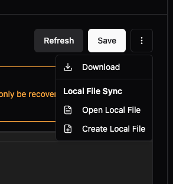

# Configuration File Editing

The configuration file editor allows you to directly modify your instance's `/data/config.yaml` file through the Management Console UI.

## Accessing the Config Editor

Two ways to open the configuration editor:

1. **From Instance Details**: Click the "Config File" button in the top-right corner
2. **From Instance Overview**: Click the context menu (⋮) → "Config File"


## ⚠️ Warning: Direct YAML Editing

**You are editing the config.yaml file directly.** Use this feature with caution:
- Invalid YAML syntax will break your instance
- Recovery requires SSH access to the container
- The agent applies changes via hot-reload - no restart needed

## Editor Controls

### Main Actions
- **Refresh**: Reload the current configuration from the instance
- **Save**: Apply your changes (the agent will hot-reload)

### Additional Options (⋮ menu)



- **Download**: Save a local copy of the configuration
- **Local File Sync**:
  - **Open Local File**: Edit the config in your preferred IDE
  - **Create Local File**: Start a new local file for editing

Local file sync enables:
- Version control with Git
- IDE features (syntax highlighting, validation, autocomplete)
- AI assistant integration (Cursor, GitHub Copilot, Claude)

## Configuration Structure

The editor shows your complete configuration with main sections:

```yaml
templates:
  protocolConverter:
    # Reusable bridge templates

protocolConverter:
  - name: my-bridge
    # Bridge configurations (shown as "Bridges" in UI)

dataFlow:
  - name: my-flow
    # Stand-alone flow configurations
```

Key sections:
- `templates:` - Reusable configuration blocks for templating
- `protocolConverter:` - Bridge definitions (UI shows as "Bridges")
- `dataFlow:` - Stand-alone flow definitions
- `dataContracts:` - Data validation rules
- `dataModels:` - Data structure definitions

For complete documentation, see [Configuration Reference](../../reference/configuration-reference.md).

## UI ↔ YAML Synchronization

UMH Core maintains two-way sync between UI and YAML:

**UI → YAML**: When you create bridges or data models in the UI, they appear here automatically

**YAML → UI**: After saving YAML changes, they're reflected in the UI immediately

This enables flexible workflows:
- **OT teams**: Use the UI for visual configuration
- **IT teams**: Use YAML for infrastructure-as-code
- **Learning**: Create in UI, study the generated YAML
- **Scaling**: Template in YAML for multiple similar devices

## Troubleshooting

**Syntax Errors**: The Save button will show errors if YAML is invalid. Common issues:
- Incorrect indentation (use spaces, not tabs)
- Missing colons after keys
- Unclosed quotes

**Changes Not Applied**: Ensure you clicked Save. Check the agent logs if changes don't take effect.

**Recovery from Bad Config**: If the instance breaks:
1. SSH into the container
2. Edit `/data/config.yaml` directly
3. The agent will auto-reload when valid

## Next Steps

- [Configuration Reference](../../reference/configuration-reference.md) - Full YAML schema
- [Variables](../../reference/variables.md) - Template variables and substitution
- [Bridges](../data-flows/bridges.md) - Configure data connections
